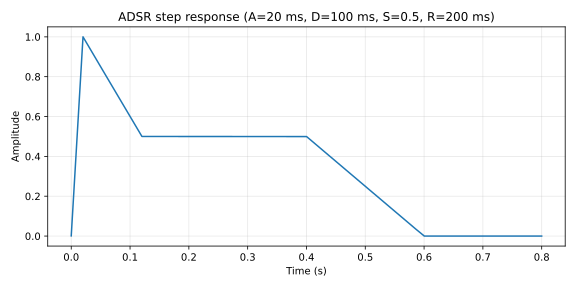

# Adsr

Linear-step attack/decay/sustain/release envelope with a five-phase state machine.

## 1. Purpose

Polyphonic-friendly amplitude envelope shared across Lindelion's voice runtimes. Linear ramps in each segment (not exponential), so the output evolves at a constant per-sample step set by the segment duration. Five phases: `Idle → Attack → Decay → Sustain → Release → Idle`.

## 2. Theory

**Per-segment step.** For a segment of duration $T_\mathrm{ms}$ at sample rate $f_s$, the per-sample step is

$$\Delta = \frac{1}{\max(1,\ T_\mathrm{ms} \cdot 10^{-3} \cdot f_s)}$$

with the special case $T_\mathrm{ms} \leq 0 \Rightarrow \Delta = 1$ (instantaneous transition).

**Phase update rules.**

| Phase | State update |
| ---- | ---- |
| Idle | $v[n] = 0$ |
| Attack | $v[n] = v[n-1] + \Delta_\mathrm{attack}$; transitions to Decay when $v \geq 1$ (clamped) |
| Decay | $v[n] = v[n-1] - (1 - s) \cdot \Delta_\mathrm{decay}$; transitions to Sustain when $v \leq s$ (clamped) |
| Sustain | $v[n] = s$ |
| Release | $v[n] = v[n-1] - v_\mathrm{release\_start} \cdot \Delta_\mathrm{release}$; transitions to Idle when $v \leq 0$ |

where $s = \mathrm{clamp}(\mathit{sustain},\,0,\,1)$ and $v_\mathrm{release\_start}$ is the value latched at `note_off`.

**Linear vs exponential.** Linear ramps give predictable, sample-accurate segment durations. Exponential ramps better match perceived loudness but require a per-segment time constant and never reach the target value in finite time. Lindelion prefers linear because the envelope drives parameter smoothing and voice gating, where deterministic completion matters more than perceptual linearity.

**Stability.** All updates are monotonic within a segment. Sustain clamps to $[0, 1]$. Idle pins to 0.

## 3. Algorithm

```rust
match self.phase {
    EnvelopePhase::Idle => self.value = 0.0,
    EnvelopePhase::Attack => {
        self.value += step_for_ms(adsr.attack_ms, sample_rate);
        if self.value >= 1.0 {
            self.value = 1.0;
            self.phase = EnvelopePhase::Decay;
        }
    }
    EnvelopePhase::Decay => {
        self.value -= (1.0 - sustain) * step_for_ms(adsr.decay_ms, sample_rate);
        if self.value <= sustain + f32::EPSILON {
            self.value = sustain;
            self.phase = EnvelopePhase::Sustain;
        }
    }
    EnvelopePhase::Sustain => self.value = sustain,
    EnvelopePhase::Release => {
        self.value -= self.release_start * step_for_ms(adsr.release_ms, sample_rate);
        if self.value <= 0.0 {
            self.value = 0.0;
            self.phase = EnvelopePhase::Idle;
        }
    }
}
```

`note_on()` enters Attack from Idle/Release, or jumps straight to Decay if the value is already at unity. `note_off()` latches the current value as the release start and enters Release.

## 4. Parameters

| Name | Type | Units | Range | Default | Notes |
| ---- | ---- | ---- | ---- | ---- | ---- |
| `attack_ms` | `f32` | ms | $\geq 0$ | 0 | $\leq 0$ means instantaneous |
| `decay_ms` | `f32` | ms | $\geq 0$ | 0 | $\leq 0$ means instantaneous |
| `sustain` | `f32` | 0..1 | $[0, 1]$ | 1.0 | Clamped per sample |
| `release_ms` | `f32` | ms | $\geq 0$ | 50 | $\leq 0$ means instantaneous |

`Adsr` is a plain-old-data struct passed by value to `AdsrState::next_sample`; the envelope state machine lives in `AdsrState`.

## 5. Response plots



Step response with $\mathit{attack\_ms} = 20$, $\mathit{decay\_ms} = 100$, $\mathit{sustain} = 0.5$, $\mathit{release\_ms} = 200$. `note_on` fires at $t = 0$, `note_off` fires at $t = 0.4\,\mathrm{s}$. The four segments are visible as linear ramps: attack rises to 1 in 20 ms, decay falls to 0.5 in 100 ms, sustain holds, release falls to 0 in 200 ms.

Pole-zero is not applicable — the envelope is a state machine with linear ramps, not an LTI filter.

## 6. Realtime contract

- **Allocation.** Allocation-free; `AdsrState` is a 12-byte struct (`phase`, `value`, `release_start`). `Adsr` is 16 bytes of POD.
- **Denormals.** No filter state means no denormal accumulation path. Sustain clamps explicitly.
- **Reset.** `AdsrState::reset()` returns to `Idle` with `value = 0`. `note_on()` and `note_off()` transition phases.
- **Thread safety.** `next_sample`, `note_on`, `note_off`, and `reset` are not safe to call concurrently with `next_sample`. The host serializes them at the voice level.
- **Bounded work.** $O(1)$ per sample with one branch in the phase match.
- **Finite output.** Output is in $[0, 1]$ by construction. Non-finite inputs to `attack_ms`, `decay_ms`, or `release_ms` produce a $\Delta = 1$ (instantaneous) segment, never NaN.
- **SIMD.** Scalar. Per-voice envelope state is not vectorized in this implementation.

## 7. Test coverage

- `lindelion_dsp_utils::envelope::tests::attack_reaches_one_at_requested_time` — pins attack duration accuracy at 10 ms / 1 kHz sample rate.
- `lindelion_dsp_utils::envelope::tests::decay_lands_on_sustain` — pins decay terminates at sustain level within $10^{-5}$.
- `lindelion_dsp_utils::envelope::tests::release_reaches_idle` — pins release returns to zero and Idle.

## 8. Usage example

```rust
use lindelion_dsp_utils::envelope::{Adsr, AdsrState};

let adsr = Adsr { attack_ms: 5.0, decay_ms: 50.0, sustain: 0.6, release_ms: 200.0 };
let sample_rate = 48_000.0;
let mut state = AdsrState::default();

state.note_on();
for sample in audio_block.iter_mut() {
    *sample *= state.next_sample(adsr, sample_rate);
}

state.note_off();
for sample in release_block.iter_mut() {
    *sample *= state.next_sample(adsr, sample_rate);
}
```

## 9. References

- Source: [`crates/lindelion-dsp-utils/src/envelope.rs`](../../crates/lindelion-dsp-utils/src/envelope.rs).
- Curtis Roads — *The Computer Music Tutorial* (MIT Press), §3 on envelope generators.
- ADR-0001: [Allocation-free audio thread](../adr/0001-allocation-free-audio-thread.md).
