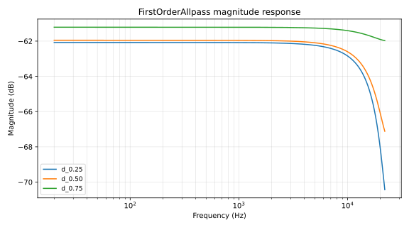
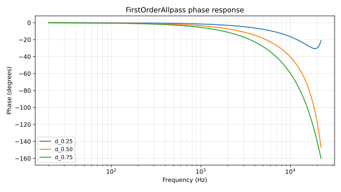
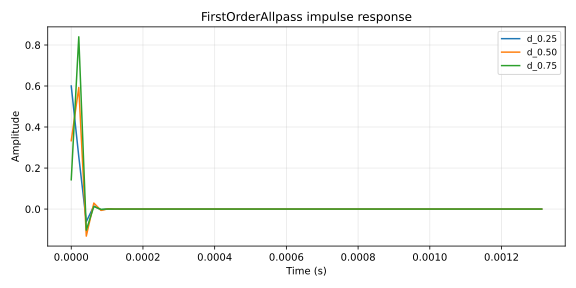

# FirstOrderAllpass

First-order all-pass filter for sub-sample fractional delay with unity magnitude response.

## 1. Purpose

Approximates a fractional-sample delay of `D ∈ [0, 1)` while keeping magnitude flat at 0 dB across the spectrum. Pairs with a [`DelayLine`](delay-line.md) (integer delay) to give continuous sub-sample tuning resolution — the canonical use is the loop tuning element of a Karplus-Strong or waveguide resonator.

## 2. Theory

**Transfer function**

$$H(z) = \frac{c + z^{-1}}{1 + c \cdot z^{-1}}$$

where the all-pass coefficient is

$$c = \frac{1 - D}{1 + D}$$

for desired fractional delay `D ∈ [0, 1)`.

**Magnitude.** By construction `|H(e^{jω})| = 1` for all ω. The filter is all-pass: only phase changes.

**Phase delay** (approximate for small ω)

$$\tau_p(\omega) \approx D \text{ samples at low frequencies}$$

with departure from `D` increasing toward Nyquist. For sub-sample tuning inside a feedback loop, the low-frequency approximation is the operating range that matters.

**Pole-zero.** Single zero at `z = -c` and single pole at `z = -1/c` (outside the unit circle when `|c| < 1`; equivalent to reflecting the zero through the unit circle, which is the defining feature of all-pass filters).

**Stability.** Requires `|c| < 1`, satisfied for any `D ∈ [0, 1)`. The implementation clamps `D ≤ 0.999_999` to keep `c` strictly bounded.

**Valid parameter range.** `D ∈ [0.0, 0.999_999]`. Hardcoded clamp; non-finite values fall through to the clamp's upper bound.

## 3. Algorithm

Direct-Form II Transposed; one state register `z1`.

```rust
// FirstOrderAllpass::process
let output = self.coefficient * (input - self.z1);
let output = output + self.z1;
self.z1 = input - self.coefficient * output;
output
```

`set_fractional_delay(D)` recomputes `c = (1 - D) / (1 + D)` and clamps `D` to the valid range.

## 4. Parameters

| Name | Type | Units | Range | Default | Notes |
| ---- | ---- | ---- | ---- | ---- | ---- |
| `fractional_delay` | `f32` | samples | `[0.0, 0.999_999]` | 0.0 (coefficient 1.0) | Clamped on every `set_fractional_delay` |

The coefficient `c` is derived; it is not a directly-controlled parameter.

## 5. Response plots



Magnitude in dB on log frequency at `D ∈ {0.25, 0.5, 0.75}`, `fs = 48 kHz`. All curves sit at `0 dB` across the spectrum — the all-pass property is visible as a flat magnitude response.



Phase in degrees on log frequency. Phase delay approximates `D` samples at low frequencies and rolls toward larger negative phase near Nyquist. The three `D` values produce distinct phase trajectories — this is the entire usable signal the filter provides.



Impulse response showing the all-pass kernel's exponential decay. The initial sample is `c` (the coefficient), followed by an alternating-sign exponential decay shaped by `c`.

## 6. Realtime contract

- **Allocation.** Allocation-free; state is two `f32` fields (`coefficient`, `z1`).
- **Denormals.** Not flushed inside `process`. Consumers feeding feedback loops typically flush at the loop boundary (waveguide does this via `snap_to_zero` on the loop tap).
- **Reset.** `reset()` zeros `z1`. `set_fractional_delay()` recomputes the coefficient without allocation.
- **Thread safety.** Not safe to call `process` and `set_fractional_delay` concurrently.
- **Bounded work.** O(1) per sample: three multiplies, two adds.
- **Finite output.** The clamp on `D` keeps `|c| < 1`. Non-finite inputs propagate (no internal flush); consumers handle this.
- **SIMD.** Scalar. Per-sample state and one branch-free path.

## 7. Test coverage

- `lindelion_dsp_utils::delay::tests::allpass_is_stable_for_impulse` — feeds a unit impulse through the all-pass at `D = 0.37`; asserts finite output and `|y[n]| ≤ 1` for all subsequent samples.

## 8. Usage example

Paired with a `DelayLine` for fractional-sample tuning:

```rust
use lindelion_dsp_utils::delay::{DelayLine, FirstOrderAllpass};

let sample_rate = 48_000.0;
let mut delay = DelayLine::new((sample_rate / 80.0) as usize); // ~12.5 ms max
let mut allpass = FirstOrderAllpass::default();

let target_delay_samples = sample_rate / 440.0; // A4 period
let integer = target_delay_samples.floor();
let fractional = target_delay_samples - integer;
allpass.set_fractional_delay(fractional);

for sample in audio_block.iter_mut() {
    let tapped = delay.read(integer);
    let tuned = allpass.process(tapped);
    delay.push(tuned * 0.99); // feedback with damping
    *sample = tuned;
}
```

## 9. References

- Julius O. Smith — [*Physical Audio Signal Processing*: All-Pass Filters](https://ccrma.stanford.edu/~jos/pasp/All_Pass_Filters.html).
- Karplus & Strong — *Digital Synthesis of Plucked-String and Drum Timbres* (Computer Music Journal, 1983) — the canonical paired-delay-and-allpass tuning construction.
- Source: [`crates/lindelion-dsp-utils/src/delay.rs`](../../crates/lindelion-dsp-utils/src/delay.rs).
- Companion: [`DelayLine`](delay-line.md).
- Consumer: [`WaveguideResonator`](waveguide.md).
- ADR-0001: [Allocation-free audio thread](../adr/0001-allocation-free-audio-thread.md).
