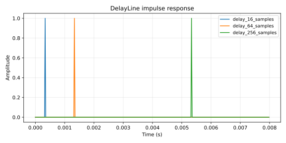

# DelayLine

Fractional-delay ring buffer with linear-interpolated read and fractional-tap energy injection.

## 1. Purpose

Variable-delay ring buffer used as the storage element of waveguides, comb filters, and short echoes. Supports two operations beyond a normal delay line:

- **Linear-interpolated read** at fractional delay positions, so the read tap can vary smoothly between integer samples.
- **Fractional-tap injection** (`add_at`) that distributes an input sample across two adjacent positions weighted by the fractional offset, so excitations can be placed inside the loop at non-integer positions (used by physical-model resonators to model strike position).

Pairs with [`FirstOrderAllpass`](allpass.md) when sub-sample phase precision matters; the all-pass handles the fractional delay while the ring buffer holds the integer delay.

## 2. Theory

**Storage.** A `Vec<f32>` of length `max_delay + 4` slots, written linearly with `write_index` advancing modulo length on each `push`.

**Linear-interpolated read.**

$$y = (1 - \tau) \cdot b[i] + \tau \cdot b[i+1 \bmod N]$$

where `i = ⌊read_position⌋`, `τ = read_position - i`, and `read_position = write_index - 1 - delay_samples`. The buffer is treated as wrapping (negative indices via `rem_euclid`).

**Fractional-tap injection.**

$$b[i] \mathrel{+}= (1 - \tau) \cdot s, \quad b[i+1 \bmod N] \mathrel{+}= \tau \cdot s$$

Injecting at fractional positions preserves the spatial spectrum of the excitation when used inside a feedback loop. Used by [`WaveguideResonator`](waveguide.md) to model strike position along a string.

**Capacity.** Constructor takes `max_delay_samples`; the internal buffer is `max_delay_samples + 4` slots to give the interpolator headroom. The four-sample headroom covers the fractional read's neighbor sample and the fractional add's neighbor write without ever indexing outside the buffer.

**Stability.** The delay line has no feedback path of its own. Used inside a feedback loop, stability depends on the loop's gain and any embedded damping (see [waveguide](waveguide.md)).

## 3. Algorithm

```rust
// push(sample): single-sample write, advancing write_index.
self.buffer[self.write_index] = sample;
self.write_index = (self.write_index + 1) % self.buffer.len();

// read(delay_samples): linear-interpolated read.
let read_index = self.write_index as f32 - 1.0 - delay_samples;
interpolation::linear_wrapped(&self.buffer, read_index)

// add_at(delay_samples, sample): fractional-tap injection.
let write_position = self.write_index as f32 - 1.0 - delay_samples;
let index_floor = write_position.floor();
let fraction = write_position - index_floor;
self.buffer[wrap(index_floor as isize)] += sample * (1.0 - fraction);
self.buffer[wrap(index_floor as isize + 1)] += sample * fraction;
```

## 4. Parameters

| Name | Type | Units | Range | Default | Notes |
| ---- | ---- | ---- | ---- | ---- | ---- |
| `max_delay_samples` | `usize` | samples | `≥ 1` | — | Fixed at construction; backing buffer is `max + 4` slots |
| `delay_samples` (read / add_at) | `f32` | samples | `[0, capacity - 2]` | — | Clamped at every call |
| `sample` | `f32` | linear amplitude | — | — | `add_at` is a no-op for `0.0` |

`capacity()` returns the buffer length (`max_delay + 4`) for callers that need to know the wrap period.

## 5. Response plots



Impulse response with integer delays of 16, 64, and 256 samples (~0.33 ms, 1.3 ms, 5.3 ms at 48 kHz). Each curve shows the unit impulse appearing exactly `delay_samples` later. The delay line is unity-gain by construction; the only non-DC magnitude response comes from the interpolation kernel for fractional delays.

## 6. Realtime contract

- **Allocation.** Allocation-free after construction. The backing `Vec<f32>` is sized once in `new(max_delay_samples)`. `push`, `read`, and `add_at` mutate in place. `clear()` zeros the buffer without resizing.
- **Denormals.** Not flushed at the buffer level. Consumers feeding feedback paths should flush via `snap_to_zero` before pushing (the waveguide does this).
- **Reset.** `clear()` zeros the buffer and resets `write_index`.
- **Thread safety.** All methods are `&mut self`; no concurrent calls.
- **Bounded work.** `push` is O(1); `read` and `add_at` are O(1).
- **Finite output.** The delay line stores whatever it is fed. Validation happens at the consumer.
- **SIMD.** Scalar. The single-tap read/write doesn't benefit from vectorization.

## 7. Test coverage

- `lindelion_dsp_utils::delay::tests::integer_delay_returns_previous_sample` — integer reads return exact buffered values.
- `lindelion_dsp_utils::delay::tests::fractional_delay_interpolates` — half-sample read linearly interpolates between neighbors.
- `lindelion_dsp_utils::delay::tests::add_at_injects_fractional_tap_energy` — fractional injection splits energy across two adjacent slots.

## 8. Usage example

```rust
use lindelion_dsp_utils::delay::DelayLine;

let mut delay = DelayLine::new(48); // 1 ms at 48 kHz

for sample in audio_block.iter_mut() {
    delay.push(*sample);
    *sample = delay.read(24.0); // 0.5 ms tap
}
```

Fractional-tap injection (used inside a waveguide loop):

```rust
delay.add_at(integer_delay * strike_position, excitation_sample);
```

## 9. References

- Julius O. Smith — [*Physical Audio Signal Processing*: Delay Lines](https://ccrma.stanford.edu/~jos/pasp/Delay_Lines.html).
- Source: [`crates/lindelion-dsp-utils/src/delay.rs`](../../crates/lindelion-dsp-utils/src/delay.rs).
- Companion: [`FirstOrderAllpass`](allpass.md) for sub-sample fractional delay paired with this ring buffer.
- Consumer: [`WaveguideResonator`](waveguide.md).
- ADR-0001: [Allocation-free audio thread](../adr/0001-allocation-free-audio-thread.md).
