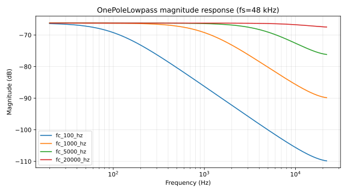
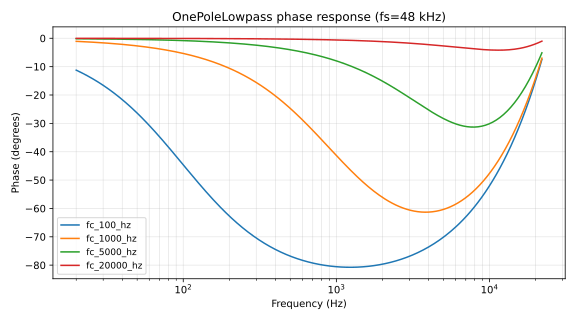
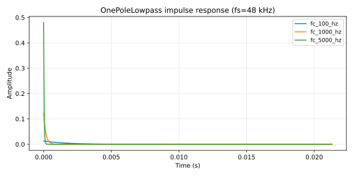

# OnePoleLowpass

Single-pole IIR low-pass filter with sample-rate-aware cutoff clamping.

## 1. Purpose

First-order one-pole infinite-impulse-response low-pass filter. Suitable for parameter smoothing, gentle denoising, and rolling off high-frequency content before downstream stages. One state variable, one coefficient, no resonance.

## 2. Theory

**Difference equation**

$$y[n] = y[n-1] + \alpha \cdot (x[n] - y[n-1])$$

where

$$\alpha = 1 - \exp\left(\frac{-2\pi \cdot f_c}{f_s}\right)$$

for cutoff $f_c$ (Hz) and sample rate $f_s$ (Hz).

**Transfer function**

$$H(z) = \frac{\alpha}{1 - (1 - \alpha) z^{-1}}$$

**Pole.** $p = 1 - \alpha$, on the positive real axis. Stability requires $0 < \alpha < 1$, satisfied for all valid $f_c$.

**Discretization.** Matched-z (exponential mapping of the analog $1/(1 + s\tau)$ prototype). No prewarp is required for single-pole matched-z.

**Valid parameter range.** $f_c \in [20\,\mathrm{Hz},\, f_s \cdot 0.45]$. Clamped at every `set_cutoff` call via `cutoff_for_sample_rate()` in `lindelion-dsp-utils::filters`. Sample rates below 1 kHz fall back to 48 kHz.

## 3. Algorithm

```rust
// One-pole low-pass with denormal flushing on input and state.
let input = snap_to_zero(input);
self.z1 = snap_to_zero(self.z1);
self.z1 += self.coefficient * (input - self.z1);
self.z1 = snap_to_zero(self.z1);
self.z1
```

The coefficient is recomputed only inside `set_cutoff`; `process` runs three arithmetic ops and three `snap_to_zero` checks per sample.

## 4. Parameters

| Name | Type | Units | Range | Default | Notes |
| ---- | ---- | ---- | ---- | ---- | ---- |
| `cutoff_hz` | `f32` | Hz | $[20,\ f_s \cdot 0.45]$ | 1000 (effective) | Clamped at construction and on every `set_cutoff` |
| `sample_rate` | `f32` | Hz | $\geq 1000$ (else 48000) | 48000 | Treated as 48 kHz when invalid |

## 5. Response plots



Magnitude in dB on log frequency at $f_c \in \{100\,\mathrm{Hz}, 1\,\mathrm{kHz}, 5\,\mathrm{kHz}, 20\,\mathrm{kHz}\}$, $f_s = 48\,\mathrm{kHz}$. Each cutoff exhibits the canonical $-3\,\mathrm{dB}$ point at $f_c$ with $-6\,\mathrm{dB}/\mathrm{octave}$ rolloff above. The 20 kHz cutoff curve sits against the Nyquist clamp ($f_c \leq f_s \cdot 0.45 \approx 21.6\,\mathrm{kHz}$).



Phase in degrees on log frequency. Each curve rolls from $0°$ at DC toward $-90°$ well above $f_c$.



Impulse response over 1024 samples (~21 ms at 48 kHz) at $f_c \in \{100\,\mathrm{Hz}, 1\,\mathrm{kHz}, 5\,\mathrm{kHz}\}$. Each curve is the unit-impulse response: a jump to $\alpha$ on sample 0, exponential decay at rate $1 - \alpha$ thereafter.

CSV data lives under `docs/plots/data/onepolelowpass_*.csv` and is regenerated by `cargo test -p lindelion-dsp-utils --test plot_data`. SVGs are regenerated by `make docs`.

## 6. Realtime contract

- **Allocation.** Allocation-free; state is two `f32` fields (`z1`, `coefficient`).
- **Denormals.** Flushed three times per sample via `lindelion_dsp_utils::math::snap_to_zero` (input, pre-update state, post-update state).
- **Reset.** `reset()` zeros `z1`. `set_cutoff()` recomputes the coefficient without allocation; sample-rate changes are absorbed via the clamp.
- **Thread safety.** `process()` and `set_cutoff()` are not safe to call concurrently; the host serializes them.
- **Bounded work.** $O(1)$ per sample.
- **Finite output.** Input, state, and output all pass through `snap_to_zero`. NaN or infinity in produces a flushed zero.
- **SIMD.** Scalar. Vectorization happens at the consumer level when this filter is applied across a block.

## 7. Test coverage

- `lindelion_dsp_utils::filters::tests::one_pole_step_response_moves_toward_input` — verifies monotonic settling toward unity and bounds the steady-state value.

This filter has no audio-thread interface of its own. `assert_no_allocations!` coverage lives in the consuming plugin's audio-thread test.

## 8. Usage example

```rust
use lindelion_dsp_utils::filters::OnePoleLowpass;

let sample_rate = 48_000.0;
let mut lp = OnePoleLowpass::new(1_000.0, sample_rate);

for sample in audio_block.iter_mut() {
    *sample = lp.process(*sample);
}
```

## 9. References

- Julius O. Smith — [Introduction to Digital Filters: One-Pole](https://ccrma.stanford.edu/~jos/filters/One_Pole.html).
- Source: [`crates/lindelion-dsp-utils/src/filters.rs`](../../crates/lindelion-dsp-utils/src/filters.rs).
- Realtime contract: [`docs/performance.md`](../performance.md).
- ADR-0001: [Allocation-free audio thread](../adr/0001-allocation-free-audio-thread.md).
