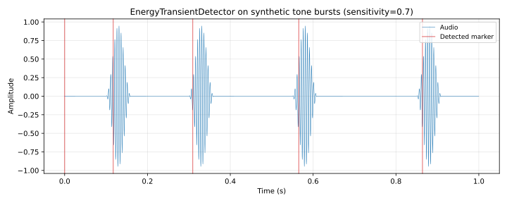

# Onset detection

Five onset-detection algorithms plus a hybrid configuration, sharing the `OnsetDetector` trait and a streaming counterpart. Used by Glirdir for sing-to-MIDI phrase capture and reserved for Linnod's slicing pipeline.

## 1. Purpose

Detect note-onset positions in an audio buffer (batch) or audio stream (incremental). Produces `SliceMarker` positions in source-sample coordinates. The crate ships five algorithm families plus a `HybridOnsetDetector` that combines spectral-flux onsets with pitch-stability onsets when a pitch contour is available.

| Algorithm | Strengths | Typical use |
| ---- | ---- | ---- |
| SuperFlux | Soft-onset melodic material (wind, voice, bowed strings) | Default for Glirdir and Linnod melodic input |
| ComplexFlux | Sustained tones with subtle articulation | Voice with consonant articulation |
| SpectralSparsity | Difficult / ambiguous material | Backup when SuperFlux underperforms |
| PitchStability | Tonal monophonic material | Adds onsets at pitch changes (used inside `HybridOnsetDetector`) |
| EnergyTransient | Percussive material | Drums, attacks, plucks |
| ManualGrid | Predictable subdivisions | Drum loops at known tempo |

`ConfiguredOnsetDetector` is the default dispatcher; it routes the `DetectionAlgorithm` enum to the matching implementation. `HybridOnsetDetector` chains SuperFlux with `PitchStabilityDetector` when a pitch track is provided, merging markers within `min_slice_ms`.

## 2. Theory

**Spectral flux (SuperFlux core).** Compute an STFT frame and its log-magnitude spectrum. Spectral flux per frame is

$$\mathit{flux}[t] = \sum_k \max(0,\ \mathit{mag}[t, k] - \mathit{mag}[t - L, k])$$

where `L` is `lookback_frames`. SuperFlux applies a per-frame max-filter of radius `max_filter_radius` to the lookback spectrum before subtraction, suppressing slowly-modulating peaks (vibrato, beats) from triggering false onsets. Peak-picking on the flux curve emits markers where flux exceeds an adaptive threshold determined by `sensitivity` and a local maximum.

**Energy transient.** For each `frame_size`-sample window compute RMS² (signal energy). When the per-frame delta `Δ = energy[t] - energy[t-1]` exceeds a sensitivity-derived threshold

$$\theta = \mathit{base} + (1 - \mathit{sensitivity}) \cdot \mathit{range}$$

(with `base = 0.02` and `range = 0.18`) and the position is at least `min_slice_ms` after the previous marker, emit a marker at the frame boundary. Cheap; works well for percussive transients with sharp envelopes; produces false positives on noisy backgrounds and misses soft onsets.

**Pitch stability.** Walk a `PitchContour` and emit a marker whenever the pitch shift between consecutive stable regions exceeds `threshold_cents` after holding stable for at least `min_stable_duration_ms`. Complements energy-based detection on legato lines where the amplitude envelope is smooth but the pitch articulates new notes.

**Manual grid.** Divide the audio into `divisions` equal segments offset by `offset_ms`. Deterministic, no analysis; used when the user knows the tempo.

**Hybrid.** SuperFlux + PitchStability with marker dedup at `min_slice_ms` granularity. Combined recall is higher than either alone on sung material; precision is preserved by the `min_slice_ms` floor.

**Stability.** Detectors are pure functions of input audio plus configuration. Streaming variants are append-only and never look ahead beyond their internal `frame_size` buffer.

**Valid parameter range.** Per `OnsetDetectionProfile::sanitized()`:
- `lookback_frames ∈ [1, 32]`
- `max_filter_radius ∈ [0, 32]`
- `pitch_stability_threshold_cents ∈ [1, 2400]`
- `pitch_stability_duration_ms ∈ [1, 5000]`
- `sensitivity` clamped to `[0, 1]` per algorithm
- `min_slice_ms` clamp documented inside each algorithm implementation

## 3. Algorithm

The dispatch path:

```rust
match config.algorithm {
    DetectionAlgorithm::SuperFlux
    | DetectionAlgorithm::ComplexFlux
    | DetectionAlgorithm::SpectralSparsity => SuperFluxDetector.detect(input, config),
    DetectionAlgorithm::EnergyTransient => EnergyTransientDetector.detect(input, config),
    DetectionAlgorithm::ManualGrid => ManualGridDetector.detect(input, config),
    DetectionAlgorithm::PitchStability => PitchStabilityDetector.detect(input, config),
}
```

`ComplexFlux` and `SpectralSparsity` currently fall through to `SuperFluxDetector` (documented as a Linnod backlog item — they need distinct implementations).

Streaming form (`StreamingEnergyTransientDetector` example): buffers `frame_size` samples, computes RMS², compares to last frame's energy, emits a marker when the delta crosses threshold and the position is at least `min_gap_samples` past the previous marker.

## 4. Parameters

`DetectionConfig` (top-level):

| Name | Type | Units | Range | Default | Notes |
| ---- | ---- | ---- | ---- | ---- | ---- |
| `algorithm` | `DetectionAlgorithm` | enum | 6 variants | `SuperFlux` | Selects detector |
| `sensitivity` | `f32` | 0..1 | `[0, 1]` | 0.5 | Higher = more markers |
| `min_slice_ms` | `f32` | ms | `≥ 0` | 50 | Minimum gap between markers |
| `profile` | `OnsetDetectionProfile` | struct | sanitized | default | Per-algorithm hyperparameters |
| `params` | `AlgorithmParams` | enum | per-algorithm | derived from profile | Concrete parameters |

`OnsetDetectionProfile` presets:

| Preset | lookback_frames | max_filter_radius | pitch_stability_threshold_cents | pitch_stability_duration_ms |
| ---- | ---- | ---- | ---- | ---- |
| `default()` | 3 | 3 | 120 | 64 |
| `relaxed()` | 5 | 4 | 160 | 80 |
| `aggressive()` | 2 | 2 | 80 | 48 |

## 5. Response plots



Synthetic test signal: four 200-Hz tone bursts (60 ms each) at `t = 0.1, 0.3, 0.55, 0.85 s` with raised-cosine amplitude envelopes and silence between bursts. `EnergyTransientDetector` is run with `sensitivity = 0.7`, `min_slice_ms = 50`, default `frame_size = 512`. Detected markers appear as red vertical lines over the blue waveform.

The detector emits an initial marker at sample 0 (the "start-of-audio" anchor) plus one marker per tone burst. Detected positions sit a few frames after the burst onset (the detector needs a frame-to-frame energy delta to cross threshold), so each red line lags the burst start by `≈ 15 ms` — consistent with the `512 / 48000 ≈ 10.7 ms` frame quantization plus the envelope ramp-up.

Sweeps over sensitivity, frame size, and algorithm comparisons are not yet emitted.

## 6. Realtime contract

- **Allocation.** Batch detectors (`EnergyTransientDetector::detect`, `SuperFluxDetector::detect`) allocate marker vectors and STFT buffers. They are NOT realtime-safe.
- **Streaming detectors** (`StreamingEnergyTransientDetector`, `StreamingSuperFluxDetector`) preallocate buffers via `with_realtime_capacity(sample_rate, config, max_block_size)`. After that call, `next_block()` is allocation-free.
- **Denormals.** `analysis::append_sanitized_audio` flushes non-finite samples; RMS computations are guarded against zero-sized chunks.
- **Reset.** `reset()` clears pending audio, frame counters, last energy, and last marker.
- **Thread safety.** Streaming detectors are `&mut self`; not safe to call concurrently.
- **Bounded work.** Per-block O(`max_block_size + frame_size`) for energy detector; per-block O(`max_block_size · log(frame_size)`) for SuperFlux (FFT).
- **Finite output.** Markers are usize positions; never NaN. Sanitization happens at the audio-input boundary.
- **Where these run.** Off the audio thread. Glirdir runs onset detection inside a worker after capture completes. Linnod runs it offline at slice-detection time.

## 7. Test coverage

- `lindelion_onset_detect::tests` — unit tests in `src/tests.rs` cover each algorithm against synthetic fixtures with known onset positions.
- `lindelion_onset_detect` integration tests in `tests/plot_data.rs` (this commit) emit the synthetic-burst fixture used by `docs/plots/onset_detection.svg`.

## 8. Usage example

```rust
use lindelion_onset_detect::{
    ConfiguredOnsetDetector, DetectionAlgorithm, DetectionConfig,
    OnsetDetectionInput, OnsetDetector,
};

let audio: Vec<f32> = /* captured phrase */;
let input = OnsetDetectionInput::new(&audio, 48_000);
let config = DetectionConfig {
    algorithm: DetectionAlgorithm::SuperFlux,
    sensitivity: 0.5,
    min_slice_ms: 60.0,
    ..DetectionConfig::default()
};
let markers = ConfiguredOnsetDetector.detect(input, config);
```

With pitch-track-aware hybrid detection:

```rust
use lindelion_onset_detect::{HybridOnsetDetector, OnsetDetectionInput, OnsetDetector};
use lindelion_pitch_detect::{PitchDetector, SwiftF0Detector};

let pitch_contour = SwiftF0Detector::default().detect(&audio, 48_000)?;
let input = OnsetDetectionInput::new(&audio, 48_000).with_pitch_contour(&pitch_contour);
let markers = HybridOnsetDetector.detect(input, DetectionConfig::default());
```

Streaming form (allocation-free per block after `with_realtime_capacity`):

```rust
use lindelion_onset_detect::{
    DetectionConfig, StreamingEnergyTransientDetector, StreamingOnsetDetector,
};

let mut detector = StreamingEnergyTransientDetector::with_realtime_capacity(
    48_000,
    DetectionConfig::default(),
    512, // max block size
);
let markers = detector.next_block(&audio_block);
```

## 9. References

- Sebastian Böck, Florian Krebs, Markus Schedl — *Evaluating the Online Capabilities of Onset Detection Methods* (ISMIR 2012). SuperFlux algorithm.
- Norberto Degara et al. — *Reliable Onset Detection Based on Spectral Phase and Magnitude* (DAFx 2009). Complex-flux family.
- Source: [`crates/lindelion-onset-detect/`](../../crates/lindelion-onset-detect/).
- Consumers: Glirdir analysis worker (`plugins/glirdir/src/analysis.rs`), planned Linnod slice detection (`docs/plugins/linnod-backlog.md`).
- Related: [`PitchDetector`](pitch-detect.md), [`PhraseAnalyzer`](phrase-analysis.md).
- ADR-0003: [Shared-core extraction policy](../adr/0003-shared-core-extraction.md).
