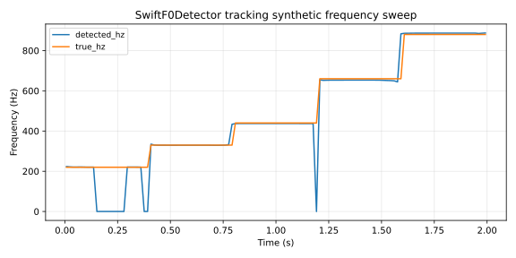

# Pitch detection

ONNX-backed SwiftF0 pitch tracker plus a lightweight zero-crossing fallback, sharing the `PitchDetector` and `StreamingPitchTracker` traits.

## 1. Purpose

Estimate fundamental frequency over time for monophonic audio. Used by Glirdir for sing-to-MIDI capture and by Linnod for slice analysis, tuning, scale snap, and pitch-shift cache preparation. Two implementations:

- **`SwiftF0Detector`** — wraps the SwiftF0 ONNX model (Lars Heller-Christiansen, 2023). The default detector; produces `PitchFrame` output at the model's frame rate (`16 kHz`, 256-sample hop, 1024-sample window) with confidence and voiced flags per frame.
- **`ZeroCrossingStreamingPitchTracker`** — single-frame zero-crossing pitch estimator. No model, no FFT, no allocation per block. Useful as a streaming fallback and as a sanity check.

## 2. Theory

**SwiftF0.** A small convolutional ONNX model trained on monophonic vocal and instrumental data. Takes a 1024-sample log-mel-scale spectrogram window at 16 kHz; outputs one frame containing fundamental frequency, confidence, and voiced/unvoiced classification. Hop size is 256 samples; the window slides over the input audio, accumulating frames at `analysis_sample_rate = 16 kHz`. Source audio at other sample rates is resampled via linear interpolation through `resample_to_swiftf0_rate` before analysis.

Pitch resolution: `[46.875, 2093.75] Hz` (the model's training range). Frames outside this range are reported with `f0_hz = None` and `voiced = false`.

**Zero-crossing.** Counts positive-going zero crossings in a single audio block, fits a linear period from the first and last crossings, returns

$$f_0 = \frac{f_s}{\mathrm{period\_samples}}$$

with sub-sample interpolation of the crossing positions. Works only on monophonic, clean, voiced signals; falls back to `None` when fewer than two crossings are seen or when the period is degenerate. Confidence is `0.95` when RMS exceeds a small noise floor, `0.0` otherwise.

**Stability.** Both detectors are pure functions of input audio plus configuration. The ONNX model is loaded once per process and cached.

**Valid parameter range.** Per `PitchDetectionConfig::sanitized()`:

- `confidence_threshold ∈ [0, 1]` — frames below threshold report `f0_hz = None`.
- `fmin_hz ∈ [SWIFTF0_MODEL_FMIN_HZ, SWIFTF0_MODEL_FMAX_HZ]`
- `fmax_hz ∈ [fmin_hz, SWIFTF0_MODEL_FMAX_HZ]`

## 3. Algorithm

SwiftF0 batch detection:

```rust
fn detect(&self, audio: &[f32], sample_rate: u32) -> Result<PitchContour, PitchDetectionError> {
    let mut tracker = SwiftF0StreamingPitchTracker::new(sample_rate, self.config);
    let mut frames = Vec::new();
    frames.extend_from_slice(tracker.next_block(audio)?);
    frames.extend_from_slice(tracker.finish()?);
    Ok(PitchContour { source_sample_rate, analysis_sample_rate, hop_size, frames })
}
```

Zero-crossing streaming (one frame per block):

```rust
fn next_block(&mut self, audio: &[f32]) -> Result<&[PitchFrame], PitchDetectionError> {
    if let Some(frame) = self.pitch_frame_from_block(audio) {
        self.block_frames[0] = frame;
        self.block_frame_count = 1;
    } else {
        self.block_frame_count = 0;
    }
    self.source_samples_seen = self.source_samples_seen.saturating_add(audio.len());
    Ok(&self.block_frames[..self.block_frame_count])
}
```

## 4. Parameters

`PitchDetectionConfig`:

| Name | Type | Units | Range | Default | Notes |
| ---- | ---- | ---- | ---- | ---- | ---- |
| `confidence_threshold` | `f32` | 0..1 | `[0, 1]` | 0.5 | Below threshold → `f0_hz = None` |
| `fmin_hz` | `f32` | Hz | `[46.875, 2093.75]` | 46.875 | Lower frequency cutoff |
| `fmax_hz` | `f32` | Hz | `[fmin_hz, 2093.75]` | 2093.75 | Upper frequency cutoff |

Per-frame output (`PitchFrame`):

| Field | Type | Meaning |
| ---- | ---- | ---- |
| `frame_index` | `usize` | Frame number in this contour |
| `source_sample_position` | `usize` | Frame start in source-sample coordinates |
| `timestamp_seconds` | `f32` | Frame timestamp |
| `f0_hz` | `Option<f32>` | Voiced fundamental, or `None` if unvoiced / below threshold |
| `raw_f0_hz` | `f32` | Model output before voicing gate |
| `confidence` | `f32` | Detector confidence `[0, 1]` |
| `voiced` | `bool` | True if `confidence ≥ threshold` and `f0 ∈ [fmin, fmax]` |
| `rms` | `f32` | Frame RMS amplitude |

## 5. Response plots



Synthetic test signal: 2 seconds of audio at 48 kHz, sine-tone sweep through `220, 330, 440, 660, 880 Hz`, each held for 0.4 seconds with raised-cosine 20 ms onset and offset ramps to give the SwiftF0 model audible articulation. Detected `f0_hz` (blue) overlaid on ground-truth frequency (orange) per frame.

Detection latency is `1024 / 16000 ≈ 64 ms` at the analysis rate (the model's window length); transitions between notes show up as a brief unvoiced gap in the detected track. Unvoiced frames are reported as `0` in the CSV for plotting and as `None` in the API.

## 6. Realtime contract

- **Allocation.** `SwiftF0Detector::detect` allocates analysis buffers, the resampled-input buffer, and the output `PitchContour`. NOT realtime-safe. Glirdir runs it inside an off-thread analysis worker.
- **`ZeroCrossingStreamingPitchTracker`** is allocation-free per block after construction.
- **Denormals.** Audio is sanitized via `append_sanitized_audio` before analysis. Non-finite RMS is filtered.
- **Reset.** `SwiftF0StreamingPitchTracker::reset()` clears pending audio and frame counters. `ZeroCrossingStreamingPitchTracker::reset()` zeros the sample counter.
- **Thread safety.** Detectors are `Sync` but their streaming variants take `&mut self`; not safe to call concurrently.
- **Bounded work.** Per-frame O(model size) for SwiftF0; O(block size) for zero-crossing.
- **Finite output.** `PitchFrame` fields are clamped/validated before emission. The `f0_hz: Option<f32>` reports `None` rather than NaN for unvoiced or out-of-range frames.
- **Where these run.** Off the audio thread for SwiftF0. Zero-crossing tracker is realtime-safe but rarely used in production (the SwiftF0 model is sufficient).

## 7. Test coverage

- `lindelion_pitch_detect::tests` in `src/tests.rs` — unit tests against synthetic sines and noise floors.
- Plot-data integration test in `tests/plot_data.rs` (this commit) emits the synthetic-sweep fixture used by `docs/plots/pitch_tracking.svg`.

## 8. Usage example

Batch detection on a captured phrase:

```rust
use lindelion_pitch_detect::{PitchDetector, SwiftF0Detector};

let detector = SwiftF0Detector::default();
let contour = detector.detect(&audio, 48_000)?;
for frame in &contour.frames {
    if let Some(f0) = frame.f0_hz {
        println!("t={:.3} s, f0={:.1} Hz", frame.timestamp_seconds, f0);
    }
}
```

Streaming zero-crossing fallback:

```rust
use lindelion_pitch_detect::{
    PitchDetectionConfig, StreamingPitchTracker, ZeroCrossingStreamingPitchTracker,
};

let mut tracker =
    ZeroCrossingStreamingPitchTracker::new(48_000, PitchDetectionConfig::default());
for block in audio.chunks(512) {
    let frames = tracker.next_block(block)?;
    // ...
}
```

## 9. References

- Lars Heller-Christiansen — [SwiftF0](https://github.com/lars76/swift-f0) ONNX pitch tracker.
- Source: [`crates/lindelion-pitch-detect/`](../../crates/lindelion-pitch-detect/).
- Consumers: Glirdir analysis worker and Linnod source analysis/tuning.
- Related: [`OnsetDetector`](onset-detect.md), [`PhraseAnalyzer`](phrase-analysis.md).
- ADR-0003: [Shared-core extraction policy](../adr/0003-shared-core-extraction.md).
