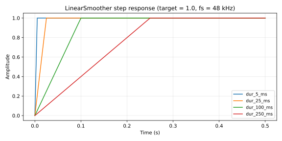

# Smoothing — LinearSmoother and SmoothedParam

Per-sample linear parameter ramp plus a registry-aware wrapper that combines value sanitization with smoothing.

## 1. Purpose

Two layered types:

- **`LinearSmoother`** is the raw stepper. Holds `current`, `target`, and per-sample `step`; calling `next_sample()` advances `current` by `step` until `samples_remaining` reaches zero, then pins to `target`.
- **`SmoothedParam`** wraps `LinearSmoother` with a `SmoothedParamSpec` that defines the parameter's range, default, smoothing duration in milliseconds, and epsilon (the deadband below which a new target is ignored). `SmoothedParam` is the type plugin code uses; `LinearSmoother` is the building block.

Used for parameter automation (host parameter changes, editor knob movement, MIDI control), patch-load fades, and any per-sample slewing of a control value on the audio thread.

## 2. Theory

**Per-sample update.** For a ramp from `current` to `target` over `N` samples:

$$\Delta = \frac{\mathrm{target} - \mathrm{current}}{N}$$

$$\mathrm{current}[n] = \mathrm{current}[n-1] + \Delta \text{ for } n \in [1, N]$$

with `current` pinned to `target` once `samples_remaining = 0`. `N = 0` means immediate transition (no smoothing).

**Spec-driven duration.** `SmoothedParamSpec::duration_samples(sample_rate)` returns:

$$N = \mathrm{round}(\mathit{sample\_rate} \cdot \mathit{smoothing\_ms} \cdot 10^{-3})$$

with non-finite sample rates falling back to 48 kHz and non-finite `smoothing_ms` falling back to 0 (immediate).

**Epsilon deadband.** `SmoothedParam::set_target` ignores requested targets within `epsilon` of the current target. This prevents thrashing the smoother for tiny automation noise.

**Sanitization.** `SmoothedParam` runs every requested target through the underlying `FloatParamSpec::sanitize` so non-finite or out-of-range values are clamped to the spec's range with the spec's default as the fallback.

**Linear vs exponential.** Linear was chosen for predictable sample-accurate ramp durations. Exponential ramps (one-pole) are perceptually smoother for amplitude but never reach the target in finite time, which complicates structural changes that need to complete before another change starts.

## 3. Algorithm

```rust
// LinearSmoother::next_sample
if self.samples_remaining > 0 {
    self.current += self.step;
    self.samples_remaining -= 1;
} else {
    self.current = self.target;
}
self.current

// LinearSmoother::set_target
self.target = target;
self.samples_remaining = duration_samples;
self.step = if duration_samples == 0 {
    self.current = target;
    0.0
} else {
    (target - self.current) / duration_samples as f32
};

// SmoothedParam::set_target
let target = self.spec.sanitize(target);
if (self.smoother.target() - target).abs() > self.spec.epsilon() {
    self.smoother.set_target(target, self.duration_samples);
}
```

## 4. Parameters

`SmoothedParamSpec`:

| Name | Type | Units | Notes |
| ---- | ---- | ---- | ---- |
| `min` | `f32` | parameter units | Lower clamp for target sanitization |
| `max` | `f32` | parameter units | Upper clamp |
| `default` | `f32` | parameter units | Used for non-finite fallback |
| `smoothing_ms` | `f32` | ms | Per-target ramp duration; `0` means immediate |
| `epsilon` | `f32` | parameter units | Deadband below which new targets are ignored |

`LinearSmoother` accepts an initial value at construction; `set_target` accepts the target and a duration in samples directly. `SmoothedParam::with_initial` constructs from a spec plus sample rate.

## 5. Response plots



Step response at four smoothing durations (5 ms, 25 ms, 100 ms, 250 ms) for a target change from 0.0 to 1.0 at `t = 0`. Each curve is a straight linear ramp landing exactly at the target after `smoothing_ms`. Subsequent samples hold at 1.0.

## 6. Realtime contract

- **Allocation.** Allocation-free. `LinearSmoother` is a 16-byte POD struct; `SmoothedParam` is a `LinearSmoother` plus a `SmoothedParamSpec` plus a `usize`.
- **Denormals.** No filter state; the linear step never produces sub-normal magnitudes for typical parameter ranges.
- **Reset.** `LinearSmoother::new(value)` constructs at a known value with no ramp pending. `SmoothedParam::reset(value)` does the same after sanitization. `SmoothedParam::set_sample_rate` recomputes the duration in samples without allocation.
- **Thread safety.** Not safe to call mutating methods concurrently. The host serializes them at the voice / parameter level.
- **Bounded work.** O(1) per sample.
- **Finite output.** `SmoothedParam` sanitizes every requested target. `LinearSmoother` is the raw type and trusts its caller.
- **SIMD.** Scalar. Per-voice / per-parameter smoothers are not typically vectorized at this layer.

## 7. Test coverage

- `lindelion_dsp_utils::smoothing::tests::reaches_target_after_requested_samples` — four-sample ramp lands at exact target.
- `lindelion_dsp_utils::smoothing::tests::zero_duration_jumps_immediately` — `duration_samples = 0` transitions instantly.
- `lindelion_dsp_utils::smoothing::tests::smoothed_param_sanitizes_target_and_smooths` — target outside `[min, max]` clamps; ramp starts after sanitization.
- `lindelion_dsp_utils::smoothing::tests::smoothed_param_ignores_targets_inside_epsilon` — sub-epsilon target change does not retarget the smoother.
- `lindelion_dsp_utils::smoothing::tests::smoothed_param_uses_default_for_non_finite_values` — NaN/infinity targets fall back to the spec's default.

## 8. Usage example

Direct `LinearSmoother`:

```rust
use lindelion_dsp_utils::smoothing::LinearSmoother;

let mut smoother = LinearSmoother::new(0.0);
smoother.set_target(1.0, 4); // 4-sample ramp

let mut samples = Vec::new();
for _ in 0..8 {
    samples.push(smoother.next_sample());
}
// samples == [0.25, 0.5, 0.75, 1.0, 1.0, 1.0, 1.0, 1.0]
```

`SmoothedParam` for a host parameter:

```rust
use lindelion_dsp_utils::smoothing::{SmoothedParam, SmoothedParamSpec};

let spec = SmoothedParamSpec::new(-12.0, 12.0, 0.0, 25.0, 0.001); // dB, 25 ms ramp
let sample_rate = 48_000.0;
let mut gain_db = SmoothedParam::with_initial(spec, sample_rate, 0.0);

gain_db.set_target(-6.0); // user moved the fader

for sample in audio_block.iter_mut() {
    let gain = 10.0_f32.powf(gain_db.next_sample() / 20.0);
    *sample *= gain;
}
```

## 9. References

- Source: [`crates/lindelion-dsp-utils/src/smoothing.rs`](../../crates/lindelion-dsp-utils/src/smoothing.rs).
- Related: [`Adsr`](adsr.md) — also linear-step, but driven by phase transitions rather than per-target ramps.
- ADR-0001: [Allocation-free audio thread](../adr/0001-allocation-free-audio-thread.md).
- ADR-0004: [Parameter registry as single source of truth](../adr/0004-parameter-registry.md) — `SmoothedParam` plugs into the parameter registry.
