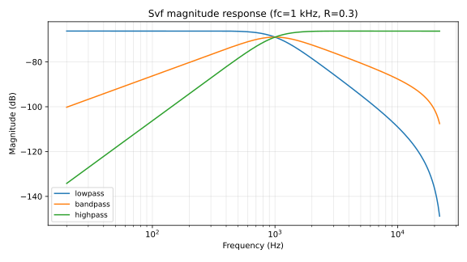
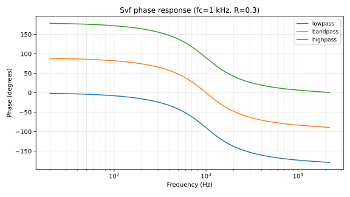
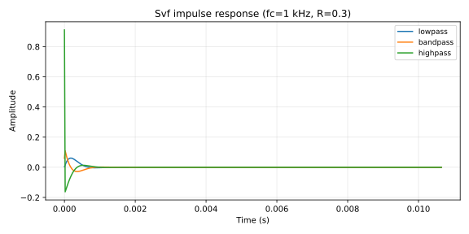

# Svf

Zavalishin state-variable filter (TPT topology) with simultaneous low-pass, band-pass, and high-pass outputs selectable by mode.

## 1. Purpose

State-variable filter implementing the Topology-Preserving Transform (TPT, also called Zero-Delay Feedback) form due to Vadim Zavalishin. Two trapezoidal-integrator stages give simultaneous LP/BP/HP outputs; the consumer selects one via `SvfMode`. Tolerates large per-sample cutoff changes better than Direct-Form biquads because the trapezoidal integrator is unconditionally stable for normalized cutoff `g = tan(π·fc/fs) > 0`.

## 2. Theory

**Trapezoidal integrators.** Each integrator is `s ↔ (2/T) · (1 − z⁻¹)/(1 + z⁻¹)` — the bilinear transform of an analog integrator. The TPT structure exposes the two integrator states (`ic1eq`, `ic2eq`) and computes the simultaneous outputs in one pass.

**Per-sample update.**

$$g = \tan\left(\frac{\pi f_c}{f_s}\right), \quad k = 2 - 1.9 \cdot R, \quad h = \frac{1}{1 + k g + g^2}$$

$$\mathit{high} = h \cdot (x[n] - k \cdot ic_1 - ic_2)$$
$$\mathit{band} = g \cdot \mathit{high} + ic_1$$
$$\mathit{low} = g \cdot \mathit{band} + ic_2$$

Integrator state updates:

$$ic_1[n+1] = g \cdot \mathit{high} + \mathit{band}, \quad ic_2[n+1] = g \cdot \mathit{band} + \mathit{low}$$

`R ∈ [0, 0.999]` is the resonance control; `k = 2 - 1.9·R` is the damping coefficient (lower damping = higher resonance peak).

**Stability.** Trapezoidal integrators are unconditionally stable for any `g > 0`. The resonance term cannot oscillate because `k ≥ 0.1` at maximum resonance.

**Valid parameter range.** `fc ∈ [20, fs · 0.45]`, `R ∈ [0, 0.999]`. Both clamped on every `set_params` call. Sample rate floors to 48 kHz when invalid.

## 3. Algorithm

```rust
let g = (std::f32::consts::PI * cutoff_hz / self.sample_rate).tan();
let damping = 2.0 - 1.9 * self.resonance;
let h = 1.0 / (1.0 + damping * g + g * g);

let high = (input - damping * self.ic1eq - self.ic2eq) * h;
let band = g * high + self.ic1eq;
let low = g * band + self.ic2eq;

self.ic1eq = snap_to_zero(g * high + band);
self.ic2eq = snap_to_zero(g * band + low);

snap_to_zero(match self.mode {
    SvfMode::Lowpass => low,
    SvfMode::Bandpass => band,
    SvfMode::Highpass => high,
})
```

## 4. Parameters

| Name | Type | Units | Range | Default | Notes |
| ---- | ---- | ---- | ---- | ---- | ---- |
| `sample_rate` | `f32` | Hz | `≥ 1000` (else 48000) | 48000 | Validated at construction |
| `cutoff_hz` | `f32` | Hz | `[20, fs · 0.45]` | 20000 | Clamped each `set_params` |
| `resonance` | `f32` | dimensionless | `[0, 0.999]` | 0.0 | Clamped; non-finite falls back to current |
| `mode` | `SvfMode` | enum | `Lowpass | Bandpass | Highpass` | `Lowpass` | Output selector |

## 5. Response plots



Magnitude in dB on log frequency at `fc = 1 kHz`, `R = 0.3`, `fs = 48 kHz`. All three modes overlaid: low-pass passes DC and rolls off above `fc`; high-pass passes Nyquist and rolls off below `fc`; band-pass peaks at `fc`. Resonance peak height controlled by `R`.



Phase in degrees on log frequency. Low-pass rolls from `0°` toward `-180°`; high-pass from `+180°` toward `0°`; band-pass crosses `0°` at `fc`.



Impulse response over 512 samples (~10.6 ms at 48 kHz). The second-order ringing is visible in all three modes; resonance at `R = 0.3` gives a moderate, audible Q-style decay.

CSV data lives under `docs/plots/data/svf_*.csv`.

## 6. Realtime contract

- **Allocation.** Allocation-free; state is six `f32` fields (`sample_rate`, `cutoff_hz`, `resonance`, `ic1eq`, `ic2eq`, plus a `SvfMode` discriminant byte).
- **Denormals.** Input and both integrator states flushed via `snap_to_zero` each sample; output also flushed before return.
- **Reset.** `reset()` zeros `ic1eq` and `ic2eq`. `set_params()` updates cutoff/resonance/mode without allocation; large jumps don't destabilize because TPT integrators tolerate them.
- **Thread safety.** `process()` and `set_params()` are not safe to call concurrently.
- **Bounded work.** O(1) per sample: one `tan` (or table lookup if hand-optimized), a divide, six multiplies, six adds.
- **Finite output.** All five state slots flushed; the `cutoff_for_sample_rate` and `finite_clamp` guards in `set_params` prevent non-finite inputs from poisoning state.
- **SIMD.** Scalar today. The `tan` and divide are the most expensive ops.

## 7. Test coverage

- `lindelion_dsp_utils::filters::tests::svf_remains_finite_under_parameter_sweep` — sweeps `(cutoff, resonance, mode)` over 10 000 iterations with mode-rotation; asserts finite output and peak `< 4.0`.
- `lindelion_dsp_utils::filters::tests::svf_recovers_from_non_finite_parameters_and_input` — feeds NaN/infinity into `set_params` and `process`; asserts recovery to finite values.

## 8. Usage example

```rust
use lindelion_dsp_utils::filters::{Svf, SvfMode};

let sample_rate = 48_000.0;
let mut filter = Svf::new(sample_rate);
filter.set_params(1_000.0, 0.3, SvfMode::Lowpass);

for sample in audio_block.iter_mut() {
    *sample = filter.process(*sample);
}
```

## 9. References

- Vadim Zavalishin — [*The Art of VA Filter Design*](https://www.discodsp.net/VAFilterDesign_2.1.2.pdf), Native Instruments, 2018. Chapter 5 introduces the trapezoidal-integrator state-variable form.
- Andy Simper (Cytomic) — [Linear Trapezoidal Integrated SVF](https://cytomic.com/files/dsp/SvfLinearTrapezoidal.pdf).
- Source: [`crates/lindelion-dsp-utils/src/filters.rs`](../../crates/lindelion-dsp-utils/src/filters.rs).
- Sibling: [Biquad](biquad.md) shares the filter category but uses Direct-Form I rather than TPT.
- ADR-0001: [Allocation-free audio thread](../adr/0001-allocation-free-audio-thread.md).
