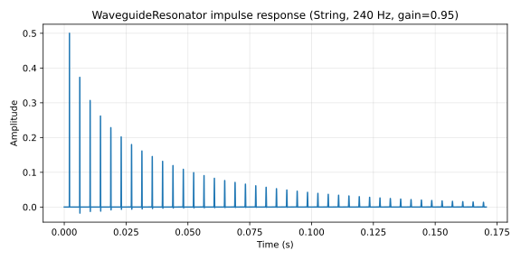

# WaveguideResonator

Karplus-Strong-style digital waveguide with selectable string or tube boundary behavior, fractional-delay tuning, loop low-pass damping, and optional nonlinear saturation.

> **Note.** Sections 2–3 describe the single-loop model. The implementation is now split into
> `string_1d.rs` (half-wave) and `tube_1d.rs` (quarter-wave) loops with corrected tube tuning,
> phase-delay boundary compensation, cubic fractional-delay reads, and a calibrated T60(f) damping;
> a rectangular 2D mesh is a sibling resonator model. See the
> [waveguide technique catalog](waveguide-techniques.md) and
> [ADR-0011](../adr/0011-waveguide-tube-tuning-and-2d-mesh.md) for the current behavior.

## 1. Purpose

Single-loop digital waveguide composed of an integer-delay ring buffer, a fractional-sample all-pass for tuning resolution, and a low-pass biquad in the feedback path for frequency-dependent damping. Two boundary models:

- **`String`** — symmetric loop with single-output tap and feedback gain.
- **`Tube`** — asymmetric reflection at the boundary; reflection sign controls open-versus-closed end character.

Used by Lamath as the alternative resonator family to [ModalBank](modal-bank.md). Where a modal bank synthesizes a tone as a sum of independent second-order resonators, the waveguide builds tone from the recirculation of an excitation through a delayed-and-filtered feedback loop. Plucked strings, blown tubes, and air-column resonances fit this model better than independent modes.

## 2. Theory

**Closed-loop structure.** A sample written into the delay buffer reappears at the read tap one period later, scaled by feedback gain and damped by the loop filter:

```
                  ┌──[× g_loop]──[lowpass]──[soft_saturate]──┐
                  │                                          │
excitation ──►(+)─┤                                          ├──► output
                  │                                          │
                  └──[delay D = fs/f − 1]──[allpass τ]───────┘
```

The fundamental frequency of the resonator is determined by the total loop delay:

$$f_0 \approx \frac{f_s}{D + \tau + \text{filter group delay}}$$

The integer part `D` is set by the `DelayLine` tap; the fractional part `τ ∈ [0, 1)` is the [FirstOrderAllpass](allpass.md) coefficient.

**Per-sample loop step.**

$$\mathit{tapped} = \mathit{delay}.\mathrm{read}(D)$$
$$\mathit{tuned} = \mathit{allpass}.\mathrm{process}(\mathit{tapped})$$
$$\mathit{damped} = \mathit{loop\_filter}.\mathrm{process}(\mathit{tuned})$$
$$\mathit{nonlinear} = \mathrm{soft\_saturate}(\mathit{damped},\ \mathit{loop\_nonlinearity})$$
$$\mathit{feedback} = \mathit{boundary\_feedback}(\mathit{nonlinear},\ \mathit{style},\ \mathit{boundary\_reflection})$$
$$\mathit{delay}.\mathrm{push}(\mathit{snap\_to\_zero}(\mathit{feedback}))$$
$$\mathit{delay}.\mathrm{add\_at}(D \cdot \mathit{position},\ \mathit{snap\_to\_zero}(\mathit{boundary\_excitation}(\mathit{excitation})))$$
$$y[n] = \mathit{snap\_to\_zero}(\mathit{boundary\_output}(\mathit{tuned}))$$

**Boundary models.**

| Style | Feedback gain factor | Excitation gain factor | Output gain factor |
| ---- | ---- | ---- | ---- |
| String | `loop_gain` | unity | unity |
| Tube | `loop_gain · tube_feedback_gain(reflection)` | `tube_excitation_gain(reflection)` | `tube_output_gain(reflection)` |

The tube boundary's three gain factors fold the reflection coefficient into the loop and out to the output. Reflection `> 0` approximates an open tube end (pressure node); `< 0` approximates a closed end (velocity node).

**Resonance compensation.** Higher loop-filter resonance lifts the loop magnitude near the filter's cutoff, which would push the closed-loop gain over unity at the resonance peak. The feedback path divides by `1 + R · K` where `R` is the loop-filter resonance and `K` is `WAVEGUIDE_RESONANCE_GAIN_COMPENSATION_DEPTH`, keeping the loop stable across resonance values.

**Stability.** The closed-loop is stable iff the magnitude around the loop stays below unity at all frequencies. With `loop_gain ≤ 0.99` and the loop low-pass attenuating high frequencies, this holds for the documented parameter ranges. The soft-saturate nonlinearity is a passive compressor; it cannot destabilize a stable linear loop.

**Valid parameter range.** Frequency clamped to `[fs / delay_capacity, fs · 0.45]` (the delay buffer's longest period to a margin below Nyquist). Loop gain, resonance, and boundary reflection clamped by their respective `FloatRange` definitions in `dsp::constants`.

## 3. Algorithm

```rust
let frequency_hz = params.frequency_hz.clamp(
    self.sample_rate / self.delay.capacity() as f32,
    self.sample_rate * 0.45,
);
let delay_samples = (self.sample_rate / frequency_hz - 1.0)
    .clamp(1.0, self.delay.capacity() as f32 - 3.0);
let integer_delay = delay_samples.floor();
let fractional_delay = delay_samples - integer_delay;
self.fractional_delay.set_fractional_delay(fractional_delay);
self.loop_filter.set_coefficients(loop_filter_coefficients(
    self.sample_rate, params.loop_filter_cutoff, params.loop_filter_resonance,
));

let delay_tap = self.delay.read(integer_delay);
let delayed = self.fractional_delay.process(delay_tap);
let damped = self.loop_filter.process(delayed);
let nonlinear = if params.loop_nonlinearity > 0.0 {
    soft_saturate(damped, params.loop_nonlinearity)
} else {
    damped
};

let resonance_compensation = 1.0
    / (1.0 + FILTER_RESONANCE.clamp(params.loop_filter_resonance)
            * WAVEGUIDE_RESONANCE_GAIN_COMPENSATION_DEPTH);
let feedback = feedback_sample(nonlinear, params, resonance_compensation);
self.delay.push(snap_to_zero(feedback));
self.delay.add_at(
    injection_delay_samples(integer_delay, params.position_of_strike),
    snap_to_zero(excitation_sample(excitation, params)),
);

snap_to_zero(output_sample(delayed, params))
```

## 4. Parameters

| Name | Type | Units | Range | Default | Notes |
| ---- | ---- | ---- | ---- | ---- | ---- |
| `style` | `WaveguideStyle` | enum | `String | Tube` | `String` | Boundary model |
| `frequency_hz` | `f32` | Hz | `[fs/capacity, fs · 0.45]` | 220 | Tunes the loop length |
| `loop_filter_cutoff` | `f32` | Hz | `WAVEGUIDE_LOOP_FILTER_CUTOFF_HZ` clamp | preset-defined | Damping color |
| `loop_filter_resonance` | `f32` | 0..1 | `FILTER_RESONANCE` clamp | preset-defined | Loop-filter Q |
| `loop_gain` | `f32` | 0..1 | `WAVEGUIDE_LOOP_GAIN` clamp | preset-defined | Decay length |
| `loop_nonlinearity` | `f32` | 0..1 | `[0, 1]` | 0.0 | Soft-saturate amount |
| `position_of_strike` | `f32` | 0..1 | `STRIKE_POSITION` clamp | preset-defined | Fractional injection point |
| `boundary_reflection` | `f32` | -1..1 | `TUBE_BOUNDARY.reflection` clamp | preset-defined | Tube end character |

Constructor: `WaveguideResonator::new(sample_rate, lowest_frequency_hz)` sizes the `DelayLine` capacity for the longest period the resonator must support.

## 5. Response plots



Impulse response over 8192 samples (~0.17 s at 48 kHz). String style at 240 Hz, loop gain 0.95, loop-filter cutoff 12 kHz, resonance 0, strike position 0.5. The decay envelope and harmonic content visible in the waveform reflect the loop-filter damping and the fractional-tap injection at the midpoint of the delay.

Parameter sweep plots (loop gain, loop-filter cutoff, strike position, tube vs string, boundary reflection) are not yet emitted — they would extend `plugins/lamath/src/dsp/waveguide.rs`'s test module with additional CSV-emit functions on the same pattern as the impulse-response test.

## 6. Realtime contract

- **Allocation.** Allocation-free after construction. `new()` allocates the `DelayLine` buffer once. `process_sample()` and the boundary helpers do not allocate.
- **Denormals.** Loop feedback flushed via `snap_to_zero` before being pushed into the delay. The excitation injected via `add_at` is also `snap_to_zero`-flushed. Output is flushed before return.
- **Reset.** `reset()` clears the delay buffer, resets the all-pass `z1`, and resets the loop biquad. Frequency / parameter changes do not require a reset; the loop tracks new parameters per sample.
- **Thread safety.** `process_sample()` is the only audio-thread method; not safe to call concurrently with itself. The `WaveguideParams` is passed by value each sample, so the caller is responsible for the parameter pipeline.
- **Bounded work.** O(1) per sample. Per-sample cost is dominated by the loop biquad and the all-pass; the delay-line read and write are constant-time.
- **Finite output.** Per-sample `snap_to_zero` at three points (feedback push, excitation add, output) backstops the loop against non-finite poisoning. Stability tests sweep the parameter space and assert finite output.
- **SIMD.** Scalar. The loop's per-sample dependence on previous samples prevents trivial vectorization.

## 7. Test coverage

- `lamath::dsp::waveguide::tests::impulse_produces_decaying_output` — feeds a unit impulse, asserts later RMS is less than earlier RMS (basic decay sanity).
- `lamath::dsp::waveguide::tests::impulse_frequency_tracks_delay_length` — auto-correlation pitch estimate within 12 Hz of 440 Hz target.
- `lamath::dsp::waveguide::tests::non_integer_delay_tracks_fractional_frequency` — fractional tuning at 277.18 Hz lands within 6 Hz.
- `lamath::dsp::waveguide::tests::loop_filter_{resonance,cutoff}_materially_changes_render` — extreme parameter changes produce audibly different output.
- `lamath::dsp::waveguide::tests::loop_gain_materially_changes_decay` — short loop-gain decays faster than long loop-gain.
- `lamath::dsp::waveguide::tests::loop_nonlinearity_materially_changes_render` — nonlinearity changes output spectrum.
- `lamath::dsp::waveguide::tests::tube_style_materially_changes_render`, `tube_boundary_reflection_materially_changes_render` — boundary mode produces distinct timbres.
- `lamath::dsp::waveguide::tests::strike_position_moves_excitation_injection_point` — onset arrives earlier when strike position is near the output tap.
- `lamath::dsp::waveguide::tests::stable_across_parameter_sweep` — 20 000-sample sweep over all parameters; asserts finite output and peak `< 10`.

## 8. Usage example

```rust
use lamath::dsp::{
    constants::{STRIKE_POSITION, WAVEGUIDE_LOOP_FILTER_CUTOFF_HZ, WAVEGUIDE_LOOP_GAIN},
    waveguide::{WaveguideParams, WaveguideResonator, WaveguideStyle},
};

let sample_rate = 48_000.0;
let mut resonator = WaveguideResonator::new(sample_rate, 30.0); // support down to 30 Hz
let params = WaveguideParams {
    style: WaveguideStyle::String,
    frequency_hz: 220.0,
    loop_filter_cutoff: WAVEGUIDE_LOOP_FILTER_CUTOFF_HZ.default,
    loop_filter_resonance: 0.1,
    loop_gain: 0.97,
    loop_nonlinearity: 0.0,
    position_of_strike: STRIKE_POSITION.default,
    boundary_reflection: 0.0,
};

let mut output = vec![0.0; 8192];
output[0] = resonator.process_sample(1.0, params);
for sample in &mut output[1..] {
    *sample = resonator.process_sample(0.0, params);
}
```

## 9. References

- Karplus & Strong — *Digital Synthesis of Plucked-String and Drum Timbres* (Computer Music Journal, 1983).
- Julius O. Smith — [*Physical Audio Signal Processing*: Digital Waveguide Models](https://ccrma.stanford.edu/~jos/pasp/Digital_Waveguide_Models.html).
- Source: [`plugins/lamath/src/dsp/waveguide.rs`](../../plugins/lamath/src/dsp/waveguide.rs).
- Building blocks: [`DelayLine`](delay-line.md), [`FirstOrderAllpass`](allpass.md), [`Biquad`](biquad.md).
- Sibling resonator: [`ModalBank`](modal-bank.md).
- Technique catalog: [Waveguide resonator techniques](waveguide-techniques.md).
- ADR-0001: [Allocation-free audio thread](../adr/0001-allocation-free-audio-thread.md).
- ADR-0011: [Waveguide tube tuning correction and 2D mesh resonator](../adr/0011-waveguide-tube-tuning-and-2d-mesh.md).
