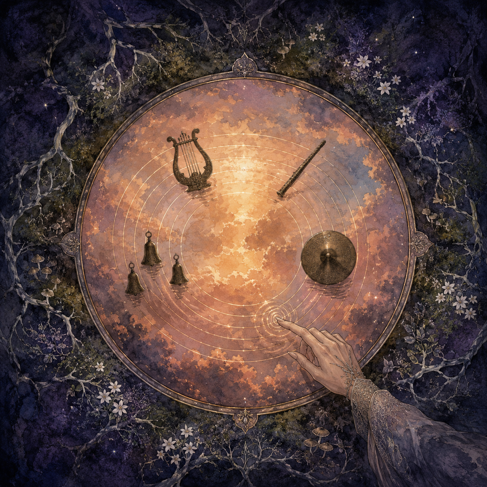

# Lamath Song Demo

"Olórelindë (The Dream Ascending)" is a 32-bar multi-track piece that exercises all four Lamath
instrument families — Modal, String, Tube, and Mesh — as an ensemble. The score
and renderer live in [`plugins/lamath/src/bin/lamath-song/`](../plugins/lamath/src/bin/lamath-song/main.rs);
the music itself is plain data in
[`composition.rs`](../plugins/lamath/src/bin/lamath-song/composition.rs).

```
make render-lamath-song
```

renders every track to its own stem WAV under `review/lamath-song/tracks/` and
sums them into `review/lamath-song/lamath-song.wav` (48 kHz stereo, 90 s).
Compressed previews: `make compress-review-audio REVIEW_AUDIO_SOURCE_DIR=review/lamath-song REVIEW_AUDIO_PREVIEW_DIR=review/audio-previews/lamath-song`.

## Form

32 bars in 4/4 at 96 BPM, in A minor with a whole-step modulation to B minor at
bar 25, plus a four-bar ring-out tail:

| Bars | Section | Material |
| ---- | ------- | -------- |
| 1–4 | Intro | Modal arpeggio alone, tube pedal note, crash swell |
| 5–12 | A | Tube lead melody over Am–F–C–G / Am–F–Dm–E, bowed-string triads, picked bass, modal eighth-note arpeggios, ride |
| 13–20 | B | Bell counter-melody takes the lead over F–G–Am–Em / F–G–E–E; tube duet in thirds and sixths in bars 17–20 |
| 21–24 | Build | Velocity crescendo on every track, bass quarter-note pulse, ride eighths, two-octave rising sixteenth ladder |
| 25–32 | Final | The A material transposed up a whole step into B minor, full ensemble, closing on a held Bm with a rolled chord and final crash |
| 33–36 | Tail | Ring-out for the final crash, bell, and bowed chord |

## Tracks

The four families appear in eight configurations across ten separately rendered
tracks. Chords are real multi-instance voicings: each bowed-string triad voice
is its own rendered instrument.

| Track | Family | Configuration | Role |
| ----- | ------ | ------------- | ---- |
| `tube-lead` | Tube | Default clarinet voice | Lead melody |
| `tube-harmony` | Tube | Darker (reduced brightness) | Duet line, final-section pads |
| `string-chord-low/mid/high` | String | Smooth bow, violin body | One triad voice each |
| `string-bass` | String | Pick, guitar body | Root–fifth bass groove |
| `modal-arp` | Modal | Default struck keys | Arpeggios two octaves above the chords |
| `modal-bells` | Modal | Bell preset | B-section counter-melody, sparkles |
| `cymbal-ride` | Mesh | Ride gong voicing | Timekeeping |
| `cymbal-crash` | Mesh | Crash voicing | Swells and section accents |

## Composition craft

The piece is assembled from standard tonal devices, chosen for reliability:

- **Harmony first.** Am–F–C–G is the minor axis of the I–V–vi–IV family;
  Am–F–Dm–E closes the phrase with an E major borrowed from A harmonic minor
  (the raised G♯), giving the minor key a real cadence. The B section moves to
  the relative-major neighborhood (F–G–Am) of the same scale.
- **Melody as decorated chord tones.** Every lead note is a chord tone of its
  bar or a stepwise passing/neighbor tone between chord tones. The A melody is
  an arch — rise, fall to a mid-phrase low point, rise back, cadence on the
  leading tone over E.
- **Orchestration by role.** Each family plays the ensemble role its physics
  suggests: the monophonic sustaining tube is the lead voice, bowed strings the
  pad layer, the ringing modal bank the arpeggio/sparkle layer, the mesh the
  timekeeping and punctuation.
- **Form as template.** Intro → A → contrasting B → four-bar build →
  recapitulation up a step. The +2 semitone modulation at bar 25 replays
  material the listener already knows, so the key change itself carries the
  lift. The build uses density, volume, and ascent: velocity ramps, a bass
  pulse, ride eighths, and a rising sixteenth ladder.

Instrument behavior shaped the score directly: the tube and bow are one-voice
models, so triads are rendered as separate instrument instances; the cymbal
processor ignores note-offs and reserves notes 0–11 as keyswitch/damp keys, so
all strikes sit at note 60 with velocity carrying the swell; modal notes damp
on note-off, so arpeggio durations overlap their successors to let the keys
ring.

## Renderer

The bin follows the render-catalog pipeline (48 kHz, 512-sample blocks,
scheduled note on/off events per block):

| Module | Purpose |
| ------ | ------- |
| [`score.rs`](../plugins/lamath/src/bin/lamath-song/score.rs) | Bar/beat addressing, tempo conversion, per-track note builder with section transposition (the key change replays home-key material through a +2 transpose) |
| [`composition.rs`](../plugins/lamath/src/bin/lamath-song/composition.rs) | The score: chord progression, melodies, arpeggio/bass/cymbal patterns, dynamics, and per-track mix placement |
| [`render.rs`](../plugins/lamath/src/bin/lamath-song/render.rs) | The eight instrument voices (bow, ride, and crash patches mirror the audition-approved render-catalog settings) and the block renderer |
| [`main.rs`](../plugins/lamath/src/bin/lamath-song/main.rs) | The mixer: per-stem cleanup highpass (TPT SVF), per-track leveling to role-based targets (active-region RMS, or peak for the crash), constant-power panning, per-section fader rides from `(bar, dB)` breakpoints, summing, mix highpass, master peak normalization, stem and mix WAV output |

Mix balance, pans, and RMS targets are one-line edits in
`composition.rs::tracks()`; the notes are all plain data, so the piece can be
re-voiced or re-arranged without touching the renderer.

## Release

The release title is **Olórelindë** *(The Dream Ascending)* — Quenya *olórë*
"dream, vision" + *lindë* "song, air": "dream-song." It sits beside Lindelion
(*lindelë*, the art of music) in the workspace's naming, and the subtitle
points at the whole-step modulation: the dream lifting a step higher before it
resolves.



### Cover image prompt

The cover above was generated from this prompt:

> Album cover artwork, painterly fantasy illustration, muted watercolor and
> gouache with fine ink detail, in the spirit of Alan Lee and Art Nouveau book
> plates. Viewed from directly above: a perfectly still dream-pool set in dark
> forest moss, filling most of the square frame as a great circle. The night
> world surrounds the pool — deep indigo moss, silver roots, scattered white
> night-flowers — but the water's reflection shows a different sky entirely: a
> warm amber-and-rose dawn with pale gold clouds, as if the pool remembers a
> morning that has not yet come. Five thin concentric ripple-rings cross the
> reflection like the lines of a musical staff, and where each ring crosses
> the light, small dark silhouettes rest on the water like notation: a bowed
> lyre, a slender reed-pipe, three tiny bells, and a bronze gong-disc. At the
> pool's edge, a single elven hand reaches in from the lower right, one
> fingertip just touching the water and sourcing the ripples. Centered radial
> composition, circle within square, crisp rim of the pool dividing cool night
> from warm reflected dawn, soft glow rising off the water, clean negative
> space in the dark moss corners for the title. No text, no lettering, square
> 1:1 format.

The prompt encodes the piece directly: the dawn held inside the reflection is
the bar-25 key change (the dream carrying the lift before the waking world has
it), the five ripple-rings are a staff, and the four silhouettes on the water
are the four Lamath families — string, tube, modal bells, and the mesh as a
gong.
