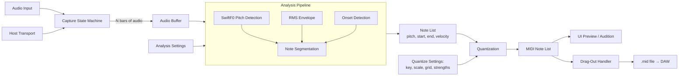

# Glirdir — Sing-to-MIDI Scratchpad — v0.3 Design Spec

**Name etymology:** Sindarin, *singer* / *song-bearer*. From *glir-* (to sing, song) + *-dir* (masculine agentive: man, one-who), with the same morphology as Lindir, the Rivendell minstrel. The suffix descends from earlier *-ndir*, related to Sindarin *dîr* (man, adult), and is distinct from *-dil* (friend/devotee, as in Eärendil) and *-dan* (wright, as in Círdan).
**Project umbrella:** Lindelion (Cargo workspace, GitHub repo).
**Target:** macOS (Apple Silicon primary), VST3.
**Status:** Core Rust crate implemented. Capture state, analysis/segmentation, shared SwiftF0 pitch detection, shared onset detection, synthetic detection-quality regression tests, MIDI quantization/export DTOs, deterministic MIDI export naming, TOML patch state, a transport-aware audition engine, worker-thread scheduling, VST3 state persistence, shared sample-library scratchpad save, a VST3 adapter, the first typed Vizia editor surface, the drag-out spike, and macOS VST3 bundle support exist. Ableton drag validation, recorded vocal fixtures, Apple Silicon performance numbers, and FLAC scratchpad storage are pending.

---

## 1. Concept & Goals

A MIDI capture plugin that listens to sung/whistled/hummed input over a fixed bar window, analyzes the entire captured phrase as a whole, and emits clean quantized MIDI that the user drags out to a DAW track. The thesis: existing voice-to-MIDI tools (Dubler 2 being the dominant one) emit MIDI in real time and therefore commit to pitch decisions before the singer has finished the syllable — leading to the universally-reported workflow that "almost all generated MIDI needs editing." Glirdir captures audio, then derives MIDI from the complete phrase with global context, producing MIDI that doesn't need editing.

### Design principles

- **Capture, then analyze.** Real-time MIDI emission makes pitch decisions causally — committing while the singer is still mid-syllable. Glirdir buffers the whole phrase before deciding anything. Vibrato, scoops, and momentary pitch wobble can be resolved into stable notes by looking at the full signal.
- **Live re-derivation.** Audio is captured once. MIDI is re-derived whenever any analysis or quantization setting changes — instant feedback for "what does this sound like in F minor with 1/16 grid?"
- **No editing-after-drag.** Output MIDI should be clean enough that no post-drag editing is needed. The plugin's UI is where editing decisions happen; the dragged MIDI is the final artifact.
- **Songwriting-sketch use case.** Single shot, single take, 4/8/16 bars. Not a recording tool. Capture an idea, drag it into a clip, move on.
- **Workspace coherence.** Reuses Lindelion shared crates (`lindelion-plugin-shell`, `lindelion-onset-detect`, `lindelion-pitch-detect`, `lindelion-ui`, `lindelion-sample-library`). Introduces one new shared crate (`lindelion-midi`).

### Non-goals

- Not real-time. There is no live-MIDI-as-you-sing mode.
- Not a recording tool. Single-shot scratchpad only; no take history in v1.
- Not a beatboxing tool. Pitched melodic source only in v1; percussion mode deferred to v2.
- Not a MIDI editor. Once dragged out, the host owns the MIDI.
- Not a vocal tuner / pitch corrector. Output is MIDI, not pitched audio.

---

## 2. Signal Path



The pipeline is split into **capture** (one-time, triggered by transport) and **analysis** (re-runs whenever settings change). Audio buffer is preserved across analysis runs; only the derived MIDI is recomputed.

### Current implementation boundary

The current crate implements the non-UI core in focused modules:

| Module | Role |
| ---- | ---- |
| `capture.rs` | Audio-input capture state machine using shared `ProcessContext` input and transport data. Capture completion is finalized off the audio thread. |
| `analysis.rs` | SwiftF0 pitch contour integration, pitch-track fed hybrid onset detection, note segmentation, and MIDI clip derivation. |
| `parameters.rs` | Host parameter metadata and patch application policy. |
| `patch.rs` / `patch_io.rs` | Serializable patch schema and shared `TomlPatchFormat` adapters. |
| `audition.rs` | Simple transport-aware sine audition renderer using shared MIDI clip DTOs and DSP smoothing. |
| `plugin.rs` | `AudioPlugin` implementation around the shared shell boundary. |
| `vst3_entry/` | VST3 processor/controller/messages/editor bridge with typed UI commands and status payloads. |
| `lindelion-ui::glirdir_vizia` | Product editor host contract, macOS Vizia surface, waveform preview, piano-roll preview, parameter controls, and command buttons. |

---

## 3. Audio Capture

### 3.1 Buffer

- Single mono buffer at 48kHz, sized for max capture length (16 bars at slowest practical tempo — e.g., 60bpm 4/4 = 64 seconds = 12MB f32). Allocated up-front at plugin instantiation.
- Capture length user-selectable: **4 bars / 8 bars / 16 bars**.
- Input source: plugin's audio input channel (mono; stereo input is summed to mono on the way in).

### 3.2 Capture state machine

```
Idle  ──[Arm pressed]──>  Armed
Armed ──[trigger met]──>  CountIn (if count-in > 0)
                          │
                          ↓
                     Capturing
                          │
                     [N bars elapsed]
                          ↓
                     Captured
                          │
              [Re-arm / Clear / Drag]
                          ↓
              Armed / Idle / (stay)
```

State persists in patch. UI shows current state prominently.

### 3.3 Sync modes (user-selectable)

| Mode               | Trigger condition                                            |
| ------------------ | ------------------------------------------------------------ |
| **Immediate**      | Capture begins as soon as armed (no host sync; works without transport playing). |
| **Bar 1 sync**     | Wait until host transport reaches bar 1 of the next loop / song-start equivalent — i.e., when `bar_position % bars_per_phrase == 0` aligned to host's song position. Useful for capturing aligned with an existing arrangement. |
| **Next downbeat**  | Wait until host transport reaches the next bar downbeat (any bar). Most flexible. |

Capture stops automatically after N bars elapsed at host tempo. If host transport stops mid-capture: capture pauses, resumes when transport resumes, or the user can cancel via the Clear button.

### 3.4 Count-in

Configurable: **0, 1, or 2 bars**. During count-in, the plugin plays a metronome click through its audio output (sine pip on downbeats, quieter pip on other beats). Click is not recorded into the audio buffer.

Count-in begins after the sync-mode trigger condition is met, immediately preceding capture.

### 3.5 Buffer persistence

- Patch files remain TOML-backed settings. VST3 state stores the patch TOML without `ScratchpadAudio` and carries captured audio plus capture-time tempo/time-signature metadata as a separate bounded binary f32 payload inside the plugin state envelope.
- FLAC remains the compression target, but v1 uses the binary payload until a Rust encoder choice is validated.
- **Clear Scratchpad** button drops the buffer.
- Closing the plugin or DAW session preserves the scratchpad — it returns on session reload.
- **Save to Library** button — writes the current scratchpad to a temporary mono WAV and ingests it through `lindelion-sample-library` into the shared `~/Music/Ahara` library. The sample filename embeds Glirdir source context such as key/scale, capture bars, and BPM while the current library schema remains audio-metadata-only.

---

## 4. Analysis Pipeline

Runs on the captured audio. Re-runs in two tiers: capture-time analysis (pitch contour, onsets) runs once when capture completes and is cached; quantization re-derivation runs every time the user adjusts key/grid/snap and is essentially instant.

### 4.1 Frame parameters

- Sample rate for analysis: **16 kHz** (SwiftF0's native rate). Captured audio is resampled to 16 kHz on entry to the analysis pipeline via shared `lindelion-dsp-utils` interpolation. Original capture-rate audio is preserved for audition and patch state.
- Hop size: **256 samples at 16 kHz** = 16 ms per frame. This is SwiftF0's native hop.
- STFT window size: handled internally by the SwiftF0 model.

16 ms hop is coarser than the previous 10 ms plan but well within tolerance for the onset/segmentation work — 16 ms is ~1/32nd note at 234 bpm, finer than any rhythmic resolution the plugin emits.

### 4.2 Pitch detection (SwiftF0)

Per frame, outputs `(f0_hz, confidence, voicing_decision)`. Implementation in shared crate `lindelion-pitch-detect`.

SwiftF0 is a ~95k-parameter convolutional neural network that runs STFT → 2D CNN → softmax over pitch bins. Pretrained weights ship as an embedded ONNX model (~400 KB) inside the `lindelion-pitch-detect` crate via `include_bytes!`. Inference runs through `tract` (pure-Rust ONNX runtime, no native dylib dependency).

Why SwiftF0 over classical pitch detection (pYIN, YIN, etc.):

- **No denormal/numerical-stability failure mode.** Classical methods accumulate state through iterative cumulative-mean-normalized-difference functions, threshold-distribution Viterbi smoothing, and recursive autocorrelation — all paths where denormals can cascade into NaN territory under unusual input conditions. SwiftF0 is feed-forward inference per frame: each frame is independent, no accumulation, no recursion.
- **Pretrained on diverse speech + music + synthetic data**, robust to background noise and varied source material.
- **Calibrated confidence output** — the low-confidence handling in §4.5.1 plugs into SwiftF0's confidence directly.
- **MIT-licensed.** No license entanglement with the rest of the Lindelion workspace.

Frequency range: 46.875 Hz (G1) to 2093.75 Hz (C7). This covers all wind instruments in Chris's playing range and full vocal range. The top of flute (D7 ≈ 2349 Hz) and piccolo range fall outside this window — see §15 open question.

For future real-time applications (e.g., Lamath v2's audio-driven ExpressionStream), PESTO is a candidate alternative with stronger per-frame streaming latency (~5ms vs SwiftF0's ~1-2ms estimated). Glirdir doesn't need that — its analysis is batch — and PESTO's LGPL-3.0 license is a complication we avoid by sticking with SwiftF0.

### 4.3 RMS envelope

Per frame (at the 16 kHz hop): windowed RMS of the audio. Used downstream for velocity mapping (§4.6) and as a secondary signal for onset detection.

### 4.4 Onset detection

Hybrid approach combining two sources from `lindelion-onset-detect`:

1. **SuperFlux** — spectral flux onset detection, tuned for soft onsets characteristic of singing.
2. **Pitch-stability** — segmentation at points where SwiftF0's pitch contour shows a discontinuous transition (sustained note A → sustained note B with a jump between). Implemented as: detect frames where the pitch derivative exceeds a threshold AND both sides have stable pitch for ≥ `min_stable_frames`.

Onsets are emitted if **either** algorithm fires, with a debounce window of `min_note_ms` (default 80ms) to suppress double-triggers. This catches both abrupt syllabic onsets (consonants, tongued attacks) and smooth legato pitch changes (slurred singing).

### 4.5 Note segmentation

Walks the per-frame `(pitch, confidence, rms)` streams plus the onset list, emitting a list of notes.

**State machine per frame:**

```
NoNote  ──[onset detected, confidence ≥ threshold]──>  InNote(pitch, velocity_accumulator)
InNote  ──[next onset]──>                              emit current note, start new
InNote  ──[end of buffer]──>                           emit current note
InNote  ──[confidence < threshold]──>                  see §4.5.1 low-confidence handling
```

Output per note: `(start_sample, end_sample, pitch_hz, peak_rms, mean_rms)`.

#### 4.5.1 Low-confidence handling

When SwiftF0 confidence drops below `confidence_threshold` (default 0.5) **during** what otherwise looks like a stable note (good onset, sustained RMS, no new onset detected):

- The note's **pitch is preserved from the previous high-confidence frame** (or, if a new onset occurred during low-confidence, from the most recent stable pitch in the current note).
- The note's **timing and velocity continue to be tracked from current frames**.

This handles the common case where a singer hits an articulation, breath, or noise burst mid-note: the pitch detector loses confidence momentarily, but the singer is musically still on the same note. Glirdir maintains the note rather than dropping it or assigning a phantom pitch.

If confidence drops at a *new* onset (the user starts a syllable but the pitch tracker can't lock on within the first few frames), the note's pitch is held at "unresolved" until confidence recovers; if confidence doesn't recover before the next onset, the note inherits the previous note's pitch (treating the unclear vocal sound as a rearticulation of the prior note).

### 4.6 Velocity mapping

Per note, the **peak RMS during the note's duration** is the velocity source. Mapping is controlled by a single knob `velocity_amount` (0–1):

```
v_constant = 100
v_dynamic  = rms_to_midi(peak_rms)
velocity   = round( (1 - velocity_amount) * v_constant + velocity_amount * v_dynamic )
```

Where `rms_to_midi` is:
- Peak capture RMS → MIDI 127
- (Peak capture RMS – 40 dB) → MIDI 1
- Linear in dB between
- Clamped to [1, 127]

At `velocity_amount = 0`, every note is velocity 100. At `velocity_amount = 1`, full dynamic range maps to 0–127.

### 4.7 Detection quality coverage

Fast CI coverage uses synthetic fixture-style tests to guard the failure modes most likely to cause post-drag MIDI cleanup:

- silence and breath/noise do not create phantom notes;
- clipped input stays finite;
- soft vowel entries and hard consonant-style restarts create expected note boundaries;
- vibrato and gradual scoops collapse to one stable note;
- legato pitch jumps split even without an energy transient;
- repeated same-pitch articulation remains two notes;
- low-register and high-near-boundary inputs remain finite and quantized.

The shared SwiftF0 crate also runs a real inference test against a synthetic pitched sine, so pitch coverage is not limited to model-byte loading or silence. Recorded vocal/instrument fixtures and Apple Silicon timing numbers remain validation artifacts for the macOS/DAW pass.

---

## 5. Quantization

Applied to the note list produced by the analysis pipeline. Two independent quantizers: pitch and timing.

### 5.1 Pitch quantization

#### 5.1.1 Key & scale (user-set, no auto-detect)

- **Root note**: 12 chromatic options (C, C#, ..., B).
- **Scale**: chromatic, major, natural minor, harmonic minor, melodic minor, pentatonic major, pentatonic minor, blues, dorian, mixolydian, custom intervals.
- "Chromatic" effectively bypasses scale-snap (always snaps to nearest semitone).

#### 5.1.2 Snap modes (selectable, default Hard)

| Mode  | Behavior                                                                                       |
| ----- | ---------------------------------------------------------------------------------------------- |
| **Hard** | Every note forced to the nearest scale degree (in the chosen key + scale).                  |
| **Soft** | If detected pitch is within `soft_snap_cents` (default ±50¢) of a scale degree, snap to it. Otherwise, snap to nearest chromatic semitone. No pitch bends. |
| **None** | Every note snapped to nearest chromatic semitone (no scale filtering).                       |

The MIDI emitted always lands on integer note numbers — no pitch bend events. Soft snap differs from Hard only in that "out-of-key" notes survive as their chromatic neighbors instead of being pulled to the scale.

### 5.2 Timing quantization

#### 5.2.1 Grid

User-selectable resolution:
- 1/4, 1/8, 1/16, 1/32 (straight)
- 1/4T, 1/8T, 1/16T (triplets)

No swing in v1 (host can apply swing on the dragged-out MIDI).

#### 5.2.2 Strength

Slider 0–100%. For each note onset:

```
quantized_time = nearest_grid_line(note.start)
emitted_time = note.start + strength * (quantized_time - note.start)
```

At 100%, every note locked to grid. At 0%, original detected timing preserved.

Note **durations** are based on the analyzed note duration from §4.5, extended to the minimum duration when needed, and then laid out as a monophonic stream so one note-off always lands before the next note-on.

### 5.3 Re-derivation

Any change to key, scale, snap mode, grid, or strength re-runs §5 only (analysis pipeline output is cached). Re-derivation is essentially instant (~milliseconds for a 16-bar capture).

Any change to capture-stage settings (frame size, confidence threshold, onset sensitivity) re-runs §4 and §5. Still under 100ms target.

---

## 6. MIDI Emission

The quantized note list is serialized to a Standard MIDI File (Format 0, single track) in memory using `midly`.

### 6.1 MIDI structure

- **Tempo**: matches host BPM at capture time (written as a tempo meta event at tick 0).
- **Time signature**: matches host time signature at capture time.
- **PPQ**: 960 (high resolution to preserve sub-grid timing when strength < 100%).
- **Notes**: each emitted as `NoteOn(channel=0, note, velocity)` followed by `NoteOff(channel=0, note, 0)` at the appropriate tick.
- **No CC events** in v1 (no pitch bend, mod wheel, etc.).
- **Filename**: deterministic and filesystem-safe, e.g. `glirdir-Cmin-4bar-120bpm.mid`.

### 6.2 Edge cases

- **Overlapping notes**: Glirdir source material is monophonic, and export enforces a non-overlapping note stream after timing quantization. Polyphonic output is not supported.
- **Notes shorter than minimum**: notes with quantized duration shorter than 1/64 (one MIDI tick at the grid resolution boundary) are extended to 1/64 minimum.
- **Empty capture**: if no notes detected (silent capture, pure noise), the MIDI file contains tempo/time-signature meta events only. Drag-out still works; the user gets an empty clip.

---

## 7. Drag-and-Drop Export

### 7.1 Drag handle

The MIDI preview area in the UI (see §10) is the drag source. Mouse-down + drag from this area initiates the OS-level drag.

### 7.2 Implementation

On drag-start:

1. Ask the VST3 controller for a drag-ready temp MIDI file. The controller also requests a fresh worker MIDI export for the current analysis; if no analysis exists, it writes an empty MIDI file with tempo metadata so empty drags behave predictably.
2. Write temp files under the OS temp directory in `lindelion-glirdir-midi-drag/`, preserving the deterministic `.mid` filename inside a unique temp directory. The controller tracks owned paths, keeps only the newest bounded set, and removes tracked files when the controller is dropped.
3. Try to initiate an AppKit file drag from the plugin's NSView using Cocoa interop and the current AppKit mouse event.
4. If AppKit drag cannot start, put the MIDI file URL on the macOS pasteboard. The editor export icon also opens a save dialog and copies the same temp MIDI file to a user-selected path.

### 7.3 Risk: NSDragging from baseview

This remains the most uncertain integration point in the spec. The phase-9 spike now has the plugin-view drag source, temp-file generation, bounded cleanup, and pasteboard/export-to-file fallback in code. The AppKit drag path still needs validation inside Ableton on macOS.

**Risk mitigation:** if dragging from the embedded plugin NSView is unreliable in Ableton, v1 keeps the export-to-file button and pasteboard file URL fallback. Only add an auxiliary overlay/window if manual validation proves the direct NSView drag cannot be made reliable.

---

## 8. Audition

A built-in audition synth lets the user hear the captured/quantized MIDI without dragging it out. Critical for the iteration loop: capture → audition → adjust key/snap/grid → audition → satisfied → drag.

### 8.1 Synth design

- Polyphonic sine oscillator (up to 4 voices, voice stealing as needed — Glirdir's output is monophonic by construction, but the synth has headroom for release tails overlapping new notes).
- Simple AD envelope (10ms attack, 200ms release).
- Mixes to the plugin's audio output.
- Audition syncs to host musical position when host transport is playing; it falls back to its own internal playback clock when host is stopped.

### 8.2 Audition controls

- **Play / Stop** button — toggles audition playback.
- **Loop** toggle — loops the captured phrase indefinitely while pressed.
- **Volume** knob — audition synth's output level.
- **Audition while editing** toggle — if on, settings changes keep audition running from the current playhead while the updated MIDI replaces the previous derivation.

The audition synth is intentionally simple/dry. It's a sanity check, not a presentation. The user's actual synth is the one they drop the MIDI onto in their DAW.

---

## 9. Patch & Sequencer Scope

- **Internal sequencer:** none. Glirdir doesn't sequence MIDI playback through external instruments — its output is a MIDI clip, period. Host owns sequencing.
- **Multiple captures:** v1 ships single-slot. No take history, no slot bank. Re-arming overwrites the current scratchpad.
- **Patches save:** the captured audio, derived note list (cached), quantization settings, capture settings. Reopening a project restores the scratchpad ready to re-derive or drag.

---

## 10. UI Layout

```
┌──────────────────────────────────────────────────────────────┐
│ [Patch ▾] [Save] [Load] [Library]            [MIDI] [CPU]   │
├──────────────────────────────────────────────────────────────┤
│                                                              │
│  ┌─── Transport / Capture ─────────────────────────────────┐ │
│  │  STATE: [Idle | Armed | Counting In | Capturing |       │ │
│  │          Captured]                                       │ │
│  │  Bars: [4][8][16]   Sync: [Imm.][Bar 1][Next ↓]         │ │
│  │  Count-in: [0][1][2]                                    │ │
│  │  [ARM]   [CLEAR]                                        │ │
│  └─────────────────────────────────────────────────────────┘ │
│                                                              │
│  ┌─── Audio + MIDI Preview (drag source) ──────────────────┐ │
│  │  ┌─ Audio waveform (top half) ──────────────────────┐  │ │
│  │  │  [waveform of captured audio with playhead]       │  │ │
│  │  └──────────────────────────────────────────────────┘  │ │
│  │  ┌─ MIDI piano roll (bottom half) ──────────────────┐  │ │
│  │  │  [derived MIDI as piano-roll blocks; grid lines]  │  │ │
│  │  └──────────────────────────────────────────────────┘  │ │
│  │  ⇨ DRAG MIDI FROM HERE                                  │ │
│  └─────────────────────────────────────────────────────────┘ │
│                                                              │
│  ┌── Quantize ───────┐  ┌── Audition ────┐ ┌── Velocity ─┐  │
│  │ Key: [C ▾]        │  │ [▶ Play]       │ │ Amount:     │  │
│  │ Scale: [Minor ▾]  │  │ [↻ Loop]       │ │ ──●──       │  │
│  │ Snap: [Hard ▾]    │  │ Vol: ──●──     │ │ 0 → 100     │  │
│  │ Grid: [1/16 ▾]    │  │ Live edit: ☒  │ │ 1 → 0–127   │  │
│  │ Strength: ──●──   │  └────────────────┘ └─────────────┘  │
│  └───────────────────┘                                      │
│                                                              │
│  ┌─── Detection ─────────────────────────────────────────┐  │
│  │  Confidence: ─●── 0.5    Min note: 80 ms              │  │
│  │  Onset sensitivity: ─●──                               │  │
│  └────────────────────────────────────────────────────────┘ │
│                                                              │
└──────────────────────────────────────────────────────────────┘
```

Key UI behaviors:
- The MIDI piano roll updates live as quantization settings change.
- Dragging from anywhere in the MIDI preview area initiates the OS drag.
- Capture state machine reflected in the STATE indicator + ARM button label (e.g., "ARM" → "ARMED — waiting for bar 1" → "COUNT-IN 2/2" → "CAPTURING 3/8" → "CAPTURED").
- Settings sections greyed when in Idle/Armed/Capturing states (only Captured allows quantization edits).

---

## 11. State & Presets

- Patches are versioned through shared `TomlPatchFormat<GlirdirPatch>`.
- Current patch state contains capture settings (bars, sync mode, count-in), analysis settings (confidence threshold, onset sensitivity, min note), quantization settings (key, scale, snap mode, grid, strength, velocity amount), audition settings, and optional `ScratchpadAudio`.
- VST3 state uses a versioned Glirdir envelope: TOML settings are stored separately from bounded binary scratchpad audio and restored through `IComponent::getState`/`setState`. Legacy TOML-only state still loads.

---

## 12. Technology Stack

Same Lindelion stack as siblings, with additions:

| Layer            | Choice                                                | Notes                                                          |
| ---------------- | ----------------------------------------------------- | -------------------------------------------------------------- |
| Plugin shell     | `lindelion-plugin-shell` (shared)                     |                                                                |
| UI               | `lindelion-ui` + Vizia direct                         | Piano-roll widget new to this plugin.                          |
| Pitch detect     | `lindelion-pitch-detect`                              | SwiftF0 ONNX model + post-processing.                          |
| ONNX runtime     | `tract` (pure Rust)                                   | Inside `lindelion-pitch-detect`. No native dylib dependency.   |
| Onset detect     | `lindelion-onset-detect` (shared with Linnod)         | SuperFlux + pitch-stability used here.                         |
| Resampling       | `lindelion-dsp-utils` interpolation                   | Capture-rate audio → 16 kHz for SwiftF0 analysis.              |
| MIDI             | `lindelion-midi`                                      | Quantization, key/scale logic, SMF emission via `midly`.       |
| Scratchpad state | Bounded binary f32 payload                            | Temporary VST3 state format; FLAC remains the compression target. |
| Sample library   | `lindelion-sample-library`                           | Scratchpad WAV ingest, hashing, indexing, and moved-file recovery. |
| Drag-out         | `objc2` + direct NSDragging interop                   | Plugin-local code; not a reusable crate.                       |
| Audition synth   | Inline module (no separate crate)                     | ~100 LOC.                                                      |

### 12.1 Workspace structure update

The `lindelion-pitch-detect` crate uses SwiftF0. It exposes frame-by-frame `(f0_hz, confidence)` output and lets callers supply analysis-specific confidence/range configuration. The SwiftF0 ONNX model is embedded via `include_bytes!` (~400 KB); the embedded graph includes a tract compatibility shim that inserts the singleton STFT input axis expected by tract's ONNX importer.

Updated workspace:

```
lindelion/                                  # GitHub repo root
├── Cargo.toml                              # Workspace
├── crates/
│   ├── lindelion-plugin-shell/             # VST3 + baseview + Vizia
│   ├── lindelion-sample-library/           # SQLite library
│   ├── lindelion-dsp-utils/                # Biquads, SVF, smoothing
│   ├── lindelion-ui/                       # Common widgets + piano roll
│   ├── lindelion-onset-detect/             # SuperFlux, ComplexFlux, etc.
│   ├── lindelion-pitch-detect/             # SwiftF0 ONNX inference + post-processing
│   ├── lindelion-psola/                    # PSOLA only; epoch detection self-contained (peak-picking on per-period autocorrelation, not pYIN)
│   └── lindelion-midi/                     # Quantization + SMF
└── plugins/
    ├── lamath/                             # Breath-excited resonator
    ├── linnod/                             # Melodic sample slicer
    └── glirdir/                            # This plugin
```

The Linnod design's PSOLA implementation needs a small adjustment: since SwiftF0 doesn't output per-period epochs (it's frame-based, not period-based), PSOLA's epoch detection becomes self-contained within `lindelion-psola` — peak-picking on per-period autocorrelation windows informed by SwiftF0's pitch contour. Spec update for Linnod deferred until that plugin's implementation pass.

---

## 13. Performance

### 13.1 Capture (audio thread)

Buffer write only — single mono sample copy per audio thread tick. Trivially cheap.

### 13.2 Audition (audio thread)

Up to 4 sine voices + envelopes. ~50 ops/sample. Trivially cheap.

### 13.3 Analysis (worker thread, off audio thread)

Pipeline cost is dominated by SwiftF0 inference. Per the SwiftF0 benchmarks (132 ms for 5 seconds of audio on CPU), expect roughly:

- 16-bar capture at 60 bpm = 64 seconds of audio → ~1.7 s analysis on i7-class CPU, estimated 500-800 ms on M-series silicon (Neon-accelerated tract inference).
- 16-bar capture at 120 bpm = 32 seconds → 250-400 ms on M-series.
- 4-bar capture at 120 bpm = 8 seconds → ~70-100 ms on M-series.

For larger captures, this exceeds the original "<100ms re-derivation" target — but **re-derivation isn't re-analysis**. The pitch contour and onset list are computed once and cached when capture completes. Subsequent settings changes (key, scale, snap, grid, strength) only re-run quantization, which operates on a list of 50-200 notes and finishes in under 1ms.

So the UX commitment is:

- **Capture → first MIDI:** "Analyzing..." spinner, completes in the 70-800 ms range depending on capture length. One-time cost.
- **Settings change → updated MIDI:** instant. Sub-frame.

If the analyzing spinner ever becomes annoying, mitigations available:

1. **Parallelize across cores via rayon.** SwiftF0 inference is per-frame independent; batch frames across cores. M2/M3 8 cores → 4-6× speedup.
2. **CoreML execution provider.** Swap `tract` for `ort` with CoreML EP, runs SwiftF0 on Apple Neural Engine. ~10× speedup expected. Adds native dylib dependency.
3. **Streaming inference during capture.** Run SwiftF0 in real-time on the incoming audio buffer as the capture progresses, so analysis is essentially complete by the time capture ends. Per-frame latency ~1-2 ms; well within real-time budget. This is the eventual right answer and removes the "analyzing" spinner entirely.

V1 ships the straightforward batch path. Streaming-during-capture is a v1.1 polish optimization.

### 13.4 Re-derivation cost

Pure quantization (no re-analysis) is on a note list of ~50-200 notes. Trivially milliseconds. Live UI updates as user slides quantize strength.

---

## 14. V1 Scope vs V2 Extensions

### V1 (ships)

- Single-slot scratchpad
- 4 / 8 / 16 bar capture
- Three sync modes (immediate, bar 1, next downbeat)
- 0/1/2 bar count-in
- SwiftF0 pitch detection + RMS + SuperFlux/pitch-stability hybrid onset detection
- Low-confidence pitch handling (preserve previous note's pitch)
- User-set key + scale (no auto-detect)
- Three snap modes (hard, soft, none)
- Grid quantization with strength slider
- RMS-based velocity with amount knob
- Audition synth
- Drag MIDI to host
- Patch save/load including encoded scratchpad audio
- DAW state persistence

### V2 architectural seams (designed-in, not implemented)

- **Multi-take history** — keep last N captures, recall any, drag any.
- **Percussion mode** — unpitched onset detection → user-mappable MIDI notes (chest-thump → kick, hi-hat sound → hat).
- **Polyphonic capture** — chord detection on the captured audio for multi-note simultaneity (significant scope).
- **Pitch bend output** — for sub-semitone expression, optionally emit pitch bend CCs alongside notes.
- **CC capture** — capture vowel formants → CC, breath energy → CC for expression-controller workflows.
- **Auto-detect key** — Krumhansl-Schmuckler key-finding as an optional suggestion (user always confirms).
- **Loop / overdub** — re-arm extends the capture instead of overwriting.
- **MIDI 2.0 / MPE output** — higher-resolution velocity and per-note expression.

---

## 15. Current Decisions

- **Audition voice:** v1 ships a simple sine audition synth. The audition is a sanity check for the derived MIDI, not a destination instrument.
- **Audition output:** v1 emits audition audio through the main stereo output. A separate audition output is deferred.
- **Live edit behavior:** when live edit is enabled, audition keeps its current playhead and swaps in the updated derived MIDI as quantize/key/grid settings change.
- **Phrase sync:** Bar 1 sync aligns to the host musical position using the selected capture length as the phrase interval: `bar_position % bars_per_phrase == 0`.
- **Drag fallback:** direct AppKit file drag from the plugin view is the primary path. Pasteboard file URL export and export-to-file remain the v1 fallback paths. An auxiliary overlay/window should only be added if Ableton validation proves the direct view drag cannot be made reliable.
- **Scratchpad state:** v1 uses a bounded binary f32 payload inside the VST3 state envelope. FLAC remains the target storage format after a Rust encoder is selected and validated.
- **Detection quality:** fast CI coverage uses synthetic fixture-style tests. Recorded vocal/instrument fixtures and Apple Silicon timing numbers are validation/hardening artifacts.
- **Confidence threshold:** the confidence threshold remains user-visible as a secondary detection control.
- **MIDI naming:** drag/export filenames are deterministic and filesystem-safe: `glirdir-<key><scale>-<bars>bar-<bpm>bpm.mid`.
- **Pitch range:** SwiftF0's G1-C7 range is accepted for v1. High flute/piccolo fallback detection is deferred.
- **Build semantics:** `make build` builds one selected plugin, defaulting to Lamath. `make build PLUGIN=glirdir` selects Glirdir. A both-plugin build target is deferred until it is needed.

## 16. VST3 Bundle Metadata

| Field | Value |
| ---- | ---- |
| Bundle name | `Glirdir` |
| Executable | `Glirdir` |
| Bundle identifier | `com.ahara.glirdir` |
| VST3 subcategory | `Fx` |
| Processor CID | `7C2E2B8AB1C44F0DA6F924276C9E0D5B` |
| Controller CID | `0D0466D253E446E58E90CF1325B5E241` |

Glirdir is an audio-effect VST3: it exposes an audio input bus, stereo output bus, and no MIDI input in v1. It produces MIDI files for drag/export rather than live MIDI output.

## 17. Validation And Deferred Work

Manual macOS/DAW validation remains:

- build, stage, install, and inspect `Glirdir.vst3` on macOS;
- confirm exported VST3 symbols and code signature;
- confirm Ableton scans the plugin, shows it in the expected category, and opens/closes the editor repeatedly;
- validate capture modes, count-in behavior, transport stop/resume, analysis status, live re-derivation, audition, drag/export, and project reload;
- record Apple Silicon performance numbers for 4/8/16-bar captures.

Deferred hardening:

- replace bounded binary f32 scratchpad state with FLAC after encoder validation;
- add recorded vocal/instrument fixture tests after manual validation identifies useful fixture categories and tolerances;
- address host-specific drag or editor lifecycle issues found in Ableton.

---

## Appendix A — Glossary

- **SwiftF0:** lightweight convolutional neural network for monophonic fundamental frequency estimation. ~95k parameters, MIT-licensed, ships as a pretrained ONNX model. Used by Lindelion as the pitch detector across all plugins.
- **PESTO:** alternative neural pitch detector from Sony CSL Paris (LGPL-3.0). Stronger streaming-latency profile but slower in batch mode. Candidate for future real-time pitch applications inside Lindelion if SwiftF0's per-frame latency proves insufficient.
- **ONNX (Open Neural Network Exchange):** a portable model file format. SwiftF0 ships as ONNX; runtime inference handled by `tract`.
- **tract:** pure-Rust ONNX inference runtime. No native dylib dependency; ships as a Cargo crate.
- **Onset:** time instant marking the start of a musical event.
- **SuperFlux:** spectral-flux-based onset detection with trajectory tracking; designed for soft onsets.
- **Pitch-stability segmentation:** segmentation of audio at points where the pitch contour shows discontinuous transitions between sustained pitch periods.
- **Krumhansl-Schmuckler:** classical algorithm for key detection from pitch class histograms via template correlation. Used in some music-information-retrieval tools; v2 may add as optional auto-detect.
- **Scratchpad:** the plugin's single-slot capture buffer. Holds audio + derived MIDI.
- **Drag-out:** the gesture of dragging from inside the plugin window onto a DAW track, initiating an OS-level file drag of the emitted MIDI.
