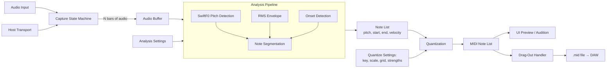

# Glirdir — Sing-to-MIDI Scratchpad — v0.3 Design Spec

**Name etymology:** Sindarin, *singer* / *song-bearer*. From *glir-* (to sing, song) + *-dir* (masculine agentive: man, one-who), with the same morphology as Lindir, the Rivendell minstrel. The suffix descends from earlier *-ndir*, related to Sindarin *dîr* (man, adult), and is distinct from *-dil* (friend/devotee, as in Eärendil) and *-dan* (wright, as in Círdan).
**Project umbrella:** Lindelion (Cargo workspace, GitHub repo).
**Target:** macOS (Apple Silicon primary), VST3.
**Status:** Planned product directory; no Cargo package exists yet.

---

## 1. Concept & Goals

A MIDI capture plugin that listens to sung/whistled/hummed input over a fixed bar window, analyzes the entire captured phrase as a whole, and emits clean quantized MIDI that the user drags out to a DAW track. The thesis: existing voice-to-MIDI tools (Dubler 2 being the dominant one) emit MIDI in real time and therefore commit to pitch decisions before the singer has finished the syllable — leading to the universally-reported workflow that "almost all generated MIDI needs editing." Glirdir captures audio, then derives MIDI from the complete phrase with global context, producing MIDI that doesn't need editing.

### Design principles

- **Capture, then analyze.** Real-time MIDI emission makes pitch decisions causally — committing while the singer is still mid-syllable. Glirdir buffers the whole phrase before deciding anything. Vibrato, scoops, and momentary pitch wobble can be resolved into stable notes by looking at the full signal.
- **Live re-derivation.** Audio is captured once. MIDI is re-derived whenever any analysis or quantization setting changes — instant feedback for "what does this sound like in F minor with 1/16 grid?"
- **No editing-after-drag.** Output MIDI should be clean enough that no post-drag editing is needed. The plugin's UI is where editing decisions happen; the dragged MIDI is the final artifact.
- **Songwriting-sketch use case.** Single shot, single take, 4/8/16 bars. Not a recording tool. Capture an idea, drag it into a clip, move on.
- **Workspace coherence.** Reuses Lindelion shared crates (`lindelion-plugin-shell`, `lindelion-onset-detect`, `lindelion-pitch-detect`, `lindelion-ui`, `lindelion-sample-library`). Introduces one new shared crate (`lindelion-midi`).

### Non-goals

- Not real-time. There is no live-MIDI-as-you-sing mode.
- Not a recording tool. Single-shot scratchpad only; no take history in v1.
- Not a beatboxing tool. Pitched melodic source only in v1; percussion mode deferred to v2.
- Not a MIDI editor. Once dragged out, the host owns the MIDI.
- Not a vocal tuner / pitch corrector. Output is MIDI, not pitched audio.

---

## 2. Signal Path



The pipeline is split into **capture** (one-time, triggered by transport) and **analysis** (re-runs whenever settings change). Audio buffer is preserved across analysis runs; only the derived MIDI is recomputed.

---

## 3. Audio Capture

### 3.1 Buffer

- Single mono buffer at 48kHz, sized for max capture length (16 bars at slowest practical tempo — e.g., 60bpm 4/4 = 64 seconds = 12MB f32). Allocated up-front at plugin instantiation.
- Capture length user-selectable: **4 bars / 8 bars / 16 bars**.
- Input source: plugin's audio input channel (mono; stereo input is summed to mono on the way in).

### 3.2 Capture state machine

```
Idle  ──[Arm pressed]──>  Armed
Armed ──[trigger met]──>  CountIn (if count-in > 0)
                          │
                          ↓
                     Capturing
                          │
                     [N bars elapsed]
                          ↓
                     Captured
                          │
              [Re-arm / Clear / Drag]
                          ↓
              Armed / Idle / (stay)
```

State persists in patch. UI shows current state prominently.

### 3.3 Sync modes (user-selectable)

| Mode               | Trigger condition                                            |
| ------------------ | ------------------------------------------------------------ |
| **Immediate**      | Capture begins as soon as armed (no host sync; works without transport playing). |
| **Bar 1 sync**     | Wait until host transport reaches bar 1 of the next loop / song-start equivalent — i.e., when `bar_position % bars_per_phrase == 0` aligned to host's song position. Useful for capturing aligned with an existing arrangement. |
| **Next downbeat**  | Wait until host transport reaches the next bar downbeat (any bar). Most flexible. |

Capture stops automatically after N bars elapsed at host tempo. If host transport stops mid-capture: capture pauses, resumes when transport resumes, or the user can cancel via the Clear button.

### 3.4 Count-in

Configurable: **0, 1, or 2 bars**. During count-in, the plugin plays a metronome click through its audio output (sine pip on downbeats, quieter pip on other beats). Click is not recorded into the audio buffer.

Count-in begins after the sync-mode trigger condition is met, immediately preceding capture.

### 3.5 Buffer persistence

- Captured audio persists with patch state (encoded as FLAC mono 48kHz inside the postcard-serialized state blob). 16-bar capture at 60bpm encodes to roughly 3-4MB FLAC.
- **Clear Scratchpad** button drops the buffer.
- Closing the plugin or DAW session preserves the scratchpad — it returns on session reload.
- **Save to Library** button — separately ingests the current scratchpad audio into the shared `lindelion-sample-library` as a regular sample (useful when a take is worth keeping as source material for Linnod or Lamath).

---

## 4. Analysis Pipeline

Runs on the captured audio. Re-runs in two tiers: capture-time analysis (pitch contour, onsets) runs once when capture completes and is cached; quantization re-derivation runs every time the user adjusts key/grid/snap and is essentially instant.

### 4.1 Frame parameters

- Sample rate for analysis: **16 kHz** (SwiftF0's native rate). Captured audio at 48 kHz is resampled to 16 kHz on entry to the analysis pipeline via `rubato`. Original 48 kHz buffer is preserved for audition and patch state.
- Hop size: **256 samples at 16 kHz** = 16 ms per frame. This is SwiftF0's native hop.
- STFT window size: handled internally by the SwiftF0 model.

16 ms hop is coarser than the previous 10 ms plan but well within tolerance for the onset/segmentation work — 16 ms is ~1/32nd note at 234 bpm, finer than any rhythmic resolution the plugin emits.

### 4.2 Pitch detection (SwiftF0)

Per frame, outputs `(f0_hz, confidence, voicing_decision)`. Implementation in shared crate `lindelion-pitch-detect`.

SwiftF0 is a ~95k-parameter convolutional neural network that runs STFT → 2D CNN → softmax over pitch bins. Pretrained weights ship as an embedded ONNX model (~400 KB) inside the `lindelion-pitch-detect` crate via `include_bytes!`. Inference runs through `tract` (pure-Rust ONNX runtime, no native dylib dependency).

Why SwiftF0 over classical pitch detection (pYIN, YIN, etc.):

- **No denormal/numerical-stability failure mode.** Classical methods accumulate state through iterative cumulative-mean-normalized-difference functions, threshold-distribution Viterbi smoothing, and recursive autocorrelation — all paths where denormals can cascade into NaN territory under unusual input conditions. SwiftF0 is feed-forward inference per frame: each frame is independent, no accumulation, no recursion.
- **Pretrained on diverse speech + music + synthetic data**, robust to background noise and varied source material.
- **Calibrated confidence output** — the low-confidence handling in §4.5.1 plugs into SwiftF0's confidence directly.
- **MIT-licensed.** No license entanglement with the rest of the Lindelion workspace.

Frequency range: 46.875 Hz (G1) to 2093.75 Hz (C7). This covers all wind instruments in Chris's playing range and full vocal range. The top of flute (D7 ≈ 2349 Hz) and piccolo range fall outside this window — see §15 open question.

For future real-time applications (e.g., Lamath v2's audio-driven ExpressionStream), PESTO is a candidate alternative with stronger per-frame streaming latency (~5ms vs SwiftF0's ~1-2ms estimated). Glirdir doesn't need that — its analysis is batch — and PESTO's LGPL-3.0 license is a complication we avoid by sticking with SwiftF0.

### 4.3 RMS envelope

Per frame (at the 16 kHz hop): windowed RMS of the audio. Used downstream for velocity mapping (§4.6) and as a secondary signal for onset detection.

### 4.4 Onset detection

Hybrid approach combining two sources from `lindelion-onset-detect`:

1. **SuperFlux** — spectral flux onset detection, tuned for soft onsets characteristic of singing.
2. **Pitch-stability** — segmentation at points where SwiftF0's pitch contour shows a discontinuous transition (sustained note A → sustained note B with a jump between). Implemented as: detect frames where the pitch derivative exceeds a threshold AND both sides have stable pitch for ≥ `min_stable_frames`.

Onsets are emitted if **either** algorithm fires, with a debounce window of `min_note_ms` (default 80ms) to suppress double-triggers. This catches both abrupt syllabic onsets (consonants, tongued attacks) and smooth legato pitch changes (slurred singing).

### 4.5 Note segmentation

Walks the per-frame `(pitch, confidence, rms)` streams plus the onset list, emitting a list of notes.

**State machine per frame:**

```
NoNote  ──[onset detected, confidence ≥ threshold]──>  InNote(pitch, velocity_accumulator)
InNote  ──[next onset]──>                              emit current note, start new
InNote  ──[end of buffer]──>                           emit current note
InNote  ──[confidence < threshold]──>                  see §4.5.1 low-confidence handling
```

Output per note: `(start_sample, end_sample, pitch_hz, peak_rms, mean_rms)`.

#### 4.5.1 Low-confidence handling

When SwiftF0 confidence drops below `confidence_threshold` (default 0.5) **during** what otherwise looks like a stable note (good onset, sustained RMS, no new onset detected):

- The note's **pitch is preserved from the previous high-confidence frame** (or, if a new onset occurred during low-confidence, from the most recent stable pitch in the current note).
- The note's **timing and velocity continue to be tracked from current frames**.

This handles the common case where a singer hits an articulation, breath, or noise burst mid-note: the pitch detector loses confidence momentarily, but the singer is musically still on the same note. Glirdir maintains the note rather than dropping it or assigning a phantom pitch.

If confidence drops at a *new* onset (the user starts a syllable but the pitch tracker can't lock on within the first few frames), the note's pitch is held at "unresolved" until confidence recovers; if confidence doesn't recover before the next onset, the note inherits the previous note's pitch (treating the unclear vocal sound as a rearticulation of the prior note).

### 4.6 Velocity mapping

Per note, the **peak RMS during the note's duration** is the velocity source. Mapping is controlled by a single knob `velocity_amount` (0–1):

```
v_constant = 100
v_dynamic  = rms_to_midi(peak_rms)
velocity   = round( (1 - velocity_amount) * v_constant + velocity_amount * v_dynamic )
```

Where `rms_to_midi` is:
- Peak capture RMS → MIDI 127
- (Peak capture RMS – 40 dB) → MIDI 1
- Linear in dB between
- Clamped to [1, 127]

At `velocity_amount = 0`, every note is velocity 100. At `velocity_amount = 1`, full dynamic range maps to 0–127.

---

## 5. Quantization

Applied to the note list produced by the analysis pipeline. Two independent quantizers: pitch and timing.

### 5.1 Pitch quantization

#### 5.1.1 Key & scale (user-set, no auto-detect)

- **Root note**: 12 chromatic options (C, C#, ..., B).
- **Scale**: chromatic, major, natural minor, harmonic minor, melodic minor, pentatonic major, pentatonic minor, blues, dorian, mixolydian, custom intervals.
- "Chromatic" effectively bypasses scale-snap (always snaps to nearest semitone).

#### 5.1.2 Snap modes (selectable, default Hard)

| Mode  | Behavior                                                                                       |
| ----- | ---------------------------------------------------------------------------------------------- |
| **Hard** | Every note forced to the nearest scale degree (in the chosen key + scale).                  |
| **Soft** | If detected pitch is within `soft_snap_cents` (default ±50¢) of a scale degree, snap to it. Otherwise, snap to nearest chromatic semitone. No pitch bends. |
| **None** | Every note snapped to nearest chromatic semitone (no scale filtering).                       |

The MIDI emitted always lands on integer note numbers — no pitch bend events. Soft snap differs from Hard only in that "out-of-key" notes survive as their chromatic neighbors instead of being pulled to the scale.

### 5.2 Timing quantization

#### 5.2.1 Grid

User-selectable resolution:
- 1/4, 1/8, 1/16, 1/32 (straight)
- 1/4T, 1/8T, 1/16T (triplets)

No swing in v1 (host can apply swing on the dragged-out MIDI).

#### 5.2.2 Strength

Slider 0–100%. For each note onset:

```
quantized_time = nearest_grid_line(note.start)
emitted_time = note.start + strength * (quantized_time - note.start)
```

At 100%, every note locked to grid. At 0%, original detected timing preserved.

Note **durations** are scaled with onsets (the gap between consecutive onsets is preserved in proportion) — the analyzed note duration from §4.5 determines emitted duration, and the next note's quantized onset doesn't override the prior note's end.

### 5.3 Re-derivation

Any change to key, scale, snap mode, grid, or strength re-runs §5 only (analysis pipeline output is cached). Re-derivation is essentially instant (~milliseconds for a 16-bar capture).

Any change to capture-stage settings (frame size, confidence threshold, onset sensitivity) re-runs §4 and §5. Still under 100ms target.

---

## 6. MIDI Emission

The quantized note list is serialized to a Standard MIDI File (Format 0, single track) in memory using `midly`.

### 6.1 MIDI structure

- **Tempo**: matches host BPM at capture time (written as a tempo meta event at tick 0).
- **Time signature**: matches host time signature at capture time.
- **PPQ**: 960 (high resolution to preserve sub-grid timing when strength < 100%).
- **Notes**: each emitted as `NoteOn(channel=0, note, velocity)` followed by `NoteOff(channel=0, note, 0)` at the appropriate tick.
- **No CC events** in v1 (no pitch bend, mod wheel, etc.).

### 6.2 Edge cases

- **Overlapping notes**: Glirdir source material is monophonic, so notes never overlap by construction. Polyphonic output is not supported (would require chord-detection logic out of scope here).
- **Notes shorter than minimum**: notes with quantized duration shorter than 1/64 (one MIDI tick at the grid resolution boundary) are extended to 1/64 minimum.
- **Empty capture**: if no notes detected (silent capture, pure noise), the MIDI file contains tempo/time-signature meta events only. Drag-out still works; the user gets an empty clip.

---

## 7. Drag-and-Drop Export

### 7.1 Drag handle

The MIDI preview area in the UI (see §10) is the drag source. Mouse-down + drag from this area initiates the OS-level drag.

### 7.2 Implementation

On drag-start:

1. Write current quantized MIDI to a temp file at `/tmp/glirdir-scratch-<uuid>.mid` (or macOS equivalent: `NSTemporaryDirectory()`).
2. File is named based on patch state — e.g., `glirdir-Cmin-16bar-120bpm.mid` — so when Ableton renames the dropped clip, the name is meaningful.
3. Initiate `NSDraggingSession` from the plugin's NSView with the temp file URL as drag pasteboard content (`kUTTypeMIDIAudio` / `public.midi-audio` pasteboard type).
4. Standard `NSDraggingSource` protocol: Ableton (and any other audio app supporting MIDI drag) accepts the drop and copies the MIDI clip onto the target track.

### 7.3 Risk: NSDragging from baseview

This is the most uncertain integration point in the spec. baseview exposes the raw NSView, but registering it as an NSDraggingSource and orchestrating the drag session requires direct Cocoa interop via `objc2` (preferred over the older `cocoa` crate).

**Risk mitigation:** validated as a spike during Step 1 of the build order (§16). If `objc2`-based dragging doesn't work cleanly within baseview's event loop, fallback options:
- Drag from a small auxiliary NSWindow rendered just behind the plugin window (workable but ugly).
- Drag via the plugin's editor view treated as a transparent overlay (cleaner, requires more event-loop wrangling).
- Worst case: "Copy MIDI to clipboard" + paste in DAW. Most DAWs support pasting MIDI clips. Loses the drag-and-drop affordance but the workflow still works.

---

## 8. Audition

A built-in audition synth lets the user hear the captured/quantized MIDI without dragging it out. Critical for the iteration loop: capture → audition → adjust key/snap/grid → audition → satisfied → drag.

### 8.1 Synth design

- Polyphonic sine oscillator (up to 4 voices, voice stealing as needed — Glirdir's output is monophonic by construction, but the synth has headroom for release tails overlapping new notes).
- Simple AD envelope (10ms attack, 200ms release).
- Mixes to the plugin's audio output.
- Audition plays in sync with host transport when host is playing; falls back to its own internal playback clock when host is stopped (so you can audition without playing the DAW).

### 8.2 Audition controls

- **Play / Stop** button — toggles audition playback.
- **Loop** toggle — loops the captured phrase indefinitely while pressed.
- **Volume** knob — audition synth's output level.
- **Audition while editing** toggle — if on, settings changes restart audition from current playhead position so you hear changes immediately.

The audition synth is intentionally simple/dry. It's a sanity check, not a presentation. The user's actual synth is the one they drop the MIDI onto in their DAW.

---

## 9. Patch & Sequencer Scope

- **Internal sequencer:** none. Glirdir doesn't sequence MIDI playback through external instruments — its output is a MIDI clip, period. Host owns sequencing.
- **Multiple captures:** v1 ships single-slot. No take history, no slot bank. Re-arming overwrites the current scratchpad.
- **Patches save:** the captured audio, derived note list (cached), quantization settings, capture settings. Reopening a project restores the scratchpad ready to re-derive or drag.

---

## 10. UI Layout

```
┌──────────────────────────────────────────────────────────────┐
│ [Patch ▾] [Save] [Load] [Library]            [MIDI] [CPU]   │
├──────────────────────────────────────────────────────────────┤
│                                                              │
│  ┌─── Transport / Capture ─────────────────────────────────┐ │
│  │  STATE: [Idle | Armed | Counting In | Capturing |       │ │
│  │          Captured]                                       │ │
│  │  Bars: [4][8][16]   Sync: [Imm.][Bar 1][Next ↓]         │ │
│  │  Count-in: [0][1][2]                                    │ │
│  │  [ARM]   [CLEAR]                                        │ │
│  └─────────────────────────────────────────────────────────┘ │
│                                                              │
│  ┌─── Audio + MIDI Preview (drag source) ──────────────────┐ │
│  │  ┌─ Audio waveform (top half) ──────────────────────┐  │ │
│  │  │  [waveform of captured audio with playhead]       │  │ │
│  │  └──────────────────────────────────────────────────┘  │ │
│  │  ┌─ MIDI piano roll (bottom half) ──────────────────┐  │ │
│  │  │  [derived MIDI as piano-roll blocks; grid lines]  │  │ │
│  │  └──────────────────────────────────────────────────┘  │ │
│  │  ⇨ DRAG MIDI FROM HERE                                  │ │
│  └─────────────────────────────────────────────────────────┘ │
│                                                              │
│  ┌── Quantize ───────┐  ┌── Audition ────┐ ┌── Velocity ─┐  │
│  │ Key: [C ▾]        │  │ [▶ Play]       │ │ Amount:     │  │
│  │ Scale: [Minor ▾]  │  │ [↻ Loop]       │ │ ──●──       │  │
│  │ Snap: [Hard ▾]    │  │ Vol: ──●──     │ │ 0 → 100     │  │
│  │ Grid: [1/16 ▾]    │  │ Live edit: ☒  │ │ 1 → 0–127   │  │
│  │ Strength: ──●──   │  └────────────────┘ └─────────────┘  │
│  └───────────────────┘                                      │
│                                                              │
│  ┌─── Detection ─────────────────────────────────────────┐  │
│  │  Confidence: ─●── 0.5    Min note: 80 ms              │  │
│  │  Onset sensitivity: ─●──                               │  │
│  └────────────────────────────────────────────────────────┘ │
│                                                              │
└──────────────────────────────────────────────────────────────┘
```

Key UI behaviors:
- The MIDI piano roll updates live as quantization settings change.
- Dragging from anywhere in the MIDI preview area initiates the OS drag.
- Capture state machine reflected in the STATE indicator + ARM button label (e.g., "ARM" → "ARMED — waiting for bar 1" → "COUNT-IN 2/2" → "CAPTURING 3/8" → "CAPTURED").
- Settings sections greyed when in Idle/Armed/Capturing states (only Captured allows quantization edits).

---

## 11. State & Presets

- Patches stored as TOML in `Patches/Glirdir/`.
- Patch contains: capture settings (bars, sync mode, count-in), analysis settings (confidence threshold, onset sensitivity, min note), quantization settings (key, scale, snap mode, grid, strength, velocity amount), and the encoded captured audio (FLAC mono 48kHz inside the patch state).
- DAW state via `IComponent::getState`/`setState`, postcard-serialized.

---

## 12. Technology Stack

Same Lindelion stack as siblings, with additions:

| Layer            | Choice                                                | Notes                                                          |
| ---------------- | ----------------------------------------------------- | -------------------------------------------------------------- |
| Plugin shell     | `lindelion-plugin-shell` (shared)                     |                                                                |
| UI               | `lindelion-ui` + Vizia direct                         | Piano-roll widget new to this plugin.                          |
| Pitch detect     | `lindelion-pitch-detect` (NEW shared crate)           | SwiftF0 ONNX model + post-processing.                          |
| ONNX runtime     | `tract` (pure Rust)                                   | Inside `lindelion-pitch-detect`. No native dylib dependency.   |
| Onset detect     | `lindelion-onset-detect` (shared with Linnod)         | SuperFlux + pitch-stability used here.                         |
| Resampling       | `rubato` (shared)                                     | 48 kHz capture → 16 kHz for SwiftF0 analysis.                  |
| MIDI             | `lindelion-midi` (NEW shared crate)                   | Quantization, key/scale logic, SMF emission via `midly`.       |
| FLAC             | `claxon` (shared)                                     | Encoding scratchpad audio into patch state.                    |
| Drag-out         | `objc2` + direct NSDragging interop                   | Plugin-local code; not a reusable crate.                       |
| Audition synth   | Inline module (no separate crate)                     | ~100 LOC.                                                      |

### 12.1 Workspace structure update

The previously-planned `lindelion-pitch-detect` crate switches its core algorithm from pYIN to SwiftF0. The crate's public API stays effectively the same — frame-by-frame `(f0_hz, confidence)` output plus a streaming wrapper — only the implementation underneath changes. Includes the SwiftF0 ONNX model embedded via `include_bytes!` (~400 KB).

Updated workspace:

```
lindelion/                                  # GitHub repo root
├── Cargo.toml                              # Workspace
├── crates/
│   ├── lindelion-plugin-shell/             # VST3 + baseview + Vizia
│   ├── lindelion-sample-library/           # SQLite library
│   ├── lindelion-dsp-utils/                # Biquads, SVF, smoothing
│   ├── lindelion-ui/                       # Common widgets + piano roll
│   ├── lindelion-onset-detect/             # SuperFlux, ComplexFlux, etc.
│   ├── lindelion-pitch-detect/             # SwiftF0 ONNX inference + post-processing
│   ├── lindelion-psola/                    # PSOLA only; epoch detection self-contained (peak-picking on per-period autocorrelation, not pYIN)
│   └── lindelion-midi/                     # Quantization + SMF (NEW)
└── plugins/
    ├── lamath/                             # Breath-excited resonator
    ├── linnod/                             # Melodic sample slicer
    └── glirdir/                            # This plugin
```

The Linnod design's PSOLA implementation needs a small adjustment: since SwiftF0 doesn't output per-period epochs (it's frame-based, not period-based), PSOLA's epoch detection becomes self-contained within `lindelion-psola` — peak-picking on per-period autocorrelation windows informed by SwiftF0's pitch contour. Spec update for Linnod deferred until that plugin's implementation pass.

---

## 13. Performance

### 13.1 Capture (audio thread)

Buffer write only — single mono sample copy per audio thread tick. Trivially cheap.

### 13.2 Audition (audio thread)

Up to 4 sine voices + envelopes. ~50 ops/sample. Trivially cheap.

### 13.3 Analysis (worker thread, off audio thread)

Pipeline cost is dominated by SwiftF0 inference. Per the SwiftF0 benchmarks (132 ms for 5 seconds of audio on CPU), expect roughly:

- 16-bar capture at 60 bpm = 64 seconds of audio → ~1.7 s analysis on i7-class CPU, estimated 500-800 ms on M-series silicon (Neon-accelerated tract inference).
- 16-bar capture at 120 bpm = 32 seconds → 250-400 ms on M-series.
- 4-bar capture at 120 bpm = 8 seconds → ~70-100 ms on M-series.

For larger captures, this exceeds the original "<100ms re-derivation" target — but **re-derivation isn't re-analysis**. The pitch contour and onset list are computed once and cached when capture completes. Subsequent settings changes (key, scale, snap, grid, strength) only re-run quantization, which operates on a list of 50-200 notes and finishes in under 1ms.

So the UX commitment is:

- **Capture → first MIDI:** "Analyzing..." spinner, completes in the 70-800 ms range depending on capture length. One-time cost.
- **Settings change → updated MIDI:** instant. Sub-frame.

If the analyzing spinner ever becomes annoying, mitigations available:

1. **Parallelize across cores via rayon.** SwiftF0 inference is per-frame independent; batch frames across cores. M2/M3 8 cores → 4-6× speedup.
2. **CoreML execution provider.** Swap `tract` for `ort` with CoreML EP, runs SwiftF0 on Apple Neural Engine. ~10× speedup expected. Adds native dylib dependency.
3. **Streaming inference during capture.** Run SwiftF0 in real-time on the incoming audio buffer as the capture progresses, so analysis is essentially complete by the time capture ends. Per-frame latency ~1-2 ms; well within real-time budget. This is the eventual right answer and removes the "analyzing" spinner entirely.

V1 ships the straightforward batch path. Streaming-during-capture is a v1.1 polish optimization.

### 13.4 Re-derivation cost

Pure quantization (no re-analysis) is on a note list of ~50-200 notes. Trivially milliseconds. Live UI updates as user slides quantize strength.

---

## 14. V1 Scope vs V2 Extensions

### V1 (ships)

- Single-slot scratchpad
- 4 / 8 / 16 bar capture
- Three sync modes (immediate, bar 1, next downbeat)
- 0/1/2 bar count-in
- SwiftF0 pitch detection + RMS + SuperFlux/pitch-stability hybrid onset detection
- Low-confidence pitch handling (preserve previous note's pitch)
- User-set key + scale (no auto-detect)
- Three snap modes (hard, soft, none)
- Grid quantization with strength slider
- RMS-based velocity with amount knob
- Audition synth
- Drag MIDI to host
- Patch save/load including encoded scratchpad audio
- DAW state persistence

### V2 architectural seams (designed-in, not implemented)

- **Multi-take history** — keep last N captures, recall any, drag any.
- **Percussion mode** — unpitched onset detection → user-mappable MIDI notes (chest-thump → kick, hi-hat sound → hat).
- **Polyphonic capture** — chord detection on the captured audio for multi-note simultaneity (significant scope).
- **Pitch bend output** — for sub-semitone expression, optionally emit pitch bend CCs alongside notes.
- **CC capture** — capture vowel formants → CC, breath energy → CC for expression-controller workflows.
- **Auto-detect key** — Krumhansl-Schmuckler key-finding as an optional suggestion (user always confirms).
- **Loop / overdub** — re-arm extends the capture instead of overwriting.
- **MIDI 2.0 / MPE output** — higher-resolution velocity and per-note expression.

---

## 15. Open Questions

1. **Audition synth scope.** Pure sine is minimal but uncharacterful. Should there be a small built-in voice palette (sine, triangle, saw, FM bell) so the audition sounds something like the user's intended target instrument? Argument against: it's a sanity check, not a presentation; users should drag MIDI to their real synth quickly rather than over-tweaking against the audition.

2. **Bar 1 sync semantics.** "Next bar 1" needs definition: bar 1 of the session, bar 1 of the loop region, or every Nth bar where N matches the capture length? The third is most musically useful (capture aligned with phrase boundaries) but most surprising — needs a clear UI label.

3. **MIDI clip naming on drag.** Current spec: `glirdir-Cmin-16bar-120bpm.mid`. Useful but verbose. Acceptable, or prefer a shorter name (and accept that Ableton will rename it to "MIDI Clip 1" or similar on drop)?

4. **Confidence threshold UI exposure.** Default 0.5 is reasonable. Should it be exposed as a user knob (more control, more rope) or hidden as an advanced setting (cleaner UI, less customization)? Lean: exposed but secondary.

5. **Live edit toggle in audition.** When on, every settings change restarts audition from current playhead position. Could also: just smoothly re-derive the MIDI underneath ongoing audition (notes "shift" as the user adjusts grid strength). Latter is fancier but might be visually/audibly disorienting. Lean: simple restart.

6. **Should the audition synth output pass through the plugin's audio output, or be routable to a separate output?** Latter would let users keep the audition out of the master mix while previewing. v2 likely; v1 ship single-output.

7. **SwiftF0 frequency range cap (C7 = 2093 Hz).** Covers vocal range, clarinet, alto/soprano flute completely. Upper end of concert flute (D7 ≈ 2349 Hz) and piccolo fall above the model's range. Three options: (a) accept the cap and document it (most likely fine for songwriting-sketch use); (b) detune-and-detect — apply an octave-down pitch shift to incoming audio, run SwiftF0, then octave-up the detected pitch (works but degrades quality at upper extremes); (c) add a fallback secondary detector for high-range content (significant scope). Lean (a).

8. **Anything inherently broken about the workflow that I haven't caught?** Specifically: anyone who sketches songs by singing — is the capture-then-drag flow actually how they'd want to work, or is there a missing affordance?

---

## 16. Implementation Sequence

Concrete observable acceptance criteria per step.

### Step 1 — Drag-out integration spike

This is the highest-risk piece. Validate it before building anything else, so the rest of the plugin doesn't get built around an assumption that turns out broken.

- Standalone test plugin (built from `lindelion-plugin-shell` skeleton) with a single button.
- Pressing the button creates a temp .mid file with a hardcoded one-bar C major scale.
- Dragging from the button area initiates NSDragging.
- Dropping on an Ableton MIDI track creates a clip containing the C major scale.

**Acceptance:** drag works reliably in Ableton on Mac. If broken, evaluate fallback options before proceeding (see §7.3).

### Step 2 — Audio capture state machine

- Buffer allocation, capture state machine, three sync modes, count-in.
- Visualize captured audio as a waveform in the UI.
- Arm → wait for trigger → count-in → capture → captured.

**Acceptance:** arm the plugin, hit play in Ableton, sing into the input, see the captured waveform appear after N bars.

### Step 3 — SwiftF0 integration + visualization

- `lindelion-pitch-detect` crate with SwiftF0 ONNX model embedded, `tract` inference path, and a frame-iterator API.
- Resampling pipeline: 48 kHz captured audio → 16 kHz for analysis via `rubato`.
- Run SwiftF0 over captured audio, overlay pitch contour and confidence band on the waveform display.

**Acceptance:** capture audio, see a smooth pitch line drawn over the waveform with low-confidence regions visually distinguished. Confirm no denormal/NaN artifacts in pathological inputs (silence, clipped audio, pure noise).

### Step 4 — Onset + segmentation + naive MIDI

- SuperFlux + pitch-stability onset detection from `lindelion-onset-detect`.
- Note segmentation per §4.5 including low-confidence pitch hold.
- Render derived notes as a piano-roll display below the waveform.
- No quantization yet — notes shown at detected pitches and times.

**Acceptance:** sing a melody, see piano-roll notes appear matching what was sung (uncleanly, but visibly).

### Step 5 — Quantization + key/scale snap

- `lindelion-midi` crate with key/scale logic and grid quantization.
- Wire key, scale, snap mode, grid, strength controls.
- Piano-roll updates live as quantization settings change.

**Acceptance:** sing a sloppy melody in C, set key=C scale=Major snap=Hard, see notes snap to scale; toggle snap modes and watch the piano-roll change.

### Step 6 — Velocity mapping

- Per-note peak RMS extraction.
- Velocity amount knob wired through the v=f(rms,amount) formula.
- Piano-roll renders note blocks with velocity-correlated opacity or height.

**Acceptance:** sing dynamically, set velocity amount = 1, see varied note heights; set amount = 0, see uniform notes.

### Step 7 — Audition synth

- Polyphonic sine synth with AD envelope.
- Play / loop / volume controls.
- Sync to host transport when playing; internal clock when stopped.
- Live-edit toggle.

**Acceptance:** hit play on audition, hear the captured/quantized melody back as sine tones; adjust grid strength while playing, hear timing change.

### Step 8 — MIDI emission + drag-out (full)

- `midly` SMF write of current quantized notes.
- Wire drag-out from MIDI preview area to the temp-file + NSDragging flow validated in Step 1.

**Acceptance:** capture, audition, adjust quantization, drag the MIDI preview onto an Ableton track, see a clean MIDI clip appear.

### Step 9 — State persistence

- Patch save/load with embedded FLAC-encoded scratchpad audio.
- DAW state save/restore (close project, reopen, scratchpad and settings restored).
- "Save to Library" action ingests scratchpad into shared `lindelion-sample-library`.

**Acceptance:** capture, save Ableton project, close, reopen → plugin restores with audio and derived MIDI ready to re-derive/drag.

### Step 10 — Polish

- UI refinement, especially the piano-roll and waveform rendering performance.
- SwiftF0 inference performance pass (profile, evaluate CoreML EP swap, consider streaming-during-capture optimization).
- Validator regression.

**Acceptance:** plugin passes validator; 16-bar capture re-derives MIDI in under 100ms on M-series silicon; UI is responsive during re-derivation.

---

## Appendix A — Glossary

- **SwiftF0:** lightweight convolutional neural network for monophonic fundamental frequency estimation. ~95k parameters, MIT-licensed, ships as a pretrained ONNX model. Used by Lindelion as the pitch detector across all plugins.
- **PESTO:** alternative neural pitch detector from Sony CSL Paris (LGPL-3.0). Stronger streaming-latency profile but slower in batch mode. Candidate for future real-time pitch applications inside Lindelion if SwiftF0's per-frame latency proves insufficient.
- **ONNX (Open Neural Network Exchange):** a portable model file format. SwiftF0 ships as ONNX; runtime inference handled by `tract`.
- **tract:** pure-Rust ONNX inference runtime. No native dylib dependency; ships as a Cargo crate.
- **Onset:** time instant marking the start of a musical event.
- **SuperFlux:** spectral-flux-based onset detection with trajectory tracking; designed for soft onsets.
- **Pitch-stability segmentation:** segmentation of audio at points where the pitch contour shows discontinuous transitions between sustained pitch periods.
- **Krumhansl-Schmuckler:** classical algorithm for key detection from pitch class histograms via template correlation. Used in some music-information-retrieval tools; v2 may add as optional auto-detect.
- **Scratchpad:** the plugin's single-slot capture buffer. Holds audio + derived MIDI.
- **Drag-out:** the gesture of dragging from inside the plugin window onto a DAW track, initiating an OS-level file drag of the emitted MIDI.
