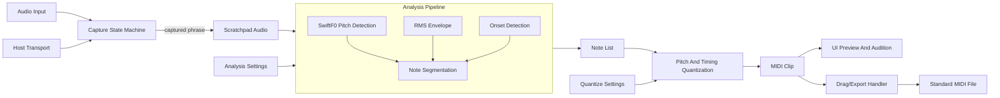

# Glirdir - Current Implementation Spec

**Name:** Glirdir
**Name etymology:** Sindarin, "singer" or "song-bearer." From `glir-` (to sing, song) plus `-dir` (masculine agentive).
**Target:** macOS VST3 audio effect, Apple Silicon primary.
**Status:** VST3 sing-to-MIDI scratchpad with editor surface, drag/export fallback paths, sample-library scratchpad save, patch/state persistence, and macOS bundle support.

This document describes the behavior implemented in the workspace today. Planned work for Glirdir lives in [glirdir-backlog.md](glirdir-backlog.md).

---

## 1. Concept And Goals

Glirdir is a MIDI capture plugin that records sung, whistled, hummed, or instrumental monophonic input over a fixed bar window, analyzes the completed phrase, and emits quantized MIDI for drag/export into the host.

The core thesis is capture-first analysis. Real-time voice-to-MIDI commits to pitch decisions before the syllable or note has fully developed; Glirdir waits until the full phrase is available so vibrato, scoops, weak attacks, and momentary confidence drops can be resolved with global context.

Design principles:

- Capture, then analyze. No live MIDI stream is emitted while recording.
- Re-derive from the preserved scratchpad. Quantization and musical settings can change without re-recording.
- Keep the host as the MIDI editor. The plugin produces a clean clip artifact; the host owns sequencing after export.
- Single-shot songwriting scratchpad. One capture buffer is active at a time.
- Reuse shared Lindelion crates for capture, pitch, onset, MIDI, UI, sample-library, patch/state, and plugin-shell boundaries.

Primary host target: Ableton and Logic on macOS.

---

## 2. Signal Path



The pipeline is split into capture, analysis, quantization, audition, and export. Capture is one-time for a scratchpad. Analysis is cached after capture completion. Quantization re-runs when musical settings change.

---

## 3. Current Implementation Boundary

| Module | Role |
| ---- | ---- |
| `lindelion-capture` | Shared audio-input capture state machine using `ProcessContext` input and transport data. Capture completion is finalized off the audio thread. |
| `analysis.rs` and `analysis_job.rs` | Product orchestration around shared phrase analysis, Glirdir MIDI clip derivation, and analysis caching. |
| `parameters.rs` | Host parameter registry, patch binding, typed codecs, and patch application policy. |
| `patch.rs` and `patch_io.rs` | Serializable patch schema, scratchpad context, and shared `TomlPatchFormat` adapters. |
| `audition.rs` | Transport-aware sine audition renderer using shared MIDI clip DTOs and DSP smoothing. |
| `plugin.rs` | `AudioPlugin` implementation around the shared shell boundary. |
| `vst3_entry/` | VST3 processor/controller/messages/editor bridge with typed UI commands and status payloads. |
| `lindelion-ui::glirdir_vizia` | Product editor host contract, macOS Vizia surface, waveform preview, piano-roll preview, parameter controls, and command buttons. |

---

## 4. Audio Capture

### 4.1 Buffer

- Single mono scratchpad buffer at 48 kHz.
- Capture length is user-selectable: 4, 8, or 16 bars.
- Audio input is summed to mono before entering the scratchpad.
- The buffer is allocated up front and written from the audio thread without allocation.

### 4.2 Capture State Machine

```text
Idle -> Armed -> CountIn -> Capturing -> Captured
  ^                                      |
  |------------- Clear/Re-arm -----------|
```

The state persists in patch/state. The UI presents the active state and capture progress.

### 4.3 Sync Modes

| Mode | Trigger |
| ---- | ---- |
| Immediate | Capture begins as soon as armed. |
| Bar 1 sync | Capture begins when host musical position aligns to the selected phrase interval. |
| Next downbeat | Capture begins at the next host bar downbeat. |

Capture stops automatically after the selected bar count at the capture-time tempo. If host transport stops mid-capture, capture pauses and resumes with transport unless the user clears it.

### 4.4 Count-In

The count-in can be 0, 1, or 2 bars. The metronome click is rendered to the plugin output but is not recorded into the scratchpad.

### 4.5 Persistence And Library Save

- Patch files remain TOML-backed settings.
- VST3 state stores patch TOML without scratchpad audio and carries captured audio plus capture-time tempo/time-signature metadata as a separate bounded binary f32 payload.
- `Clear Scratchpad` drops the buffer.
- DAW project reload restores the scratchpad.
- `Save to Library` writes the scratchpad to a temporary mono WAV and ingests it through `lindelion-sample-library`.

---

## 5. Analysis Pipeline

Analysis runs on captured audio after capture completion. Capture-time analysis is cached; quantization re-derivation is separate and fast.

### 5.1 Frame Parameters

- Analysis sample rate: 16 kHz.
- Capture-rate audio is resampled through shared DSP interpolation before pitch analysis.
- SwiftF0 hop size: 256 samples at 16 kHz, or 16 ms.
- Original capture-rate audio is preserved for audition and state.

### 5.2 Pitch Detection

SwiftF0 runs through `lindelion-pitch-detect`. It emits `(f0_hz, confidence, voicing_decision)` per frame. The embedded ONNX model is shipped inside the pitch-detect crate and runs through the pure-Rust `tract` runtime.

SwiftF0 is used because it is feed-forward per frame, carries calibrated confidence output, is robust across speech/music/synthetic material, and has a compatible license for this workspace.

Frequency range is G1 through C7. Inputs above that range are handled as bounded/finite analysis cases but are not specially optimized.

### 5.3 RMS And Onset Detection

The RMS envelope is computed per analysis frame and feeds velocity mapping plus segmentation.

Onset detection combines shared `lindelion-onset-detect` sources:

- SuperFlux for soft spectral onsets;
- pitch-stability segmentation for discontinuous pitch transitions between stable regions.

An onset is accepted if either source fires, with a debounce window controlled by the minimum note length.

### 5.4 Note Segmentation

Segmentation walks pitch, confidence, RMS, and onset streams and emits notes with start sample, end sample, pitch, peak RMS, and mean RMS.

Low-confidence handling preserves musical continuity:

- When confidence drops inside an otherwise stable note, timing and velocity continue while pitch holds the last reliable value.
- When a new onset starts during low confidence, the note pitch remains unresolved until confidence recovers.
- If confidence does not recover before the next onset, the new note inherits the previous stable pitch.

### 5.5 Detection Quality Coverage

Fast CI coverage uses synthetic fixture-style tests for the cases most likely to cause post-export cleanup:

- silence and breath/noise avoid phantom notes;
- clipped input stays finite;
- soft vowel entries and hard consonant-style restarts create expected note boundaries;
- vibrato and gradual scoops collapse to one stable note;
- legato pitch jumps split without requiring an energy transient;
- repeated same-pitch articulation remains two notes;
- low-register and high-near-boundary inputs remain finite and quantized.

The shared SwiftF0 crate also runs a real inference test against a synthetic pitched sine.

---

## 6. Quantization

Glirdir applies independent pitch and timing quantizers to the analyzed note list.

### 6.1 Pitch Quantization

User settings:

- root note;
- scale: chromatic, major, natural minor, harmonic minor, melodic minor, pentatonic major, pentatonic minor, blues, dorian, mixolydian, or custom intervals;
- snap mode: `Hard`, `Soft`, or `None`.

Behavior:

- `Hard` forces every note to the nearest selected scale degree.
- `Soft` snaps near-scale notes to the scale and otherwise keeps nearest chromatic semitone.
- `None` snaps to the nearest chromatic semitone only.

Emitted MIDI uses integer note numbers and no pitch bend.

### 6.2 Timing Quantization

Grid choices:

- 1/4, 1/8, 1/16, 1/32;
- 1/4T, 1/8T, 1/16T.

Strength is 0-100 percent. At full strength, starts land on the nearest grid line. At zero strength, analyzed timing is preserved. Durations derive from analysis, are extended to the minimum duration when needed, and are laid out as a monophonic stream.

### 6.3 Re-Derivation

Changes to key, scale, snap mode, grid, strength, or velocity amount re-run quantization only. Changes to analysis controls re-run analysis and quantization.

---

## 7. MIDI Emission

Glirdir serializes Standard MIDI File Format 0 clips in memory using `midly`.

Clip structure:

- tempo meta event from capture-time host BPM;
- time-signature meta event from capture-time host meter;
- PPQ 960;
- channel 0 note-on and note-off events;
- deterministic filesystem-safe filename such as `glirdir-Cmin-4bar-120bpm.mid`.

Edge cases:

- Source is monophonic and export enforces non-overlapping notes.
- Notes shorter than the minimum are extended.
- Empty captures export a tempo/time-signature-only MIDI file so drag/export behavior stays predictable.

---

## 8. Drag And Export

The MIDI preview area is the drag source. On drag-start:

1. The editor asks the VST3 controller for a drag-ready temp MIDI file.
2. The controller requests a fresh worker export for the current derivation, or writes an empty MIDI file with tempo metadata when no notes exist.
3. Temp files are written under the OS temp directory in `lindelion-glirdir-midi-drag/` with bounded cleanup.
4. The plugin attempts an AppKit file drag from the embedded NSView.
5. If direct drag cannot start, the controller places the file URL on the macOS pasteboard.

The editor export icon also opens a save dialog and copies the same temp MIDI file to a user-selected path.

---

## 9. Audition

Audition lets the user hear the derived MIDI before dragging it out.

Current design:

- polyphonic sine oscillator with up to four voices;
- simple attack/release envelope;
- output through the main stereo bus;
- host-position sync when transport is playing;
- internal playback clock when host transport is stopped.

Controls:

- play/stop;
- loop;
- volume;
- audition while editing.

---

## 10. UI Layout

The Vizia editor exposes:

- top bar with patch, save/load, library, MIDI activity, and CPU/status controls;
- transport/capture panel with state, bars, sync mode, count-in, arm, and clear;
- combined waveform and MIDI piano-roll preview that acts as the drag source;
- quantize controls for key, scale, snap, grid, and strength;
- audition controls;
- velocity amount control;
- detection controls for confidence, minimum note length, and onset sensitivity.

The MIDI preview updates when quantization settings change. Analysis status is surfaced while worker analysis is active.

---

## 11. State And Presets

- Patches are versioned through shared `TomlPatchFormat<GlirdirPatch>`.
- Patch state contains capture settings, analysis settings, quantization settings, audition settings, and optional scratchpad audio metadata.
- VST3 state uses a versioned Glirdir envelope with TOML settings stored separately from bounded binary scratchpad audio.
- The active scratchpad, capture-time tempo/meter, and cached derivation can be restored after DAW project reload.

---

## 12. Technology Stack

| Layer | Choice | Notes |
| ---- | ---- | ---- |
| Plugin shell | `lindelion-plugin-shell` | Shared VST3 boundary, parameters, state, process context, transport, and messages |
| UI | `lindelion-ui` with Vizia direct | Product editor, waveform preview, piano roll, and commands |
| Capture | `lindelion-capture` | Shared audio-input capture state machine |
| Pitch detect | `lindelion-pitch-detect` | SwiftF0 ONNX inference and post-processing |
| ONNX runtime | `tract` | Pure Rust runtime |
| Onset detect | `lindelion-onset-detect` | SuperFlux and pitch-stability sources |
| Resampling | `lindelion-dsp-utils` | Capture-rate audio to 16 kHz analysis input |
| MIDI | `lindelion-midi` | Quantization, key/scale logic, and SMF emission |
| Scratchpad state | Bounded binary f32 payload | Current VST3 state representation |
| Sample library | `lindelion-sample-library` | Scratchpad WAV ingest, hashing, indexing, and moved-file recovery |
| Drag/export | `objc2` and direct AppKit interop | Product-local macOS drag path with pasteboard/export fallback |
| Audition synth | Product-local module | Lightweight MIDI sanity check |

---

## 13. Performance

Audio-thread work:

- capture writes one mono sample per input tick;
- audition renders up to four simple sine voices;
- no analysis runs on the audio thread.

Worker analysis is dominated by SwiftF0 inference. Capture-to-first-MIDI can show an analyzing state for longer captures. Subsequent musical setting changes reuse cached analysis and re-run quantization on the note list.

UX commitment:

- capture to first MIDI: bounded worker job with visible status;
- settings change to updated MIDI: interactive re-derivation.

---

## 14. VST3 Bundle Metadata

| Field | Value |
| ---- | ---- |
| Bundle name | `Glirdir` |
| Executable | `Glirdir` |
| Bundle identifier | `com.ahara.glirdir` |
| VST3 subcategory | `Fx` |
| Processor CID | `7C2E2B8AB1C44F0DA6F924276C9E0D5B` |
| Controller CID | `0D0466D253E446E58E90CF1325B5E241` |

Glirdir is an audio-effect VST3. It exposes an audio input bus, a stereo output bus, and no MIDI input. It produces MIDI files for drag/export rather than live MIDI output.

---

## Appendix A - Glossary

- **SwiftF0:** lightweight convolutional neural network for monophonic fundamental frequency estimation.
- **ONNX:** portable model file format used for the embedded SwiftF0 model.
- **tract:** pure-Rust ONNX inference runtime.
- **Onset:** time instant marking the start of a musical event.
- **SuperFlux:** spectral-flux onset detection with trajectory tracking.
- **Pitch-stability segmentation:** splitting audio where the pitch contour shows discontinuous transitions between stable pitch periods.
- **Scratchpad:** the plugin's single active capture buffer.
- **Drag-out:** dragging from inside the plugin window to create an OS-level file drag of the emitted MIDI.
