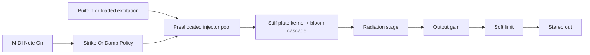

# Lamath Cymbal - Current Implementation Spec

**Name:** Lamath Cymbal
**Target:** VST3 instrument bundle on the Lamath-family build paths; Linux validates the library and DSP tests.
**Status:** Stiff-plate physical cymbal with a nonlinear bloom cascade, one excitation slot, seven host parameters, and a sparse Vizia editor.

---

## 1. Product Boundary

Lamath Cymbal is a struck-idiophone instrument built on the stiff-plate physical model in
`lindelion-idiophone` ([ADR-0050](../adr/0050-cymbal-stiff-plate-fdtd.md)). The product
crate owns patch serialization, the seven-parameter host surface, MIDI strike/damp policy,
excitation-slot state, VST3 entry points, and editor plumbing.

Non-goals in this product:

- no dual resonator A/B design;
- no modal/tube/string selector;
- no sidechain or streamed live excitation;
- no Lamath modulation matrix;
- no multi-slot articulation system.

---

## 2. Physical Model And Signal Path

The resonator is an explicit FDTD scheme for the Kirchhoff plate with a tension term
(`ü = −κ²∇⁴u + c²∇²u − losses`) on a rectangular grid sized from the stability condition,
with distributed σ₀ + σ₁∇² losses calibrated in closed form to two T60 targets. Boundaries
are free (variational Neumann form) below `Material` 0.5 and simply supported above.

The nonlinear bloom is a per-edge tension-modulation cascade: each grid edge stiffens with
its own strain (`wₑ = c² + span·min(γsₑ, 1)`), the divergence-form/energy-conserving
discretization, clamped inside the grid's closed-form stability budget. The cascade
generates the velocity-dependent mid/high wash and air of a hard strike; its slow (DC)
component — the gong pitch glide — is dosed per voicing (`∝ 1/κ²`), so thin gongs bend and
stiff rides hold pitch. The bloom's drive is the plate's own mean bending strain, never
output level.

Strikes are unipolar contact-force pulses whose duration carries hardness (hard stick
≈ 0.45 ms, soft mallet ≈ 3.5 ms, jazz brush = eight light contacts over ≈ 15 ms, bell
stick ≈ 0.2 ms), injected through a Gaussian contact aperture. The radiated output is a
sparse point-cluster velocity tap through a band-limited volume-acceleration stage whose
corner is the per-voicing coincidence frequency (`f_c = c_air²/2πκ`), crossfaded between
tap positions on note retunes.

Ordinary note-ons strike the persistent cymbal body; the played note moves the strike and
pickup positions over the plate (modal color selection), never the tuning. MIDI notes C-2
through B-2 (notes 0 through 11) damp the body with a 60 ms choke ramp and clear the ring
when the choke reaches silence. An output-energy gate with a post-strike hold skips the
stencil when the body is silent.

The processor keeps a fixed 16-injector pool so repeated strikes can overlap without
allocating on the audio thread.

The nine Basic-tab voices (Default, Ride, Kit Ride, Crash, Kit Crash, Splash, China, Gong,
Triangle) are curated points in the seven-parameter space; the `Size` control's bottom
segment reaches bell/triangle register (a ≈ 6 cm plate) while the rest of its range spans
≈ 10"–26" plates.

---

## 3. Patch And Parameters

The patch stores seven sound controls plus an optional loaded excitation sample:

| Host parameter | Patch field | Range | Default |
| ---- | ---- | ---- | ---- |
| `Material` | `material` | `0..1` | `0.65` |
| `Size` | `size` | `0..1` | `0.74` |
| `Damping` | `damping` | `0..1` | `0.28` |
| `Tension` | `tension` | `0..1` | `0.55` |
| `Strike` | `strike_position` | `0..1` | `0.42` |
| `Spread` | `pickup_spread` | `0..1` | `0.42` |
| `Output` | `output_gain_db` | `-24..12 dB` | `-3.0 dB` |

The editor derives its knob list from the same parameter metadata used by the VST3 controller. The optional sample is stored as a shared `SampleReference`; if it is absent or resolves to an empty buffer, the built-in excitation is used.

---

## 4. UI And Excitation Slot

The Vizia editor is deliberately sparse:

- one audio-file excitation slot with built-in fallback;
- drag-and-drop and file-browser assignment through shared audio-file slot components;
- waveform/slot state provided by shared UI services;
- seven knobs for the complete host parameter surface.

The slot is a cymbal excitation source, not a sampled-instrument voice. Played pitch still moves the strike/pickup layout, while the resonating body owns the audible decay.

---

## 5. VST3 And State

`lamath-cymbal` builds as both `cdylib` and `rlib`. The default `vst3-entry` feature exports the VST3 factory for DAW bundles. Consumers such as the Lamath render catalog can depend on the library with `default-features = false` to call the processor without exporting duplicate VST3 entry points.

Patch state is versioned TOML through the product's `patch_io` adapter and shared shell state helpers.

---

## 6. Validation

`make ci` covers the fast path, including:

- patch and VST3 state roundtrips;
- VST3 factory/editor/bus/parameter behavior;
- no-allocation MIDI strike processing;
- finite and bounded output;
- loaded excitation behavior;
- retune/restrike behavior;
- damp key behavior;
- material, size, damping, tension, strike, spread, and output-gain axes.

`make test-integration` covers heavier cymbal sweeps, including sustained ring behavior and finite/bounded/audible timbre sweeps.

The Lamath-family review renderer exercises the same processor through the historical `make render-lamath-audio` invocation for the mesh/cymbal catalog cases.
