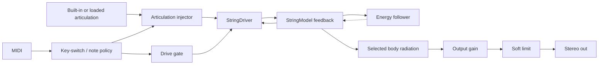

# Lamath Stringed - Current Implementation Spec

**Name:** Lamath Stringed
**Target:** VST3 instrument bundle on the Lamath-family build paths; Linux validates the library and DSP tests.
**Status:** Extracted string product with driver/body selection, eight articulation slots, seven host parameters, model-switch UI, and a sparse Vizia editor.

---

## 1. Product Boundary

Lamath Stringed is the focused extraction of Lamath's string model. It keeps the validated string waveguide, pick/bow driver, and reduced-body coupling while discarding the original Lamath machinery around dual resonators, waveguide selection, modulation, streamed excitation, and sidechain input.

The reusable physical model lives in `lindelion-string` as `StringModel` plus `StringDriver`. The product crate owns patch serialization, the seven-parameter host surface, MIDI/key-switch policy, articulation-slot state, driver/body selection, VST3 entry points, and editor plumbing.

Non-goals in this product:

- no dual resonator A/B design;
- no modal/mesh/tube selector;
- no sidechain or streamed live excitation;
- no Lamath modulation matrix;
- no sampler-style pitched playback.

---

## 2. Signal Path

The processor is monophonic. A note-on sets the current pitch, opens the drive gate, and injects the selected articulation into the selected driver. A note-off for the held note closes the gate. The processor oversamples the string model by 2x and returns mono string output to both stereo channels.

---

## 3. Patch And Parameters

The patch stores seven sound controls, a driver selector, a body selector, three model switches, a selected articulation, and eight articulation slots:

| Host parameter | Patch field | Range | Default |
| ---- | ---- | ---- | ---- |
| `Brightness` | `brightness` | `0..1` | `0.62` |
| `Damping` | `damping` | `0..1` | `0.34` |
| `Stiffness` | `stiffness` | `0..1` | `0.72` |
| `Strike` | `strike_position` | `0..1` | `0.36` |
| `Pickup` | `pickup_position` | `0..1` | `0.82` |
| `Body mix` | `body_balance` | `0..1` | `0.38` |
| `Output` | `output_gain_db` | `-24..12 dB` | `-8.0 dB` |

Driver selection:

- `None`;
- `Pick`;
- `Bow`.

Body selection:

- `Disabled`;
- `Guitar`;
- `Violin`.

Model switches:

- `body_contact`;
- `bow_drive`;
- `tension`.

When the driver is `Bow` and `bow_drive` is disabled, the current processor selects no active driver. `body_contact` controls body coupling and `tension` controls energy-dependent tension modulation.

---

## 4. Articulations And Key Switches

Lamath Stringed has eight articulation slots. Each slot has a built-in excitation and can optionally hold a loaded audio file through the shared audio-file slot-list UI. If a loaded file is absent or empty, the slot falls back to its built-in excitation.

Built-in slot names:

| Slot | Key switch | Name |
| ---- | ---- | ---- |
| 0 | C-2 | `Pick` |
| 1 | C#-2 | `Sforzando` |
| 2 | D-2 | `Legato` |
| 3 | D#-2 | `Staccato` |
| 4 | E-2 | `Marcato` |
| 5 | F-2 | `Tremolo` |
| 6 | F#-2 | `Harmonic` |
| 7 | G-2 | `Soft` |

MIDI notes C-2 + n select slot n and do not trigger a played note. Other note-ons play the current string voice with the selected articulation.

---

## 5. UI

The Vizia editor is deliberately sparse and instrument-shaped:

- driver selector: none, pick, bow;
- body selector: disabled, guitar, violin;
- seven knobs for the complete host parameter surface;
- switches for body contact, bow drive, and tension;
- eight articulation slots with shared drag-and-drop/file-browser assignment.

The UI does not expose Lamath's old resonator family choices, sidechain controls, live-excitation controls, or modulation controls.

---

## 6. VST3 And State

`lamath-stringed` builds as both `cdylib` and `rlib`. The default `vst3-entry` feature exports the VST3 factory for DAW bundles. Consumers such as the Lamath render catalog can depend on the library with `default-features = false` to call the processor without exporting duplicate VST3 entry points.

Patch state is versioned TOML through the product's `patch_io` adapter and shared shell state helpers.

---

## 7. Validation

`make ci` covers the fast path, including:

- patch and VST3 state roundtrips;
- VST3 factory/editor/bus/parameter behavior;
- no-allocation processing;
- default-note audibility;
- loaded excitation behavior;
- driver, body, and switch materiality;
- articulation attack behavior;
- tuning/register behavior;
- onset-click guards;
- brightness and body-balance axes.

`make test-integration` covers heavier string register sweeps with a velocity/register-aware sustained-audibility floor. Shared `lindelion-string` tests cover the string kernel's body coupling, tension modulation, register behavior, matrix sweeps, and extreme-drive behavior.

The Lamath-family review renderer exercises the same processor through the historical `make render-lamath-audio` invocation for string catalog cases.
