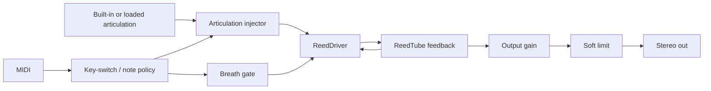

# Lamath Tube - Current Implementation Spec

**Name:** Lamath Tube
**Target:** VST3 instrument bundle on the Lamath-family build paths; Linux validates the library and DSP tests.
**Status:** Extracted reed-driven tube product with eight articulation slots, eight host parameters, model-switch UI scaffolding, and a sparse Vizia editor.

---

## 1. Product Boundary

Lamath Tube is the focused extraction of Lamath's reed-driven wind tube model. It keeps the validated reed/tube DSP and discards the original Lamath machinery around dual resonators, waveguide selection, modulation, streamed excitation, and sidechain input.

The reusable physical model lives in `lindelion-wind` as `ReedDriver` plus `ReedTube`. The product crate owns patch serialization, the eight-parameter host surface, MIDI/key-switch policy, articulation-slot state, VST3 entry points, and editor plumbing.

Non-goals in this product:

- no dual resonator A/B design;
- no modal/mesh/string selector;
- no sidechain or streamed live excitation;
- no Lamath modulation matrix;
- no polyphonic wind body.

---

## 2. Signal Path

The tube is monophonic. A note-on sets the current pitch, opens the breath gate, and injects the selected articulation into the reed driver. A note-off for the held note closes the gate. The processor oversamples the reed/tube model by 2x and returns mono wind output to both stereo channels.

---

## 3. Patch And Parameters

The patch stores eight sound controls, three applied model switches, a selected articulation, and eight articulation slots:

| Host parameter | Patch field | Range | Default |
| ---- | ---- | ---- | ---- |
| `Pressure` | `pressure` | `0..1` | `0.58` |
| `Reed` | `reed_stiffness` | `0..1` | `0.48` |
| `Embouchure` | `embouchure` | `0..1` | `0.52` |
| `Humanize` | `humanize` | `0..1` | `0.0` |
| `Brightness` | `brightness` | `0..1` | `0.52` |
| `Damping` | `damping` | `0..1` | `0.28` |
| `Bell` | `bell` | `0..1` | `1.0` |
| `Output` | `output_gain_db` | `-24..12 dB` | `-8.0 dB` |

The model-switch patch fields are:

- `bell_enabled`;
- `bore_steepening_enabled`;
- `body_enabled`.

The editor also shows a `Reed` switch as physical-model scaffolding, but the current DSP keeps the reed enabled because this product is specifically a reed-driven tube.

`Humanize` drives independent steady-state random walks for reed pressure, embouchure, and vocal-tract/body-formant voicing. `0.0` disables variance; `1.0` reaches an intentionally unmusical boundary for auditioning.

---

## 4. Articulations And Key Switches

Lamath Tube has eight articulation slots. Each slot has a built-in excitation and can optionally hold a loaded audio file through the shared audio-file slot-list UI. If a loaded file is absent or empty, the slot falls back to its built-in excitation.

Built-in slot names:

| Slot | Key switch | Name |
| ---- | ---- | ---- |
| 0 | C-2 | `Tongue` |
| 1 | C#-2 | `Sforzando` |
| 2 | D-2 | `Legato` |
| 3 | D#-2 | `Staccato` |
| 4 | E-2 | `Marcato` |
| 5 | F-2 | `Breath` |
| 6 | F#-2 | `Accent` |
| 7 | G-2 | `Slur` |

MIDI notes C-2 + n select slot n and do not trigger a played note. Other note-ons play the current tube voice with the selected articulation.

---

## 5. UI

The Vizia editor is deliberately sparse:

- an instrument-style tube layout;
- eight knobs for the complete host parameter surface;
- model switches for reed, bell, bore steepening, and body;
- eight articulation slots with shared drag-and-drop/file-browser assignment.

The UI does not expose Lamath's old resonator family choices, sidechain controls, live-excitation controls, or modulation controls.

---

## 6. VST3 And State

`lamath-tube` builds as both `cdylib` and `rlib`. The default `vst3-entry` feature exports the VST3 factory for DAW bundles. Consumers such as the Lamath render catalog can depend on the library with `default-features = false` to call the processor without exporting duplicate VST3 entry points.

Patch state is versioned TOML through the product's `patch_io` adapter and shared shell state helpers.

---

## 7. Validation

`make ci` covers the fast path, including:

- patch and VST3 state roundtrips;
- VST3 factory/editor/bus/parameter behavior;
- no-allocation processing;
- default-note audibility;
- loaded excitation behavior;
- switch materiality for the applied model switches;
- sustain/release behavior;
- articulation key-switch phrasing;
- tuning/register behavior;
- onset and brightness-axis behavior.

`make test-integration` covers heavier tube processor sweeps. Shared `lindelion-wind` tests cover the reed/tube kernel's tuning, register, and extreme-drive behavior.

The Lamath-family review renderer exercises the same processor through the historical `make render-lamath-audio` invocation for tube catalog cases.
