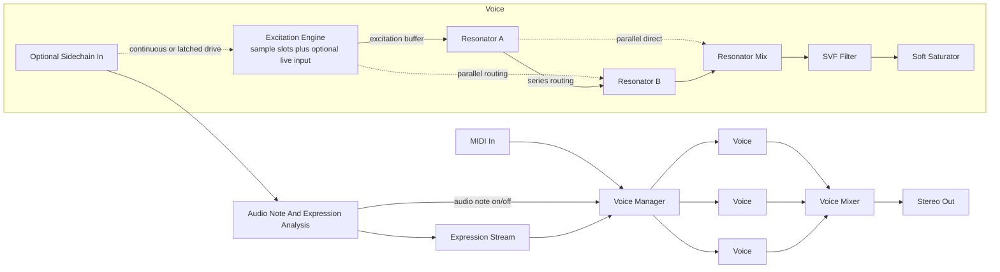

# Lamath - Current Implementation Spec

**Name:** Lamath
**Name etymology:** Sindarin, "echo" or "ringing of voices." Six letters, pronounced LAH-math; paired phonetically with Glirdir.
**Target:** macOS VST3 instrument, Apple Silicon primary and Intel best-effort.
**Status:** VST3 resonator instrument with MIDI and sidechain audio inputs. Linux workspace validation and realtime/no-allocation tests pass.

This document describes the behavior implemented in the workspace today. Planned work for Lamath lives in [lamath-backlog.md](lamath-backlog.md).

---

## 1. Concept And Goals

Lamath is a polyphonic physical-modeling synth where short samples act as excitation signals into resonator models. The sample is not treated as pitched/timestretched playback material; tonality comes from the resonator.

The core product goal is hybrid acoustic timbre: real breath transients, key clicks, chiff, plucks, or articulation noise drive modal and waveguide resonators so the instrument avoids the synthetic attack character common to physical-model synths.

Design principles:

- Sound generation only. Reverb, delay, and broad effect chains belong downstream in the host.
- Sample as DSP component. Excitation samples are short transients, not melodic loops or complete sampled notes.
- One instrument boundary. MIDI, sidechain note creation, audio expression, and live excitation all run through the same VST3 instrument and voice manager.
- Shared host-neutral core. Plugin shell, process context, MIDI normalization, patch/state helpers, sample-library ownership, and audio-expression analysis live in shared crates. Lamath owns product identity, sidechain policy, voice ownership, and resonator behavior.
- Bounded realtime path. Audio-thread processing must not allocate, block, log, perform file/database I/O, or call UI/host services.

Primary host target: Ableton on macOS.

---

## 2. Signal Path



Each voice owns independent excitation playback cursors, resonator state, modulation state, filter state, and output state. Voice allocation and ownership live above the voice DSP so MIDI-created and audio-created voices use the same runtime path.

---

## 3. Excitation Engine

### 3.1 Sample Slots

A patch declares up to four excitation slots. Each slot stores:

- sample reference by blake3 hash and last-known library-relative path;
- pre-mix gain in dB;
- velocity zone;
- fixed sample-start offset plus optional velocity modulation depth;
- one-shot or loop playback mode;
- pitch-track switch;
- round-robin group.

On note-on, the engine filters slots by velocity zone, advances round-robin cursors, sums selected slots into the per-voice excitation stream, and routes that stream into the resonator graph.

### 3.2 Playback

- Samples are loaded into RAM during patch load or structural patch application.
- Per-voice playback cursor advances in f32 sample space.
- Linear interpolation is used because excitation transients do not require high-fidelity sampler interpolation.
- One-shot playback terminates at sample end; loop playback wraps.

### 3.3 Live Sidechain Excitation

The optional sidechain input bus can feed voice excitation in patch-configurable modes:

- `Off` - sample-slot excitation only.
- `Continuous` - sanitized sidechain audio is mixed into active voices every block.
- `NoteLatched` - each note copies a bounded sidechain onset window into a per-voice latch buffer and plays it through the excitation path.
- `ContinuousAndNoteLatched` - a latched onset transient plus continuous sidechain drive while the voice remains active.

Lamath-local policy owns sidechain bus setup, live-excitation mode, gain, latch window, pre-roll, fade, and structural apply rules. Shared `ProcessContext::input` carries the audio input and shared detector/expression crates produce host-neutral analysis events.

Realtime constraints:

- Sidechain scratch buffers, pre-roll rings, detector state, and per-voice latch buffers are allocated during setup or structural patch application.
- Latch window size, pre-roll, and max-latency changes are structural because they size preallocated buffers.
- Empty, inactive, or unrouted input produces MIDI-only behavior.

---

## 4. Resonators

Each voice has two resonator slots, A and B. Each slot can be a modal bank or a one-dimensional waveguide, and both slots may use the same model type.

### 4.1 Modal Bank

The modal bank is a parallel bank of second-order resonant filters. Current parameters include:

- `mode_count` - default 64, soft cap 128, hard realtime cap 256;
- `model_preset` - hardcoded templates such as kalimba, marimba, bell, glass-bowl, metal-bar, woodblock, and generic-strike;
- `fundamental_tune` - MIDI tracked with semitone and cent offsets;
- `inharmonicity`;
- `brightness`;
- `decay_global`;
- `decay_tilt`;
- `position_of_strike`.

Position of strike modulates mode gain so excitation location changes the modal response.

### 4.2 Waveguide

The waveguide is a Karplus-Strong-derived single-delay-line model for plucked-string and tube-like timbres. Current parameters include:

- `fundamental_tune`;
- `waveguide_style` - `String` or `Tube`;
- `loop_filter_cutoff`;
- `loop_filter_resonance`;
- `loop_gain`;
- `loop_nonlinearity`;
- `position_of_strike`;
- `boundary_reflection`.

The string style uses ordinary same-polarity feedback. The tube style applies the boundary reflection coefficient inside the loop so polarity and reflection amount are part of the resonator response.

### 4.3 Routing

Two routing modes are implemented:

- `Parallel` - excitation feeds A and B independently and their outputs are mixed.
- `Series` - excitation feeds A, then A's output feeds B's excitation input.

Series routing includes a high-pass and transient-bias gate before B to keep steady-state resonance from becoming runaway feedback.

---

## 5. Output Stage

Per voice:

- state-variable filter with low-pass, band-pass, and high-pass modes;
- post-filter soft saturation with drive and gain compensation;
- amp envelope controlled gain;
- voice mix to stereo with master gain and pan.

The output path is intentionally compact. Resonators supply most of the timbral identity.

---

## 6. Voice Management And Expression

- Baseline polyphony is 8 voices, configurable up to 16.
- Voice stealing order is oldest released, then quietest released, then oldest active.
- Note-on resets excitation cursors and envelopes. Resonator retrigger is patch-configurable and defaults to ringing carryover.
- All voice state is allocated up front.

Lamath uses a per-voice expression stream:

```rust
struct ExpressionStream {
    pitch_bend: f32,
    pressure: f32,
    brightness: f32,
    velocity: f32,
    gate: bool,
}
```

MIDI maps channel pitch bend, channel pressure, CC brightness, note velocity, and note gate into the stream. Sidechain analysis maps stable pitch, pitch drift, RMS, and spectral centroid into audio-created note events plus expression. Lamath owns source mode, voice ownership, retrigger behavior, latch/continuous excitation routing, and UI/status payloads.

Implemented source modes:

- `Off` - MIDI creates voices.
- `AudioCreatesNotes` - sidechain onsets create and release voices.
- `MidiPlusAudioCreatesNotes` - MIDI and sidechain audio can both create voices, with ownership tracked so one source cannot release the other source's voices.

---

## 7. Modulation

Current sources:

- amp envelope;
- secondary envelope;
- LFO;
- MIDI velocity;
- MIDI channel aftertouch;
- MIDI mod wheel;
- MIDI pitch bend;
- audio-derived pressure, brightness, and pitch bend when sidechain expression is enabled.

Assignable destinations:

- filter cutoff;
- Resonator A damping;
- Resonator B damping;
- Resonator A position-of-strike;
- Resonator B position-of-strike;
- excitation gain;
- LFO rate.

Fixed routings:

- amp envelope to output gain;
- pitch bend to both resonator pitches;
- velocity to excitation gain;
- MIDI note or audio-created note pitch to resonator fundamental.

Four user-assignable modulation slots are exposed as linear source-to-destination routes.

---

## 8. Sample Library

Lamath uses the shared file-backed sample library.

Default disk layout:

```text
~/Library/Application Support/Ahara/Lamath/
|-- Samples/
|-- Patches/
|-- index.db
`-- config.toml
```

Samples are content-addressed by blake3 hash with last-known-path fallback. The SQLite index tracks relative path, filename, duration, sample rate, channel count, RMS/peak metadata, waveform preview, import time, notes, and tags.

Patch sample resolution:

1. Look up the stored hash in SQLite.
2. If the hash is missing, try the last-known path.
3. If a file is found by path, hash and index it.
4. Otherwise mark the slot missing and bypass it while loading the rest of the patch.

The library supports drag/drop ingest, copy or reference-only policies, preview generation, moved-file recovery, missing-sample reporting, and patch export with embedded sample audio.

---

## 9. State And Presets

- Patches are stored as TOML through the shared versioned patch I/O helpers.
- VST3 DAW state uses shared `PluginState` and Lamath patch payloads through `IComponent::getState` and `setState`.
- Current patch/state payloads include audio input, expression, note-detection, and live-excitation fields directly.
- The default patch is hardcoded so the plugin makes sound without user samples.

No compatibility or migration layer is carried for undeployed pre-sidechain Lamath state.

---

## 10. UI And Services

The native Vizia editor exposes:

- top-level patch save/load/export and library commands;
- excitation slot controls;
- Resonator A/B controls and routing;
- output filter, saturation, gain, and pan controls;
- envelope, LFO, and modulation controls;
- sidechain source, audio-expression, note-detection, and live-excitation controls;
- sample ingest, assignment, clear, and telemetry services.

The UI runs at editor framerate and reads audio-thread state through lock-free or message-based boundaries.

---

## 11. Technology Stack

Lamath follows the workspace framework-less plugin architecture:

| Layer | Choice | Responsibility |
| ---- | ---- | ---- |
| VST3 ABI | `vst3` crate | COM ABI and generated bindings |
| Plugin shell | `lindelion-plugin-shell` | descriptors, parameters, process context, MIDI/control events, state, VST3 helpers, messages, and voice-management primitives |
| UI | `lindelion-ui` with Vizia direct | native editor surfaces and product command model |
| DSP utilities | `lindelion-dsp-utils` | math, smoothing, filters, delay/interpolation, envelopes, and analysis helpers |
| Audio expression | `lindelion-audio-expression`, `lindelion-pitch-detect`, `lindelion-onset-detect` | streaming pitch/onset/loudness/expression contracts |
| Sample library | `lindelion-sample-library` | loaded-audio ownership, file-library ingest, hashing, indexing, and previews |
| Serialization | `serde` and `toml` | diffable patches and versioned DAW state payloads |

Shared crates carry host protocol mechanics and host-neutral analysis contracts. Lamath-local code carries product CIDs, bus table, parameter list, patch paths, apply-policy enums, runtime targets, UI slots, VST3 messages, resonator DSP, sidechain source modes, audio-created voice ownership, live-excitation routing, and latch-buffer policy.

---

## 12. Performance

Current realtime targets:

- allocation-free audio processing;
- bounded sidechain note detection and excitation;
- no file/database/UI/host calls from the audio thread;
- preallocated voices, resonator state, sidechain buffers, detector state, and latch buffers.

Measured Linux release probe for the all-enabled sidechain path:

- effective audio-onset to first-output latency: 407 samples / 8.479 ms at 48 kHz;
- 10 seconds rendered in 942.925 ms on the current x86_64 Linux runner;
- realtime ratio: 0.09429.

The realtime note-creation path uses the shared realtime audio analysis note detector backed by zero-crossing pitch and a bounded energy-transient detector. Higher-quality detectors remain behind shared traits for offline or quality-focused use.

Default bounded settings:

- onset sensitivity `0.5`;
- release floor `0.01` RMS;
- minimum note length `60 ms`;
- pitch confidence `0.65`;
- realtime detector frame `512` samples at 48 kHz;
- latch window `120 ms`;
- pre-roll `20 ms`;
- fade `5 ms`;
- live excitation disabled by default.

Offline processing can use looser caps than realtime rendering when the host reports offline process mode.

---

## 13. Current Implementation Status

Implemented:

- stable host parameter surface with component/controller tests;
- parameter updates that mutate patch state and update live runtime targets;
- smoothed live output, loop-gain, filter, pitch-bend, saturation, and routing controls;
- structural resonator and modulation changes that update future voices without killing active notes;
- DSP render, automation stress, sample-rate/buffer-size, offline, and no-allocation tests for the audio path;
- sidechain note creation, MIDI/audio ownership, audio expression, continuous and note-latched live excitation, no-allocation coverage, and latency/CPU probe coverage;
- TOML patch save/load and DAW state roundtrip;
- file-backed sample library with ingest, hashing, indexing, preview generation, moved-file recovery, and missing-sample reporting;
- native editor command services for patch save/load/export, sample ingest/assignment/clear, and telemetry requests;
- macOS VST3 bundle layout, moduleinfo generation, ad-hoc signing, staging, and install automation.

---

## Appendix A - Glossary

- **Excitation:** the input signal that drives a resonator.
- **Modal bank:** a parallel array of resonant filters, each modeling one vibrational mode.
- **Waveguide:** a delay-line-based model of a vibrating string or tube.
- **Mode:** a single vibrational frequency of a physical object.
- **Position of strike:** where excitation is applied to the resonating object.
- **Expression stream:** Lamath's per-voice continuous-control contract for pitch bend, pressure, brightness, velocity, and gate.
