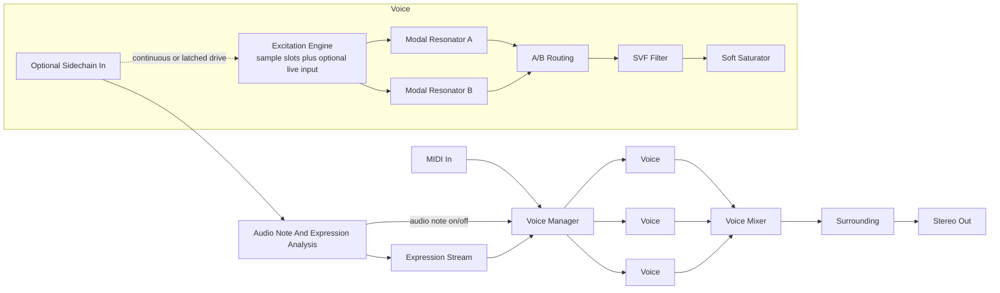

# Lamath - Current Implementation Spec

**Name:** Lamath
**Name etymology:** Sindarin, "echo" or "ringing of voices." Six letters, pronounced LAH-math; paired phonetically with Glirdir.
**Target:** macOS VST3 instrument, Apple Silicon primary and Intel best-effort.
**Status:** Dual modal resonator VST3 instrument with MIDI input, optional sidechain note/expression input, and live excitation. Linux workspace validation and realtime/no-allocation tests pass.

This document describes the behavior implemented in the workspace today. Planned work for Lamath lives in [lamath-backlog.md](lamath-backlog.md).

---

## 1. Product Boundary

Lamath is now the original Lamath product narrowed to a pure dual modal resonator. It keeps the A/B resonator design, sample-slot excitation, live sidechain excitation, audio-created notes, audio expression, and the surrounding mechanical/radiation/sympathetic layer. It no longer contains waveguide string, reed tube, 2D mesh, shared-body idiophone, or modulation routing.

The extracted physical-model products are separate VST3 instruments:

| Product | Model | Spec |
| ---- | ---- | ---- |
| Lamath Cymbal | Shared-body idiophone / mesh cymbal | [lamath-cymbal.md](lamath-cymbal.md) |
| Lamath Tube | Reed-driven wind tube | [lamath-tube.md](lamath-tube.md) |
| Lamath Stringed | Picked/bowed string with body selection | [lamath-stringed.md](lamath-stringed.md) |

Lamath's product-local code owns product identity, patch paths, host parameters, sidechain policy, voice ownership, live-excitation routing, the dual-modal runtime, and VST3/editor adapters. Shared crates own host-neutral shell contracts, sample references, audio-expression analysis, UI services, and reusable DSP support.

---

## 2. Signal Path

```mermaid
flowchart LR
    MIDI[MIDI In] --> VM[Voice Manager]
    SIDE[Optional Sidechain In] --> ANALYSIS[Audio Note And Expression Analysis]
    ANALYSIS -->|audio note on/off| VM
    ANALYSIS --> EXP[Expression Stream]
    EXP --> VM

    VM --> VA[Voice]
    VM --> VB[Voice]
    VM --> VN[Voice]

    subgraph Voice
        EE[Excitation Engine<br/>sample slots plus optional live input]
        RA[Modal Resonator A]
        RB[Modal Resonator B]
        ROUTE[A/B Routing]
        FILT[SVF Filter]
        SAT[Soft Saturator]

        SIDE -.->|continuous or latched drive| EE
        EE --> RA
        EE --> RB
        RA --> ROUTE
        RB --> ROUTE
        ROUTE --> FILT
        FILT --> SAT
    end

    VA --> MIX[Voice Mixer]
    VB --> MIX
    VN --> MIX
    MIX --> SUR[Surrounding]
    SUR --> OUT[Stereo Out]
```

Each voice owns excitation playback cursors, two modal-bank states, filter/output state, and expression state. Voice allocation and ownership live above voice DSP so MIDI-created and audio-created voices use the same runtime path.

---

## 3. Excitation

Lamath patches declare excitation slots. Each slot stores a shared `SampleReference`, pre-mix gain, velocity zone, start offset, velocity start modulation, loop flag, pitch-track flag, and optional round-robin group.

On note-on, the engine filters slots by velocity, advances round-robin cursors, sums selected excitation streams, and routes that signal into the modal graph. Missing samples are bypassed while the rest of the patch loads.

The optional sidechain input bus can also feed voice excitation:

- `Off` - sample-slot excitation only.
- `Continuous` - sanitized sidechain audio is mixed into active voices every block.
- `NoteLatched` - each note captures a bounded sidechain onset window and plays it through the excitation path.
- `ContinuousAndNoteLatched` - a latched onset transient plus continuous sidechain drive while the voice remains active.

Sidechain scratch buffers, pre-roll rings, detector state, and per-voice latch buffers are allocated during setup or structural patch application, not on the realtime path.

---

## 4. Modal Resonators

Each voice has two modal resonator slots, A and B. A modal bank is a parallel bank of second-order resonant filters. Current modal controls include:

- `mode_count` - default 64, hard realtime cap 256;
- `preset` - `Kalimba`, `Marimba`, `Bell`, `GlassBowl`, `MetalBar`, `Woodblock`, or `GenericStrike`;
- semitone and cent offsets;
- `inharmonicity`;
- `brightness`;
- `decay_global`;
- `decay_tilt`;
- `position_of_strike`.

Position of strike modulates mode gain so the excitation point changes the modal response.

Implemented A/B routing modes:

- `Parallel` - excitation feeds both modal banks and their outputs are mixed.
- `Series` - excitation feeds A, then A's output feeds B.
- `BodyColor` - excitation feeds A and a short window of A's response becomes colored excitation for B.

---

## 5. Sidechain Notes And Expression

Implemented source modes:

- `Off` - MIDI creates voices.
- `AudioCreatesNotes` - sidechain onsets create and release voices.
- `MidiPlusAudioCreatesNotes` - MIDI and sidechain audio can both create voices, with ownership tracked so one source cannot release the other source's voices.

Lamath uses a per-voice expression stream for pitch bend, pressure, brightness, velocity, and gate. MIDI maps channel pitch bend, channel pressure, CC brightness, note velocity, and note gate into that stream. Sidechain analysis maps stable pitch, pitch drift, RMS, and spectral centroid into audio-created note events plus expression when enabled.

---

## 6. Surrounding

The surrounding layer was intentionally kept while Lamath was narrowed back to dual modal resonators. It currently exposes:

- `mechanical_noise`;
- `radiation_brightness`;
- `sympathetic`.

These controls remain part of Lamath's product-local modal runtime. They are not part of the extracted Cymbal, Tube, or Stringed parameter surfaces.

---

## 7. State, UI, And VST3

- Patches are stored as TOML through shared versioned patch I/O helpers.
- VST3 DAW state uses shared `PluginState` and Lamath patch payloads through `IComponent::getState` and `setState`.
- The Vizia editor exposes patch save/load/export, excitation slots, modal A/B controls, routing, output controls, sidechain note/expression controls, live-excitation controls, surrounding controls, sample ingest/assignment/clear, and telemetry.
- The UI reads audio-thread state through lock-free or message-based boundaries.
- The default patch is hardcoded so the plugin makes sound without user samples.

---

## 8. Review Render Catalog

Lamath includes an offline review render catalog for subjective listening across the current Lamath-family resonators. The catalog is a command-line tool, not an integration test harness: it renders audio artifacts for human review through the real Lamath modal synth path and the extracted Lamath Cymbal, Tube, and Stringed processors.

The catalog keeps the pre-extraction 86-case, 11-group selection surface: baseline dynamics, register range, drivers, contact, source/body balance, surrounding, chords, articulation, edge cases, tube dynamics, and mesh timbre. Modal cases render through Lamath; string, tube, and mesh/cymbal cases render through the extracted processors that now own those physical-model paths.

`make render-lamath-audio` writes the WAV catalog to `review/lamath-render-catalog/` with a `manifest.toml` and `index.md`. The WAV tree is ignored because it is large and regeneratable. `make compress-review-audio` creates stageable MP3 previews under `review/audio-previews/lamath-render-catalog/`.

The local React/TypeScript review UI in `tools/lamath-review-ui/` reads the manifest, plays the MP3 previews or WAV fallback, and writes per-file plus category comments to `review/lamath-render-catalog-comments.json` for later analysis. See [development.md](../development.md#review-audio) for commands, storage policy, and the Sulion dev-server port range.

---

## 9. Performance And Tests

Current realtime targets:

- allocation-free audio processing;
- bounded sidechain note detection and excitation;
- no file/database/UI/host calls from the audio thread;
- preallocated voices, resonator state, sidechain buffers, detector state, and latch buffers.

`make ci` covers the fast workspace unit path, including Lamath patch/state roundtrips, host parameter binding, modal runtime behavior, sidechain note/expression behavior, live excitation, and no-allocation audio-path guards. Heavier DSP sweeps and render/audition work stay behind the integration/render harnesses described in [development.md](../development.md#testing).

---

## Appendix A - Glossary

- **Excitation:** the input signal that drives a resonator.
- **Modal bank:** a parallel array of resonant filters, each modeling one vibrational mode.
- **Mode:** a single vibrational frequency of a physical object.
- **Position of strike:** where excitation is applied to the resonating object.
- **Expression stream:** Lamath's per-voice continuous-control contract for pitch bend, pressure, brightness, velocity, and gate.
- **Surrounding:** Lamath's retained mechanical/radiation/sympathetic coloration layer around the modal instrument.
