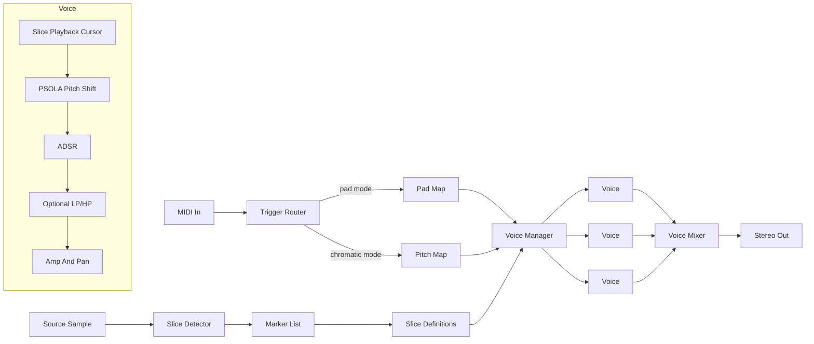

# Linnod - Backlog

This file tracks the planned melodic sample slicer work that is not part of the current implemented Linnod scaffold in [linnod.md](linnod.md).

---

## Product Goal

Build a polyphonic sample slicer optimized for melodic monophonic source material such as wind, voice, and bowed strings. The slicer should construct rhythmic chops that the source itself never played, with onset detection and UI defaults tuned for soft-onset melodic material rather than drum loops.

Design principles:

- Multiple onset detection algorithms are first-class options.
- Every slice has musical controls: ADSR, fine pitch, gain, pan, reverse, and playback mode.
- Pad mode is per-pad mono; chromatic mode is polyphonic across the global voice pool.
- The host owns sequencing. Linnod does not include an internal pattern editor.
- Shared Lindelion crates should carry plugin-shell, sample-library, DSP, UI, onset, and PSOLA functionality.

Non-goals:

- Not a beat slicer, though percussive material can be loaded.
- Not a time-stretch engine.
- Not a granular, spectral, or broad sample-mangling synth.
- No host-tempo sync of slice playback.

---

## Signal Path To Implement

Slice detection runs offline on the source sample at load/edit time. The marker list and per-slice parameters define slice behavior. The voice manager allocates voices on note-on using pad or chromatic trigger rules.

---

## Sample Loading

- Drag/drop one source sample into the plugin.
- Convert the source to 48 kHz mono on load.
- Ingest the source into the shared `lindelion-sample-library`.
- Reference samples by hash plus path fallback.
- Keep one source sample per patch.

---

## Slice Detection

Implement six switchable offline detection algorithms:

| Algorithm | Best For |
| ---- | ---- |
| SuperFlux | Wind, voice, and soft-onset melodic material |
| ComplexFlux | Sustained tones with subtle articulation |
| Spectral sparsity | Difficult or ambiguous material |
| Pitch-stability | Tonal monophonic material |
| Energy/transient | Percussive material |
| Manual grid | Predictable subdivisions |

Common parameters:

- sensitivity;
- minimum slice length.

Algorithm-specific parameters include lookback frames, max-filter radius, pitch-stability threshold, minimum stable duration, grid divisions, and offset.

Re-detection should replace auto markers silently, but when user-edited markers exist it should offer replace, merge, or cancel.

---

## Marker And Slice Editing

Markers are start points. A slice runs from its marker to the next marker, or to the end of the sample. Per-slice end trimming is controlled by `end_offset_ms`.

Planned marker UI:

- draggable vertical handles on a waveform;
- snap to zero crossing by default;
- double-click between markers to add;
- right-click marker to delete;
- numeric position input;
- waveform zoom and pan;
- slice audition from the waveform;
- per-patch undo/redo.

Planned slice list:

- pad number;
- slice name;
- start position;
- computed duration;
- detected fundamental;
- gain, pan, and pitch quick controls.

Initial slice count remains 16, matching the 4x4 pad grid.

---

## Triggering And Voice Management

Pad grid:

- 4x4 pads, numbered 1-16.
- Default MIDI notes 36-51.
- User-remappable pad notes.

Pad mode:

- notes 36-51 trigger pads 1-16;
- slices play at original pitch;
- retriggering the same pad chokes its previous voice;
- different pads can overlap within the voice limit.

Chromatic mode:

- one active pad is selected;
- the active slice plays across the keyboard with MIDI note 60 as original pitch;
- polyphonic playback uses the shared voice pool.

Voice system:

- 16-voice pool;
- pad mode per-pad mono;
- chromatic mode voice stealing by oldest released, quietest released, then oldest active;
- all voice state allocated up front;
- no audio-thread allocations.

---

## Playback And Per-Slice Parameters

Implement slice playback with:

- f32 playback cursor;
- forward and reverse playback;
- one-shot, gated, and looped modes;
- ADSR;
- per-slice gain and pan;
- one-pole low-pass filter;
- PSOLA pitch shifting;
- unpitched pass-through fallback for breath/noise regions.

Per-slice parameters:

- name;
- start and end offsets;
- pitch semitones and cents;
- gain;
- pan;
- reverse;
- playback mode;
- attack, decay, sustain, and release;
- filter cutoff.

---

## Pitch Shift, Tuner, And Scale Snap

PSOLA work:

- run pitch analysis offline at slice creation;
- store epoch positions in cached analysis;
- overlap-add pitch periods at playback;
- fall back to pass-through on unpitched regions.

Tuner work:

- display detected fundamental, note name, and cents deviation;
- tune one slice to the configured reference;
- tune all slices;
- support configurable reference frequency.

Scale snap work:

- select chromatic, major, natural minor, harmonic minor, melodic minor, pentatonic major, pentatonic minor, blues, or custom intervals;
- select root note;
- snap one or all slices to the selected scale while preserving per-slice override.

---

## UI

Implement a Vizia editor with:

- top bar for patch, save/load, library, MIDI activity, and CPU/status;
- full-width waveform view with markers;
- detection controls;
- tuning controls;
- 4x4 pad grid;
- pad/chromatic mode controls;
- active chromatic pad selector;
- selected-slice editor;
- collapsible slice list.

The selected slice should be highlighted in both pad grid and waveform.

---

## State And Presets

- Store patches as TOML in `Patches/Linnod/`.
- Persist source sample reference, marker list with auto/user tags, per-slice parameters, detection settings, tuning settings, trigger mode, and pad assignments.
- Recompute cached pitch analysis on load because it is deterministic from sample plus markers.
- Implement DAW state save/restore through the shared plugin state path.

---

## Bundle And Validation

- Add Linnod VST3 bundle automation.
- Ensure Ableton sees Linnod as a separate instrument.
- Run Steinberg validator once the bundle target exists.
- Validate 16 simultaneous voices with PSOLA active on Apple Silicon.

---

## Product Extensions

- Multiple banks of 16 pads.
- Multiple source samples per patch.
- Per-slice modulation slots.
- Cross-pad choke groups.
- MIDI export for common chop patterns.
- Stereo source preservation.
- Phase-vocoder pitch-shift mode for non-pitched or polyphonic content.

---

## Open Product Questions

- Whether the first full implementation should stay at one bank or include multiple banks immediately.
- Whether waveform-click audition should trigger only when no MIDI note is held or always play.
- Whether start-marker plus end-offset remains sufficient, or explicit start/end regions are needed.
- Whether cross-pad choke groups are useful for melodic wind/voice material.

---

## Implementation Sequence

1. Sample loading and waveform rendering.
2. Energy/transient detection and manual markers.
3. Pad grid and basic triggering.
4. Per-slice parameters, ADSR, amp, and pan.
5. Remaining detection algorithms and re-detection workflow.
6. PSOLA pitch shift and pitch analysis.
7. Tuner and scale snap.
8. Chromatic mode and voice-management refinement.
9. Patch save/load and library integration polish.
10. UI, validator, and performance polish.
