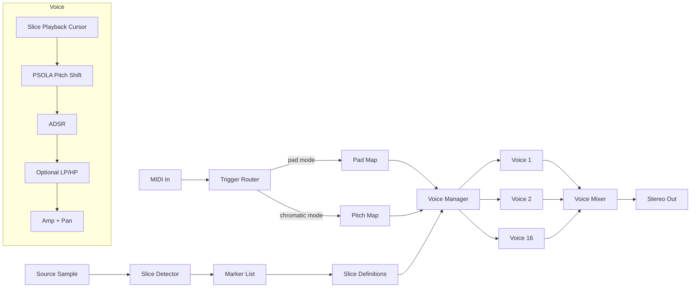

# Linnod — Melodic Sample Slicer v0.3 Design Spec

**Name:** Linnod.
**Name etymology:** Sindarin, a measured Elvish verse unit: a half-line of 4+3 syllables forming a distinct portion of a larger song. From `lind`/`lin-`, the Sindarin song/music root, plus a verse marker. Pronounced LIN-nod.
**Repo:** same Cargo workspace as Lamath (Lindelion plugin suite).
**Target:** macOS (Apple Silicon primary), VST3.
**Status:** Cargo scaffold and patch model implemented; slicing DSP, editor, and bundle automation planned.

---

## 1. Concept & Goals

A polyphonic sample slicer optimized for **melodic monophonic source material** (wind, voice, bowed strings) used to construct **rhythmic chops** that the source itself never played. The thesis: existing slicers (Serato Sample, Slicex, Simpler slice mode) were designed for percussive breakbeats and vocal stems and their DSP + UI assumptions break down on soft-onset melodic material. This plugin centers the wind/voice case as the primary use, not an afterthought.

### Design principles

- **Multiple onset detection algorithms.** Magnitude-based transient detection is known to be unreliable for soft onsets (wind, voice, bowed strings). Ship algorithms tuned for that material as first-class options, not last resorts.
- **Per-slice musical control.** Every slice has its own ADSR, fine pitch (cents), gain, pan, reverse, and playback mode. Editing a chop should feel like editing an instrument, not editing playback macros.
- **Polyphony where it matters.** Pad-mode is per-pad mono (drum-machine feel, automatic choke on retrigger). Chromatic mode is polyphonic across the global voice pool.
- **DAW-only sequencing.** No internal pattern editor. Triggering is via MIDI from the host.
- **Workspace integration.** Shares utility crates with Lamath (plugin shell, sample library, DSP utils, UI widgets).

### Non-goals

- Not a beat slicer. Drum breaks can be loaded, but tooling defaults assume melodic source.
- Not a time-stretch engine. Playback rate is fixed at the source rate; pitch shift is decoupled from duration via PSOLA.
- Not a sample-mangling synth (granular, spectral, etc.). That's adjacent design space, not this plugin.
- No host-tempo sync of slice playback. Slices play at their natural duration; rhythm is constructed via MIDI triggers in the host.

---

## 2. Signal Path



The slice detector runs offline on the source sample at load/edit time, producing a marker list. The marker list and per-slice parameters together define each slice's behavior. Voice manager allocates voices on note-on, with allocation rules that depend on trigger mode (pad vs chromatic).

---

## 3. Sample Loading

- Drag-and-drop into the plugin loads a single source sample.
- One sample per instance (no multi-sample slicing in v1).
- Sample is converted to 48kHz mono on load (slice work is monophonic by intent — stereo wind recordings are folded to mono for slicing; downstream `pan` per slice handles spatialization).
- Source samples ingested into the shared `lindelion-sample-library` (SQLite-indexed, blake3-hashed, drag-drop persisting to library). Slicing one sample doesn't lock the sample to this patch; the same source can be re-used in another patch with different markers.

---

## 4. Slice Detection

Six detection algorithms, switchable per-patch. The active algorithm has its own parameter cluster (sensitivity, lookback, minimum slice length, etc.). All algorithms run offline on the source sample; results populate the marker list.

### 4.1 Algorithms

| Algorithm                | Best for                                          | Notes                                                                                  |
| ------------------------ | ------------------------------------------------- | -------------------------------------------------------------------------------------- |
| **SuperFlux**            | Wind, voice, soft-onset melodic (default)         | Spectral flux with trajectory tracking; designed for soft onsets, robust to vibrato.   |
| **ComplexFlux**          | Sustained tones with subtle articulation          | SuperFlux + local group delay; better on stable tones with amplitude fluctuation.      |
| **Spectral Sparsity**    | Difficult/ambiguous material                      | Newer non-data-driven approach with strong cross-instrument generalization.            |
| **Pitch-Stability**      | Highly tonal monophonic material                  | Detects pitch contour via shared pitch analysis; segments where stable pitch periods break.             |
| **Energy / Transient**   | Drum loops, percussive breaks                     | Classic magnitude-based; the "Serato-style" detector. Worst on melodic material.       |
| **Manual Grid**          | Tempo-locked loops, predictable subdivisions      | Fixed division of source sample into N equal regions; user sets N.                     |

### 4.2 Algorithm parameter clusters

Each algorithm exposes 2–4 parameters. Common across all:

- `sensitivity` (0–1) — threshold for emitting a marker
- `min_slice_ms` (default 50ms) — suppresses markers closer than this minimum

Algorithm-specific examples:

- SuperFlux: `lookback_frames`, `max_filter_radius`
- Pitch-Stability: `pitch_stability_threshold_cents`, `min_stable_duration_ms`
- Manual Grid: `divisions`, `offset_ms`

### 4.3 Re-running detection

Triggered by: changing algorithm, adjusting sensitivity, or pressing "Re-detect."

Behavior:

- If all current markers are auto-generated → silently replace.
- If any markers have been user-edited (manually added, moved, or deleted) → confirmation dialog: **Replace all** / **Merge** (keep user-edited markers, fill gaps with new auto-detected) / **Cancel**.

Markers are tagged in storage as `auto` or `user` for this purpose.

---

## 5. Slice Management & Markers

### 5.1 Marker semantics

A marker is a **start point**. A slice runs from its marker to the next marker (or end of sample). This is simpler than region-based (start + end pair) and matches the user's stated preference. Trade-off: per-slice trim from the end is handled via the slice's `end_offset_ms` parameter rather than a region boundary.

### 5.2 Marker editing UI

- Markers shown as draggable vertical handles on a waveform view (top of UI, full plugin width).
- **Drag** a marker to move it. Snap-to-zero-crossing on by default; toggle off via modifier key.
- **Double-click** between markers to add a new one at click position.
- **Right-click** a marker to delete.
- **Numeric input** per marker (samples or ms) accessible from the slice list.
- **Zoom** waveform view (mouse wheel or pinch); pan when zoomed in.
- **Audition** a slice in isolation by clicking its waveform region (without triggering MIDI).
- All edits are undo/redo-able (per-patch undo stack).

### 5.3 Slice list

Below the waveform view, slices listed numerically (1, 2, 3, ..., up to 16 in v1). Each row shows:

- Pad number (auto-assigned 1–16, reassignable)
- Slice name (user-editable, default "Slice N")
- Start position (ms / samples, editable)
- Duration (read-only, computed from next marker)
- Detected fundamental (Hz + note name + cents from A=440)
- Quick params: gain, pan, pitch cents

Full per-slice parameter editing happens in the right panel when a pad is selected (see §7).

### 5.4 Slice count

V1 ships with up to **16 slices** per patch (matching the 4×4 pad grid). Banks of additional 16s are deferred to v2.

---

## 6. Pad Grid & Trigger Mapping

### 6.1 Grid layout

4×4 pad grid, pads numbered 1–16. Each pad references one slice (typically by index, but reassignable).

- Default MIDI mapping: pads 1–16 ← MIDI notes 36–51 (C1–D#2; standard drum pad range).
- User-remappable per-pad.
- Triggering pad N plays slice assigned to pad N.

### 6.2 Trigger modes

**Pad Mode** (default):

- MIDI notes 36–51 trigger pads 1–16 respectively.
- All notes play their slice at original pitch (no chromatic transposition).
- Per-pad mono: retriggering the same pad chokes its previous instance.
- Different pads can sound simultaneously (up to global voice limit).
- Use case: rhythmic recombination of a melodic recording at original pitch.

**Chromatic Mode** (secondary):

- A single "active" pad is selected (defaults to pad 1; user-selectable).
- The active slice plays chromatically across the keyboard, with MIDI note 60 (C4) as the original pitch reference.
- Polyphonic: multiple notes can sound simultaneously, each at its own pitch.
- Use case: turning a single slice into a tuned instrument for chord/melody work.

**Switching:** mode is a per-patch toggle in the UI. Both modes share the same voice pool.

---

## 7. Per-Slice Parameters

Each of the 16 slices has its own parameter set. Editing happens in the right panel when a pad is selected.

| Parameter         | Range / Type                                  | Notes                                                                  |
| ----------------- | --------------------------------------------- | ---------------------------------------------------------------------- |
| `name`            | string (default "Slice N")                    | User label for the slice.                                              |
| `start_offset_ms` | float, ≥0, default 0                          | Trim from slice start (positive offsets the playback into the slice). |
| `end_offset_ms`   | float, ≥0, default 0                          | Trim from slice end (positive ends playback before next marker).      |
| `pitch_semitones` | int, ±48, default 0                           | Coarse pitch via PSOLA.                                                |
| `pitch_cents`     | float, ±100, default 0                        | Fine pitch via PSOLA.                                                  |
| `gain_db`         | float, -∞ to +12, default 0                   |                                                                        |
| `pan`             | float, -1 to +1, default 0                    |                                                                        |
| `reverse`         | bool, default false                           | Plays the slice backward.                                              |
| `playback_mode`   | enum: `one_shot` / `gated` / `looped`         | Default `one_shot`. See §7.1.                                          |
| `attack_ms`       | float, 0–5000, default 0                      | ADSR attack.                                                           |
| `decay_ms`        | float, 0–5000, default 0                      |                                                                        |
| `sustain`         | float, 0–1, default 1                         |                                                                        |
| `release_ms`      | float, 0–5000, default 50                     |                                                                        |
| `filter_cutoff`   | float, 20–20000 Hz, default 20000 (open)      | One-pole low-pass; off when at max.                                    |

### 7.1 Playback modes

- **`one_shot`** — slice plays from its start to its end (or to its `end_offset_ms`), ignoring note-off. Most natural for chop-style triggering.
- **`gated`** — slice plays while the MIDI note is held. Note-off triggers ADSR release. If the slice reaches its end before note-off, it stops (no loop).
- **`looped`** — slice loops from start to end while the note is held. Note-off triggers ADSR release. Useful for sustained slice content (a held flute note used as a drone element).

---

## 8. Voice Management

- **16-voice pool.**
- **Pad mode:** per-pad mono. Retriggering the same pad sends the previous voice to release (ADSR release tail plays out), and a new voice starts immediately. Different pads occupy independent voices.
- **Chromatic mode:** polyphonic. Voice stealing by: oldest-released → quietest-released → oldest-active.
- All voices share the same global voice pool — switching from pad to chromatic mode mid-pattern handles voice allocation gracefully without abrupt cutoffs.

Voice state per voice: slice reference, playback cursor (f32 sample index), PSOLA state (pitch period buffer, current phase), ADSR state, filter state.

All voice state allocated up-front at instantiation. Zero allocations in the audio thread.

---

## 9. Pitch Shift (PSOLA)

### 9.1 Choice rationale

PSOLA (Pitch Synchronous Overlap-Add) is the right algorithm for this plugin's specific case:

- Source is **monophonic** and **pitched** (wind, voice, bowed strings).
- Pitch shifts are typically **small** (<1 semitone).
- **Formants must be preserved** — wind instrument timbre is heavily defined by formant structure, and naive resampling shifts formants with pitch (the "chipmunk" effect).
- Decouples pitch from duration — slice length is preserved regardless of pitch shift.

PSOLA handles small shifts cleanly; ±2 semitones is high-quality, ±12 starts showing artifacts but remains usable for creative effects. Algorithmic complexity is moderate (~few hundred lines of Rust) and CPU cost is low.

### 9.2 Implementation

1. **Pitch period analysis** (offline, at slice creation): run pitch analysis on the slice to detect pitch contour and mark pitch epochs (period boundaries).
2. **Period storage:** epoch positions stored as part of the slice's cached analysis. Re-computed when slice boundaries change.
3. **Real-time synthesis:** at playback, overlap-add windowed pitch periods at the new period rate (computed from `pitch_semitones + pitch_cents/100`).
4. **Edge handling:** at unpitched regions (breath noise, transients), fall back to time-domain pass-through (no PSOLA).

### 9.3 Limitations

- Polyphonic content shifts poorly (pitch tracking fails on chords). Not a concern given monophonic source intent, but worth flagging in user-facing docs.
- Extreme shifts (>±octave) show audible artifacts. Acceptable as creative effect; documented as a soft limit.
- Pure noise content (breath without pitch) passes through unchanged regardless of pitch parameter setting.

---

## 10. Tuner & Scale Snap

### 10.1 Integrated tuner

For each slice, the plugin runs pitch analysis on the slice's content and displays:

- Detected fundamental (Hz)
- Closest note name at A=440 (e.g., "F#4")
- Cents deviation from that note (e.g., "+18¢")

**One-click "Tune to A=440"** per slice — sets `pitch_cents` to the negative of the detected cents deviation, snapping the slice to standard concert pitch. Per-slice override always available.

**"Tune all to A=440"** button — applies the above to every slice.

**Tuning reference** is configurable per-patch (default 440Hz; supports 432Hz, 441Hz, 442Hz, or arbitrary). Tuner display and all snap operations use the configured reference.

### 10.2 Scale snap

A separate operation that quantizes slice pitches to a musical scale.

- User selects scale: chromatic / major / natural minor / harmonic minor / melodic minor / pentatonic major / pentatonic minor / blues / custom intervals.
- User selects root note (defaults to A).
- **"Snap all to scale"** — for each slice, finds detected fundamental, computes the nearest scale degree (in the configured tuning), and sets that slice's `pitch_semitones + pitch_cents` to land on it.
- Per-slice override always preserved.

Scale snap composes with A=440 tuning: snap-to-A=440 first to remove drift, then snap-to-scale to land on scale degrees. UI presents these as two distinct buttons.

---

## 11. UI Layout

```
┌─────────────────────────────────────────────────────────────┐
│  [Patch Name]   [Save] [Load] [Library]      [MIDI] [CPU]   │
├─────────────────────────────────────────────────────────────┤
│                                                             │
│  ┌─── Waveform View (full width, ~25% of UI height) ─────┐  │
│  │   Markers as draggable handles. Zoom/pan.             │  │
│  └───────────────────────────────────────────────────────┘  │
│                                                             │
│  ┌──────── Detection ───────┐ ┌──── Tuning ───────────┐    │
│  │ Algorithm: [SuperFlux ▾] │ │ Reference: 440 Hz     │    │
│  │ Sensitivity: ────●────   │ │ Scale: [Chromatic ▾]  │    │
│  │ Min length: 50 ms        │ │ Root: [A ▾]            │   │
│  │ [Re-detect]              │ │ [Tune all] [Snap all] │    │
│  └──────────────────────────┘ └────────────────────────┘   │
│                                                             │
│  ┌──── Pad Grid (4×4) ────┐  ┌── Selected Slice ───────┐   │
│  │  [01] [02] [03] [04]   │  │ Name: [Slice 5      ]    │  │
│  │  [05] [06] [07] [08]   │  │ Pitch: -3 st  +12¢       │  │
│  │  [09] [10] [11] [12]   │  │ Gain: ──●── 0 dB         │  │
│  │  [13] [14] [15] [16]   │  │ Pan:  ─●──── 0           │  │
│  │                        │  │ Mode: [one-shot ▾]       │  │
│  │  Mode: ⦿ Pad           │  │ ADSR: A D S R curves     │  │
│  │       ○ Chromatic      │  │ Filter: ──●── 20kHz      │  │
│  │  Active (chrom): [01]  │  │ [Reverse] [Tune to A=440]│  │
│  └────────────────────────┘  └──────────────────────────┘  │
│                                                             │
│  ┌─ Slice List (collapsible) ──────────────────────────┐   │
│  │ #  Pad  Name      Start    Dur    Pitch    Cents    │   │
│  │ 1  01   Slice 1   0.00s   0.34s   F#4     +18¢      │   │
│  │ ...                                                  │   │
│  └─────────────────────────────────────────────────────┘   │
└─────────────────────────────────────────────────────────────┘
```

Selected slice is highlighted on the pad grid and on the waveform view (slice's region highlighted). Right panel updates to reflect the selected slice's parameters.

---

## 12. Workspace & Shared Crates

This plugin lives in the same Cargo workspace as Lamath. Crate inventory:

```
lindelion/
├── Cargo.toml                    # Workspace root
├── crates/
│   ├── lindelion-plugin-shell/       # VST3 + baseview + Vizia integration
│   ├── lindelion-sample-library/     # SQLite-indexed sample library
│   ├── lindelion-dsp-utils/          # Biquads, SVF, saturation, smoothing
│   ├── lindelion-ui/                 # Common Vizia widgets
│   ├── lindelion-onset-detect/       # NEW: SuperFlux, ComplexFlux, spectral sparsity, pitch-stability
│   └── lindelion-psola/              # NEW: PSOLA pitch shift + pitch-analysis boundaries
├── plugins/
│   ├── lamath/          # The first plugin
│   └── linnod/                   # This plugin
```

**Shared crates this plugin pulls in:**

- `lindelion-plugin-shell` — fully reused for VST3 integration, parameter system, MIDI normalization, state I/O.
- `lindelion-sample-library` — fully reused; samples ingested by either plugin appear in the other's library browser.
- `lindelion-dsp-utils` — biquads (filter), smoothing (parameter smoothing), envelope helpers.
- `lindelion-ui` — knob, slider, waveform view (extended in this plugin to support markers), sample browser.

**New crates introduced:**

- `lindelion-onset-detect` — `OnsetDetector` trait with implementations: `SuperFlux`, `ComplexFlux`, `SpectralSparsity`, `PitchStability`, `EnergyFlux`, `ManualGrid`. Each is independently usable. Reusable later for Lamath's v2 audio-expression-analysis pipeline.
- `lindelion-psola` — PSOLA pitch shift + pitch-analysis boundaries. Reusable for any future plugin needing formant-preserving pitch manipulation of monophonic content.

Both new crates designed to be plugin-agnostic — they take audio buffers and return analysis/synthesis results, no VST3 dependency.

---

## 13. State & Presets

- Patches stored as TOML in `Patches/Linnod/` (separate subdirectory from Lamath patches).
- Patch contains: source sample reference (blake3 hash + last-known-path), marker list with `auto`/`user` tags, per-slice parameters, detection algorithm + params, tuning reference, scale settings, trigger mode, pad assignments.
- Cached analysis (pitch-analysis epoch positions per slice) **not** stored in patch — recomputed on patch load, since it's deterministic from the source sample + markers and recomputation is cheap.
- DAW state save/restore via `IComponent::getState` / `setState` — same path as Lamath (postcard binary serialization of active patch).

---

## 14. Technology Stack

Same stack as Lamath (see Lamath design §12), with additions:

| Layer            | Choice                                       | Notes                                                              |
| ---------------- | -------------------------------------------- | ------------------------------------------------------------------ |
| Plugin shell     | `lindelion-plugin-shell` (shared)                | VST3 + baseview + Vizia integration.                               |
| UI               | `vizia` direct (shared `lindelion-ui`)           | Waveform view extended for marker handles.                         |
| Format           | VST3 only                                    | Same constraints as resonator.                                     |
| Onset detection  | `lindelion-onset-detect` (this plugin introduces) | All algorithms pure-Rust.                                          |
| Pitch shift      | `lindelion-psola` (this plugin introduces)       | Hand-rolled PSOLA + pitch analysis.                                          |
| FFT              | `realfft`                                    | Used by spectral detection methods and pitch analysis.                         |
| Sample library   | `lindelion-sample-library` (shared)              | Same DB, same on-disk layout.                                      |
| Resampling       | `rubato`                                     | For sample-rate conversion at load.                                |

---

## 15. Performance

### 15.1 Offline analysis

Slice detection and pitch analysis run offline (at sample load or marker edit), not in the audio thread. Detection on a 30-second sample completes well under a second on M-series silicon for any of the algorithms.

### 15.2 Per-voice cost (audio thread, 48kHz)

| Component               | Cost / sample      | Notes                                                              |
| ----------------------- | ------------------ | ------------------------------------------------------------------ |
| Slice playback cursor   | ~5 ops             | Linear interp, position advance.                                   |
| PSOLA synthesis         | ~80 ops            | Overlap-add of pitch period buffers; cheap given periods are cached. |
| ADSR                    | ~5 ops             | State machine + linear interp.                                     |
| One-pole filter         | ~5 ops             |                                                                    |
| Amp + pan               | ~5 ops             |                                                                    |
| **Total per voice**     | **~100 ops/sample** |                                                                    |

16 voices × 100 ops/sample × 48000 = 77 MOps/sec. Light. Plenty of headroom on M-series silicon.

### 15.3 Memory

Per-sample loaded: source PCM (mono f32, ~190 KB/sec @ 48kHz) + per-slice analysis cache (epoch positions, ~1KB/slice). A 60-second source sample with 16 slices is ~12 MB resident. Comfortable.

---

## 16. V1 Scope vs V2 Extensions

### V1 (ships)

- One source sample per patch
- Up to 16 slices, 4×4 pad grid
- 6 detection algorithms with per-algorithm parameter clusters
- Manual marker editing on waveform view
- Per-slice ADSR + pitch (semi + cents) + gain + pan + reverse + playback mode + one-pole filter
- PSOLA pitch shift and tuner
- Scale snap + A=440 tuning reference (configurable)
- Pad mode (per-pad mono, choke on retrigger) + chromatic mode (poly)
- 16-voice global pool
- DAW state save/restore + TOML patch files
- Workspace integration with shared crates

### V2 architectural seams (designed-in, not implemented)

- **Multiple banks** — 4 banks of 16 pads (64 slices total), bank-switch via MIDI or UI.
- **Multiple source samples per patch** — multi-sample slicer for layered patches.
- **Per-slice modulation slots** — LFO/envelope routing to filter/pitch/pan beyond fixed ADSR.
- **Cross-pad choke groups** — pad N chokes pad M (configurable groups, drum-machine-style).
- **MIDI export** — "drag MIDI to host" feature for common chop patterns (sequential, reverse, random, every-other) as DAW-droppable MIDI clips.
- **Stereo source preservation** — option to keep slices stereo through the pipeline (cost: doubled PSOLA work).
- **Phase-vocoder pitch shift mode** — alternative to PSOLA for non-pitched/polyphonic content.

---

## 17. Open Questions

1. **Bank expansion in v1?** Spec'd as 16 slices for v1, bank expansion as v2. If you'd rather have 4 banks of 16 (64 slices) on day one, the marker storage and UI just needs to grow accordingly — not a deep architectural change. Worth a check before locking.

2. **Slice audition on click in waveform view.** Should audition trigger only when no MIDI note is currently held (to avoid muddying the mix), or always play?

3. **End-offset vs region-based slice boundaries.** Spec uses start-marker-only with per-slice `end_offset_ms`. Alternative: every slice has explicit start AND end markers, allowing slices to overlap or leave gaps. Start-only is simpler and matches your stated preference, but worth confirming once you've thought about whether you'd want non-contiguous slice playback.

4. **Choke group beyond per-pad mono.** Drum machines often allow cross-pad choke (open hi-hat chokes closed hi-hat). Useful for wind material? E.g., two articulations of the same note in a choke group so only one plays at once.

---

## 18. Implementation Sequence

Each step has concrete acceptance criteria. Step 1 is partially implemented by the current Cargo scaffold; the VST3 bundle target remains future work.

### Step 1 — Workspace setup

- Lindelion is a Cargo workspace with Lamath and Linnod as sibling plugin crates.
- Shared crates exist for plugin shell, sample library, DSP utilities, UI, onset detection, and PSOLA boundaries.
- Lamath builds and runs against the shared crates.
- `plugins/linnod/` defines the Linnod descriptor, parameters, patch model, and a silent `AudioPlugin` implementation.
- Linnod VST3 bundle automation and Ableton validation remain future work.

**Acceptance:** `cargo check -p linnod` and `cargo test -p linnod` pass; when bundle support is added, Ableton sees Linnod as a separate plugin.

### Step 2 — Sample loading + waveform view

- Drag-and-drop a sample onto Linnod.
- Sample loads into the shared library.
- Waveform view in the UI renders the loaded sample.

**Acceptance:** drop a clarinet recording, see it as a waveform in the plugin.

### Step 3 — Energy/transient detection + manual markers

- Energy-based detector implemented in `lindelion-onset-detect` (the simplest algorithm to validate the pipeline).
- Detection runs at load, populates marker list, markers shown on waveform.
- Manual marker add/move/delete via mouse + keyboard.
- Slice list shows numbered slices.

**Acceptance:** load a sample, detect 16 markers, manually edit a few, see the slice list update.

### Step 4 — Pad grid + basic triggering

- 4×4 pad grid in UI.
- MIDI notes 36–51 trigger pads 1–16.
- Slice playback (no PSOLA yet, no ADSR — just raw playback from marker to next marker).
- Pad-mode per-pad mono (retrigger chokes previous).

**Acceptance:** load a sample, see markers, trigger pads via a MIDI keyboard, hear slices play back at original pitch.

### Step 5 — Per-slice parameters + ADSR + amp/pan

- Per-slice parameter struct wired up.
- ADSR envelope applied to slice playback.
- Per-slice gain, pan, reverse, playback mode (one-shot, gated, looped).
- Right panel UI for editing selected slice.

**Acceptance:** chop a sample, set ADSR per slice, hear envelope shaping; gated mode releases on note-off.

### Step 6 — SuperFlux + ComplexFlux + Spectral Sparsity + Pitch-Stability + Manual Grid

- Five remaining detection algorithms implemented.
- Algorithm-switcher dropdown + per-algorithm parameter clusters in UI.
- Re-detection workflow (replace / merge / cancel) when markers have user edits.

**Acceptance:** switch detection algorithms on a wind sample; see SuperFlux find onsets that energy-based missed.

### Step 7 — PSOLA pitch shift + pitch analysis

- `lindelion-psola` crate: pitch analysis and epoch detection (offline, cached per slice) + PSOLA real-time synthesis.
- Per-slice pitch in semitones + cents wired to PSOLA.
- Verify formant preservation on wind material (clarinet shifted ±100¢ should still sound like a clarinet).

**Acceptance:** select a clarinet slice, shift +50 cents, hear pitch change without timbral chipmunk effect.

### Step 8 — Tuner + scale snap

- pitch-analysis-based fundamental detection per slice, displayed as note + cents from A=440.
- "Tune to A=440" per slice + "Tune all" button.
- Scale dropdown + "Snap all to scale" button.
- Configurable tuning reference (default 440Hz).

**Acceptance:** load a slightly-out-of-tune clarinet recording, tune all slices to A=440, then snap all to A-major; verify the slices play as a tuned scale.

### Step 9 — Chromatic mode + voice management refinement

- Chromatic mode toggle.
- Active-pad-for-chromatic selector.
- Polyphonic playback in chromatic mode (up to 16 voices, voice stealing).
- Mode-switch handles in-flight voices gracefully.

**Acceptance:** select a slice, switch to chromatic mode, play a chord on a MIDI keyboard, hear it played in the slice's timbre at three different pitches simultaneously.

### Step 10 — Patch save/load, library integration polish

- Patches saved as TOML, samples referenced by hash with path fallback (same as Lamath).
- Library browser drawer shows samples ingested across both plugins.

**Acceptance:** save a patch, close DAW, reopen project, patch reloads with all markers and slice params intact. Verify sample-not-found behavior (move sample on disk, reload, see missing-sample warning).

### Step 11 — Polish

- UI refinement (waveform rendering performance, marker drag feel).
- Validator regression.
- Performance pass under load (16 simultaneous voices with PSOLA active).

**Acceptance:** plugin passes validator; sustains 16-voice polyphony with headroom on M-series silicon.

---

## Appendix A — Glossary

- **Onset:** the time instant marking the start of a musical event. Distinct from transient (the noisy attack period) and attack (the rising amplitude envelope).
- **Soft onset:** an onset without a sharp transient — characteristic of wind, voice, and bowed string material.
- **PSOLA (Pitch Synchronous Overlap-Add):** a time-domain pitch-shifting algorithm that resamples pitch periods of a monophonic pitched signal to a new pitch period rate, preserving formants and decoupling pitch from duration.
- **Epoch:** a pitch period boundary in a periodic signal. PSOLA operates on epoch-aligned windows.
- **Formant:** a resonant peak in a sound's spectrum, characteristic of the instrument's body or vocal tract. Preservation matters for instrument identity through pitch shifts.
- **Slice:** a region of the source sample between two markers (or the last marker and end-of-sample), triggered as a unit.
- **Marker:** a start point in the source sample. Defines slice boundaries.
