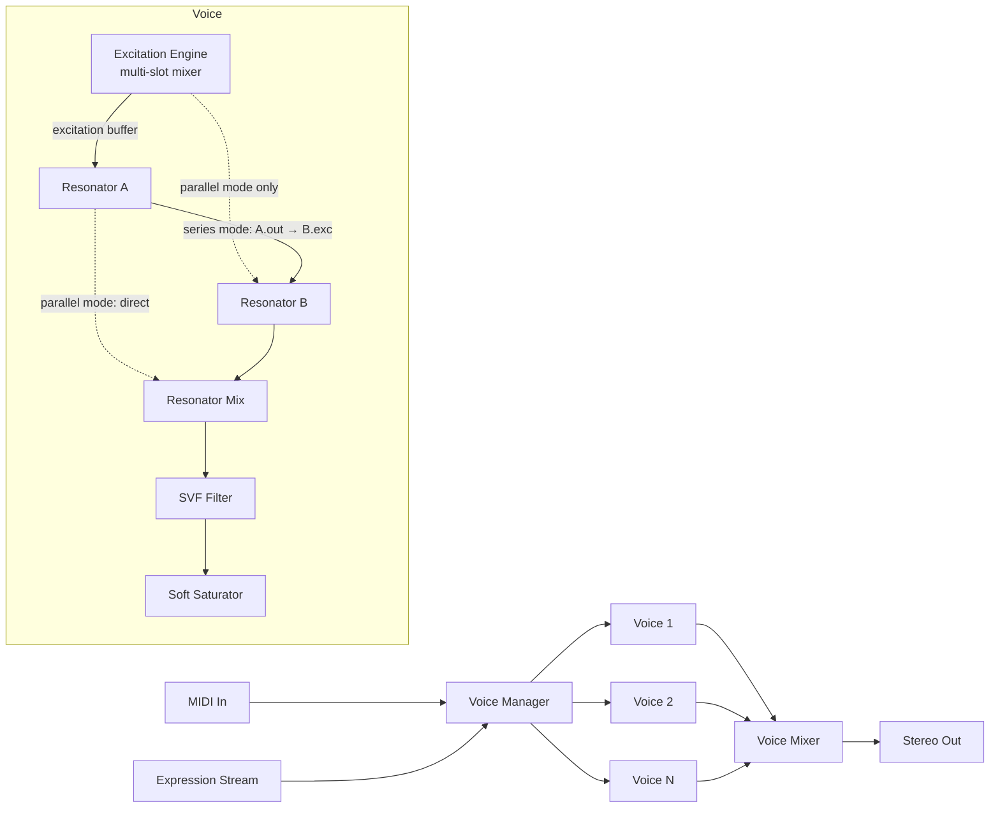

# Breath-Excited Resonator Synth — v0.1 Design Spec

**Working title:** TBD (see §15)
**Author context:** Ahara
**Target:** macOS (Apple Silicon primary, Intel best-effort), VST3
**Status:** v0.1 design — pre-implementation

---

## 1. Concept & Goals

A polyphonic physical-modeling synth where the **excitation source** is a user-loaded sample (rather than a synthesized impulse/noise burst), feeding configurable **resonator models** (modal bank, 1D waveguide). The thesis: existing physical-model synths sound like physical-model synths because their excitations are synthetic; feeding real breath transients, key clicks, and articulation noise into resonators produces hybrid timbres that no sampler library covers and no synthetic-excitation model can fake.

### Design principles

- **Sound generation only.** No FX, no reverb, no time-based or spectral processing beyond what's structurally part of the physical model. Effects belong in the Ableton chain downstream.
- **Sample as DSP component, not as playback.** The excitation sample is treated as an input signal into a resonator — not as a pitched/timestretched sound source. Tonality comes from the resonator.
- **Architectural seams for v2.** Live audio input as excitation, and audio-derived expression streams, are deferred but the architecture leaves clean hooks.
- **Tight scope.** Fixed modulation routings, two resonator models, one output stage. No mod matrix, no per-effect chains, no built-in factory library.

### Non-goals

- Not a sampler. Excitations are short transients (typically <500ms), not melodic/looped content.
- Not a granular synth.
- Not an FX plugin (will not host or emulate reverb, delay, distortion-as-effect, etc.).
- Not cross-DAW polished — Ableton on Mac is the only test target for v1.

---

## 2. Signal Path



Each voice is independent state. The voice manager handles allocation, stealing, and routing MIDI/Expression to active voices. The `Expression Stream` is a per-voice struct (see §8) that v1 fills from MIDI and v2 will optionally fill from analyzed audio.

---

## 3. Excitation Engine

### 3.1 Slot architecture

A patch declares up to **4 excitation slots**. Each slot has:

- **Sample reference** — by blake3 hash + last-known library-relative path
- **Gain** — pre-mix gain into the excitation buffer (dB)
- **Velocity zone** — lo/hi velocity bounds (0–127); slot only fires inside the zone
- **Sample-start offset** — fixed offset, plus optional velocity modulation depth
- **One-shot or loop** — one-shot is default; loop only for steady-state excitations (rare)
- **Pitch-track switch** — default off (excitation stays at original pitch); when on, sample is pitch-shifted to follow MIDI note via linear-interpolation resampling
- **Round-robin group** — slots tagged into the same RR group cycle on consecutive note-ons

### 3.2 Mixing rules

On each note-on, the engine:

1. Filters slots by velocity zone.
2. Within each RR group present, advances the RR cursor and selects one slot.
3. Sums all selected slots' sample playback into a per-voice excitation buffer.
4. Streams the excitation buffer into the resonator(s) per the routing config (§4.3).

This gives you, in one patch: a single excitation; or a velocity-split (soft taps vs hard strikes); or layered exciters (breath + key click); or RR variation across note repetitions; or any combination.

### 3.3 Playback mechanics

- Samples loaded into RAM at patch load (typical excitations are ≤1s, ≤96kB at 48kHz/16-bit mono).
- Per-voice playback cursor (f32 sample index) advances at `dest_sr / source_sr * pitch_ratio` per output sample.
- Linear interpolation between adjacent samples. Sufficient for excitation use; not trying to be Acoustica.
- Cursor terminates at sample end (one-shot) or wraps (loop).

---

## 4. Resonators

Two resonator slots per voice: **Resonator A** and **Resonator B**. Each slot is independently configurable as either a modal bank or a 1D waveguide. Both slots can be the same model type (e.g., A and B both modal banks, tuned to different fundamentals).

### 4.1 Modal bank

Bank of N second-order resonant filters in parallel, each modeling a single vibrational mode of a struck/blown idiophone.

**Parameters (per-resonator):**

- `mode_count` — user-configurable, **default 64**, soft cap 128, hard cap 256. Engine exposes an "offline render" override that allows unlimited (see §13).
- `model_preset` — frequency-ratio + decay-envelope template. Built-in templates: kalimba, marimba, bell, glass-bowl, metal-bar, woodblock, generic-strike. Templates ship hardcoded in v1 (no user editing).
- `fundamental_tune` — MIDI-tracked, plus fine offset (semitones + cents)
- `inharmonicity` — stretches/compresses the ratio template away from the preset's defaults
- `brightness` — per-mode gain envelope (tilts high modes up or down)
- `decay_global` — multiplier on all per-mode decays
- `decay_tilt` — biases high modes to decay faster (natural) or slower (unnatural, useful)
- `position_of_strike` — 0–1; modulates per-mode gains via `gain[n] *= |sin(n * π * position)|` so the excitation excites different modes more or less strongly depending on where on the resonator it lands

**DSP:** N parallel second-order resonator biquads. SIMD-batch in groups of 4 per AVX2/NEON lane (see §13).

### 4.2 1D waveguide

Karplus-Strong-extended single-delay-line waveguide for plucked-string and tube-like timbres.

**Parameters (per-resonator):**

- `fundamental_tune` — MIDI-tracked, semitone + cent offset
- `waveguide_style` — `String` or `Tube`; string is the default single-delay-line plucked/struck behavior, tube adds boundary reflection behavior for bore-like resonances
- `loop_filter_cutoff` — controls high-frequency damping in the feedback loop (brightness)
- `loop_filter_resonance` — controls Q of the loop filter
- `loop_gain` — feedback gain (sustain length)
- `loop_nonlinearity` — soft-clip strength inside the loop (adds bow-like character)
- `position_of_strike` — 0–1; selects the tap point along the delay line where excitation is injected
- `boundary_reflection` — -1–1; tube style reflection coefficient, where negative values invert the boundary reflection and positive values preserve polarity

**DSP:** delay line of length `sr / freq` samples (with first-order all-pass for sub-sample fractional tuning), one-pole or biquad lowpass in the loop, soft-clip stage. `String` style uses ordinary same-polarity feedback; `Tube` style applies the boundary reflection coefficient inside the loop so polarity and reflection amount become part of the resonator response.

**Deferred to v2:** bidirectional/two-port waveguide for proper tube modeling (closed-end reflection, clarinet-like behavior). v1 single-line is sufficient for the plucked/struck character.

### 4.3 Resonator routing

Two routing modes, switchable per-patch:

- **Parallel:** excitation buffer feeds both A and B independently. Audio outputs sum (with per-resonator mix slider).
- **Series (cascade):** excitation buffer feeds A only. A's audio output becomes B's excitation input.

**Series mode stability:** feeding A's continuous tonal output into B's excitation input risks runaway resonance (B excited by every cycle of A's ring-down). Mitigation: B's excitation input passes through a **high-pass at ~80Hz + transient-bias gate** that emphasizes onset content and de-emphasizes steady-state. This is part of the series-mode path, not user-exposed.

---

## 5. Output Stage

Per-voice, after resonator mix:

### 5.1 Filter — State Variable Filter (SVF)

- 12 dB/oct, modes: LP (default), BP, HP, switchable per-patch
- Parameters: cutoff (Hz, MIDI-key-trackable), resonance (0–1, self-oscillating at max)
- SVF chosen over ladder for: lower CPU, cleaner sound, less character of its own (resonators already supply character)
- Cutoff is a primary modulation destination (see §7.3)

### 5.2 Saturation — soft analog-modeled

- Sits **post-filter** as a master color stage
- `tanh`-based wave-shaper with mild asymmetry (slight even-harmonic content)
- Single `drive` parameter (0–1); output gain compensation built-in
- Post-filter rather than pre-filter because the resonators already provide harmonic complexity; saturation is for output coloration, not sound design

### 5.3 Master

- Per-voice gain (governed by amp envelope)
- Voice-mix sum to stereo
- Master gain control, master pan
- No per-voice stereo placement in v1 (deferred to v2)

---

## 6. Voice Management

- **Polyphony:** 8 voices baseline. User-configurable up to 16 (CPU-permitting).
- **Voice stealing:** oldest-released → quietest-released → oldest-active (suppress only if all slots are sustaining).
- **Per-voice state:** excitation playback cursors, resonator state (delay lines, biquad states), envelope/LFO states, filter state. All allocated up-front at instantiation; zero allocations in the audio thread.
- **Note-on cost:** sample-cursor reset, envelope reset, optional resonator state reset (configurable per-patch — "retrigger resonator" toggle; off by default for ringing carryover between notes).

---

## 7. Modulation

### 7.1 Sources

- **Amp Envelope** (ADSR) — always routed to output gain
- **Secondary Envelope** (ADSR) — user-assignable destination
- **LFO** — sine/triangle/saw/square/random S&H; rate in Hz or tempo-synced
- **MIDI Velocity** — note attack value
- **MIDI Aftertouch** (channel) — user-assignable destination
- **MIDI Mod Wheel** (CC1) — user-assignable destination
- **MIDI Pitch Bend** — always routed to resonator pitch (range configurable, default ±2 semitones)

### 7.2 Destinations (assignable)

- Filter cutoff
- Resonator A damping (modal decay_global / waveguide loop_gain)
- Resonator B damping
- Resonator A position-of-strike
- Resonator B position-of-strike
- Excitation gain
- LFO rate

### 7.3 Fixed routings (always-on)

- Amp envelope → output gain
- Pitch bend → resonator pitch (both A and B)
- Velocity → excitation gain (linear; depth controllable per-patch)
- MIDI note → resonator fundamental (equal temperament)

### 7.4 User-assignable routings

Four slots, each: `{source} → {destination} × amount`. Source picked from §7.1, destination from §7.2. No curves in v1 (linear only).

Justification for fixed-routing-with-4-flex-slots over full matrix: keeps UI small and the "playable instrument" feel intact, while leaving room for one experiment per patch (e.g., aftertouch → position-of-strike for breath-controlled timbre shift).

---

## 8. MIDI & Expression

### 8.1 ExpressionStream abstraction

```rust
struct ExpressionStream {
    pitch_bend: f32,    // semitones, signed
    pressure: f32,      // 0..1, channel pressure equivalent
    brightness: f32,    // 0..1, timbre/CC74 equivalent
    velocity: f32,      // 0..1, note-on velocity (latched)
    gate: bool,
}
```

One stream per voice. The Voice Manager maintains stream state and passes it into the voice's processing each block.

### 8.2 v1 stream source — MIDI

- `pitch_bend` ← channel pitch bend × range
- `pressure` ← channel aftertouch (CC129 equivalent)
- `brightness` ← CC74 (default; user-mappable to other CCs)
- `velocity` ← note-on velocity
- `gate` ← note-on / note-off

### 8.3 v2 stream source — audio analysis (architectural seam only)

The trait is defined in v1 but only the MIDI implementation ships:

```rust
trait ExpressionSource {
    fn next_block(&mut self, voice_id: VoiceId) -> ExpressionStream;
}
```

v2 will add `AudioAnalysisExpressionSource` that consumes a sidechain audio stream and emits ExpressionStream via:

- Pitch tracker (pYIN or similar) → `pitch_bend`
- Smoothed RMS envelope → `pressure`
- Spectral centroid or harmonic/noise ratio → `brightness`

This is also the seam where v2's "live audio as excitation" plugs in — the same audio stream that drives `AudioAnalysisExpressionSource` will optionally route into the excitation buffer of triggered voices.

---

## 9. Sample Library

A persistent, plugin-managed sample library. Lives on disk independently of any Ableton set. Patches reference samples by content hash with last-known-path fallback.

### 9.1 Disk layout

```
~/Library/Application Support/Ahara/<PluginName>/
├── Samples/              # User's organized hierarchy; arbitrary subfolders
│   ├── breath/
│   ├── key-clicks/
│   ├── mallets/
│   └── ...
├── Patches/              # Patch files (.json or .toml)
├── index.db              # SQLite index
└── config.toml           # User settings (library path overrides, etc.)
```

Library path configurable. Default as shown; user can relocate to e.g. a fast NVMe or a synced Dropbox folder.

### 9.2 SQLite schema (v1)

```sql
CREATE TABLE samples (
  id INTEGER PRIMARY KEY,
  blake3_hash TEXT UNIQUE NOT NULL,
  relative_path TEXT NOT NULL,        -- relative to Samples/ root
  filename TEXT NOT NULL,
  duration_ms INTEGER NOT NULL,
  sample_rate INTEGER NOT NULL,
  channels INTEGER NOT NULL,
  rms_db REAL,
  peak_db REAL,
  waveform_preview BLOB,              -- precomputed RMS-per-pixel preview, ~1KB
  imported_at TEXT NOT NULL,
  user_notes TEXT
);

CREATE TABLE tags (
  id INTEGER PRIMARY KEY,
  name TEXT UNIQUE NOT NULL
);

CREATE TABLE sample_tags (
  sample_id INTEGER NOT NULL REFERENCES samples(id) ON DELETE CASCADE,
  tag_id INTEGER NOT NULL REFERENCES tags(id) ON DELETE CASCADE,
  PRIMARY KEY (sample_id, tag_id)
);

CREATE INDEX idx_samples_hash ON samples(blake3_hash);
CREATE INDEX idx_samples_path ON samples(relative_path);
```

### 9.3 Drag-and-drop ingest

Drop audio file(s) onto the plugin UI → samples ingest pipeline:

1. Compute blake3 hash of the source file.
2. If hash already in `samples` table → no-op (deduplication).
3. Otherwise: copy file into `Samples/incoming/` (or user-selected subfolder), convert to flac if not already, write metadata to SQLite, generate waveform preview, insert row.
4. Default behavior is **copy** (sample lives in library). Optional setting: reference-only (sample stays at original path; library tracks absolute path; portability cost).

### 9.4 Patch ↔ sample resolution

Patch file stores each excitation slot's sample reference as:

```toml
[slot.1]
sample_hash = "blake3:abc123..."
last_known_path = "breath/clarinet-chiff-soft-01.flac"
```

Resolution order on patch load:

1. Look up by `sample_hash` in SQLite → if found, use that path.
2. If not found by hash, try `last_known_path` → if file exists, hash it and add to library, then use it.
3. If still not found, mark slot as "missing sample" — UI shows red indicator, slot is bypassed, patch otherwise loads.

### 9.5 Embed-on-export

A "Export patch with samples" action bakes referenced sample audio into the patch file as base64-encoded flac. Receiving instance auto-imports on load. Useful for sharing patches across machines.

---

## 10. State & Presets

- Patches stored as TOML on disk in `Patches/` (human-readable, diffable, easy to version-control).
- Plugin state for DAW project save/load is serialized via VST3's `IComponent::getState` / `setState` — current implementation: serialize the active patch (plus any unsaved parameter overrides) to a self-contained byte buffer using `serde` + `bincode` or `postcard`. Reload reconstructs the same patch.
- Patch file references samples by hash; resolution at load time per §9.4.
- "Default patch" ships hardcoded — a single excitation slot referencing a synthesized noise burst (generated at plugin init), feeding a modal bank with the `marimba` template. So the plugin makes sound out of the box with no user samples.

---

## 11. UI (Vizia)

Layout sketch (described — full mockup deferred):

- **Top bar:** patch name, browse/save/export, library button, MIDI activity LED, CPU meter.
- **Left column — Excitation Engine:** 4 slot rows (sample name, velocity zone, gain, RR group, pitch-track toggle). Drop zones above each slot. Mute/solo per slot.
- **Center — Resonator A and Resonator B:** stacked panels, each with model-type switch (Modal / Waveguide), preset selector (modal only), and the resonator-specific parameter cluster. Routing switch (Series / Parallel) between them.
- **Right column — Output & Modulation:** filter (cutoff, res, mode), saturation (drive), master (gain, pan). Below: envelopes (amp + secondary), LFO, 4 user mod slots.
- **Bottom drawer:** sample library browser (collapsed by default). When expanded, shows tree of `Samples/`, tag filter chips, waveform preview, audition button (plays excitation through current Resonator A config).

UI runs at the editor framerate (typically 30–60 fps), pulls audio-thread state via lock-free reads.

---

## 12. Technology Stack

**Architectural decision: framework-less integration on top of raw VST3 bindings + off-the-shelf windowing/UI.**

No plugin framework (no nih-plug, no JUCE, no iPlug2). The VST3 ABI grunt work (COM vtables, FUnknown plumbing) comes from the MIT-licensed `vst3` crate (coupler.rs). Window lifecycle and NSView embedding — the one piece that genuinely earns its keep — comes from `baseview`. UI from `vizia` direct (not the `vizia-plug` adapter, which is the nih-plug bridge we're not using). Everything between those layers — parameter system, MIDI normalization, voice management, state serialization, audio buffer iteration, threading discipline — is project code under our control.

Rationale for going framework-less:
- The new MIT-licensed `vst3` crate (Oct 2025) removed the GPL-contamination tax that previously made framework-less unattractive.
- Plugin's architectural needs (multi-source `ExpressionStream`, future live-input excitation seam, custom sample-slot routing) don't fit cleanly into nih-plug's idioms.
- Plumbing surface for this plugin is modest (one stereo out, MIDI in, ~30 parameters, one editor window). Once written, it's owned and never breaks on a framework upgrade.
- Matches the approach used successfully for the C# VST host project.

### 12.1 Crate stack

| Layer            | Choice                                                 | Notes                                                                          |
| ---------------- | ------------------------------------------------------ | ------------------------------------------------------------------------------ |
| VST3 ABI         | **`vst3` crate** (coupler.rs)                          | MIT/Apache 2.0. Pre-generated bindings, no libclang at build time.             |
| Plugin shell     | **Project code (`crate::shell`)**                      | Implements `IPluginFactory`, `IComponent`, `IAudioProcessor`, `IEditController`, `IPlugView`. See §12.2. |
| Window lifecycle | **`baseview`**                                         | NSView embedding, dpi, focus, event loop. Used directly, not via nih-plug.    |
| UI framework     | **`vizia`** (direct)                                   | Declarative, retained-mode. Custom binding into project parameter system.      |
| Format           | **VST3** only                                          | Ableton on Mac loads VST3 natively. CLAP not yet supported by Ableton (as of Live 12.4, May 2026). |
| Build target     | Apple Silicon primary, Intel best-effort               | Custom `xtask` produces `.vst3` macOS bundle (Info.plist, PkgInfo, ad-hoc signature). |
| DSP              | Hand-rolled biquad bank, hand-rolled waveguide         | Optional `realfft` for any FFT needs. No C++ STK dependency.                   |
| Sample I/O       | `symphonia` for decode, `claxon` for flac write        | All pure-Rust.                                                                 |
| Resampling       | `rubato`                                               | Pure-Rust, real-time-capable.                                                  |
| Database         | `rusqlite` (bundled libsqlite)                         | Single-file embedded DB.                                                       |
| Hashing          | `blake3`                                               | Fast content addressing.                                                       |
| Serialization    | `serde` + `toml` (patches), `postcard` (DAW state)    | Patch files diffable; DAW state compact binary.                                |
| SIMD             | `std::simd` (portable) or `pulp`                       | For modal-bank batching; see §13.                                              |

### 12.2 Plugin shell — what we own and write

This is the layer that nih-plug would have provided. Owning it is the cost of going framework-less; the size is bounded by the plugin's actual surface.

- **Factory entry point.** `IPluginFactory` exposing the plugin's UID, category, and component class. ~50 LOC.
- **Component lifecycle.** `IComponent` + `IAudioProcessor` — bus arrangements (stereo out, MIDI in), process setup/teardown, `process()` audio loop. ~200–300 LOC.
- **Parameter system.** Atomic `f32` per parameter (audio thread reads, UI/host writes via atomics). Parameter info: ID, normalized range, display formatter, step count, automation flags. Wired through `IEditController`. ~300–400 LOC.
- **MIDI event normalization.** VST3 event stream → internal `NoteEvent` / `CcEvent` enums. Channel pressure, pitch bend, note on/off, CC mapping. ~150 LOC.
- **State serialization.** `IComponent::getState` / `setState` writing/reading the active patch via `postcard`. ~80 LOC.
- **Editor binding.** `IPlugView` wrapping `baseview::Window`, connecting Vizia's render loop, handling resize and dpi. ~200–400 LOC.
- **Bundle build script.** Custom `cargo xtask` that produces `.vst3` macOS bundle layout, Info.plist, ad-hoc signature for local dev. Reference: vst3-sys repo example. ~200 LOC.
- **Threading discipline.** Lock-free SPSC ring buffer for UI→audio messages, atomic params for the reverse. ~150 LOC.

Total shell code: roughly 1500–2500 LOC. Written once, doesn't churn.

### 12.3 VST3 validator

Steinberg's `validator` tool runs ~300 conformance tests against the bundle. The plugin must pass these for reliable behavior across hosts. The validator runs from the SDK distribution and reports pass/fail per check. Plan: integrate validator runs into the build (xtask target that builds, then runs validator, fails build on regression).

---

## 13. Performance

### 13.1 Per-voice cost model (rough, 48kHz)

| Component                     | Cost (per sample)            | Notes                                              |
| ----------------------------- | ---------------------------- | -------------------------------------------------- |
| Excitation playback (4 slots) | ~20 ops                      | Linear interp, mix sum                             |
| Modal bank, 64 modes          | ~256 ops (with SIMD batching) | 4 modes per 4-lane SIMD vector                     |
| Waveguide                     | ~40 ops                      | Delay tap + loop filter + clip                     |
| Filter (SVF)                  | ~10 ops                      |                                                    |
| Saturation                    | ~10 ops                      | tanh approximation                                 |
| **Total per voice**           | **~340 ops/sample**          | Both resonators at 64 modes is worst-case          |

8 voices × 340 ops/sample × 48000 samples/sec ≈ 130 MOps/sec. Comfortable on M-series silicon with room to spare; should idle well under 5% single-core CPU at moderate polyphony.

### 13.2 Mode count tradeoffs

- 32 modes: kalimba/woodblock convincing, bells thin
- 64 modes: sweet spot for v1 default
- 128 modes: bells, glass, gongs reach their full character; 2× CPU
- 256+ modes: diminishing returns for real-time; useful for offline render

### 13.3 Offline render mode

Detect via VST3's `ProcessSetup::processMode` — VST3 reports `kOffline` for bounce/render contexts. When offline:

- Mode count cap is removed (or set to a configurable "offline max", default 512)
- Voice count cap can be raised
- Internal oversampling factor optionally bumped (1× → 2× or 4×)

Patches store both a "live" mode count and an "offline" mode count. Live for performance, offline for bouncing the final track.

### 13.4 SIMD plan

The modal bank is the main SIMD target. Each mode is a 2nd-order biquad with shared input/output structure. Batch modes in groups of 4 (NEON) or 8 (AVX2): vectorize the per-sample update across modes. Expect ~3× throughput vs scalar.

Worth doing from the start because the architecture (mode parameter layout in memory) is hard to retrofit. Use `std::simd` portable intrinsics; fall back to scalar on unsupported targets.

---

## 14. V1 Scope vs V2 Extensions

### V1 (ships)

- Polyphonic (8 voices, configurable to 16)
- Resonator A + B, each Modal or Waveguide
- Series and Parallel routing
- 4-slot excitation engine with velocity zones, round-robin, layering
- SVF filter + soft saturation output
- Fixed mod routings + 4 user-assignable slots
- Sample library: SQLite-indexed, drag-drop ingest, hash-based patch references
- VST3, Mac primary

### V2 architectural seams (designed-in, not implemented)

- **Live audio input as excitation** — sidechain audio → excitation buffer path. Slot infrastructure already supports a "source" abstraction; v2 adds a `LiveAudioSlot` source.
- **Audio-derived ExpressionStream** — pluggable `ExpressionSource` trait, v2 adds `AudioAnalysisExpressionSource` (pYIN + RMS + centroid).
- **Plate / membrane resonator** — third model type plugged into the existing resonator slot interface.
- **Banded waveguide** — fourth model type for bowed/glass timbres.
- **Cross-coupling / sympathetic resonance routing** — third routing mode where B's output partially feeds back into A's excitation.
- **Per-voice stereo placement** — pan and stereo width per voice for natural ensemble spread.
- **Microtuning** — Scala / .tun file support if a worldbuilding/game project needs it.

---

## 15. Open Questions

1. **Name.** Working title placeholder. Candidates aligned with the chthonic-grounded-physical aesthetic: *Sympathy*, *Hollow*, *Conduit*, *Plenum*, *Septum*, *Lithic*, *Tellurian*, *Antechamber*. Pick one before any UI work; appears in filenames, default library path, patch file metadata.

2. **Default mode count per template.** Should each modal preset (kalimba, bell, glass, etc.) ship with its own recommended mode count, or is the user always responsible for setting it? Recommend: per-preset default with user override.

3. **Sample format on ingest.** Always re-encode to flac, or preserve original format if already wav/flac? Recommend re-encode to flac mono 48kHz 24-bit (excitations rarely need stereo; storage savings real over a large library).

4. **Patch file format.** TOML (proposed, human-readable, diffable) vs JSON (more standard) vs RON (Rust-native but less tooling). Recommend TOML.

5. **Plugin name in DAW.** The bundle name shown in Ableton's browser. Suggest: `<PluginName> by Ahara`.

---

## 16. Build Order

Each step is its own definition-of-done with concrete observable outcomes. No time estimates — work them at whatever pace.

### Step 1 — Skeleton plugin (the integration shell, end-to-end)

**Definition of done:**

- `vst3` crate + `baseview` + `vizia` wired together as a buildable Cargo workspace.
- Custom `xtask` produces a `.vst3` bundle (Info.plist, PkgInfo, ad-hoc signature) that Ableton on Mac discovers.
- Plugin loads in Ableton, presents a window, draws one knob via Vizia.
- The knob controls a master-gain parameter on a constant 440Hz sine wave generated in the audio thread.
- DAW automation of the knob is reflected in the audio output (host → param → audio).
- Save the Ableton project, close, reopen → plugin state restored (param value persists).
- Steinberg `validator` passes all applicable checks against the bundle.

This step is the framework-less bet. If this step turns into a quagmire, that's the signal to fall back to nih-plug; if it goes smoothly, the rest of the spec is just DSP on top of a known-working shell.

### Step 2 — Single excitation slot + single waveguide resonator

Simplest end-to-end physical-model signal path. Hardcode a single test sample baked into the binary; play it on note-on, route through a Karplus-Strong-style waveguide tuned to the MIDI note, out to stereo.

**Done:** play a note on a connected MIDI keyboard, hear a plucked-string sound tuned to the note, with sustain controlled by the loop-gain parameter (exposed as a knob in the UI).

### Step 3 — Modal bank resonator

Add modal bank as a second model type. Implement `kalimba` and `marimba` presets. User-configurable mode count (slider, 16–256).

**Done:** switch the resonator slot between Waveguide and Modal, hear convincing plucked-string vs struck-bar timbres on the same input.

### Step 4 — Multi-slot excitation engine

Expand to 4 excitation slots with velocity zones, round-robin groups, and layering. Drag-and-drop sample loading (sample lives in RAM, no library yet).

**Done:** create a patch with two excitation slots (e.g., breath layer + key click), play a note, hear both excitations summed into the resonator.

### Step 5 — Two-resonator routing

Add Resonator B slot. Implement Parallel and Series routing modes, including the series-mode HPF + transient-bias gate on B's excitation input.

**Done:** confirm series mode is stable (no runaway feedback) across the parameter space of both resonators. Parallel mode mixes A and B independently.

### Step 6 — Output stage

SVF filter + soft saturator. Filter modes LP/BP/HP switchable.

**Done:** filter cutoff sweeps as expected; saturation drive audibly thickens without breaking the resonator's tonal content.

### Step 7 — Modulation infrastructure

Envelopes (amp + secondary), LFO, fixed routings, 4 user-assignable mod slots. MIDI velocity, pitch bend, channel pressure, mod wheel all routed per §7.

**Done:** patch with secondary env → resonator damping plays a struck note that opens up tonally as the env decays.

### Step 8 — Sample library

SQLite-indexed library at the standard library path. Drag-drop ingest pipeline (hash, copy, flac re-encode, metadata insert, waveform preview generation). Library browser UI in the bottom drawer.

**Done:** drop a folder of samples onto the plugin window; samples ingest; library browser shows them with previews; clicking a sample auditions it through Resonator A.

### Step 9 — Patch save/load with hash-based sample resolution

Patches saved as TOML files in `Patches/`. Sample references stored as `(blake3_hash, last_known_path)` pairs. Resolution order per §9.4.

**Done:** save a patch using samples from the library. Move the samples to different subfolders. Reload the patch — samples still resolve via hash. Delete one sample from the library — patch loads with that slot flagged as missing, other slots intact.

### Step 10 — Polish

UI refinement, SIMD optimization of the modal bank, validator regression suite in CI, performance pass under stress (16 voices × 128 modes × both resonators).

**Done:** plugin passes all validator checks, holds up under stress at target polyphony with headroom on M-series silicon.

---

## Appendix A — Glossary

- **Excitation:** the input signal that drives a resonator (struck/blown/plucked). In this synth: a sample.
- **Modal bank:** a parallel array of resonant filters, each modeling one vibrational mode of a physical object.
- **Waveguide:** a delay-line-based model of a 1D vibrating medium (string, tube). Sound emerges from the feedback loop's standing-wave behavior.
- **Mode:** a single vibrational frequency of a physical object. A kalimba tine has a few strong modes; a cymbal has hundreds.
- **Position of strike:** where on a resonating object the excitation is applied. Affects which modes are excited (a string struck at its midpoint excites mostly odd harmonics).
- **ExpressionStream:** internal abstraction for per-voice continuous control (pitch bend, pressure, brightness, gate). v1 driven by MIDI; v2 optionally driven by audio analysis.
